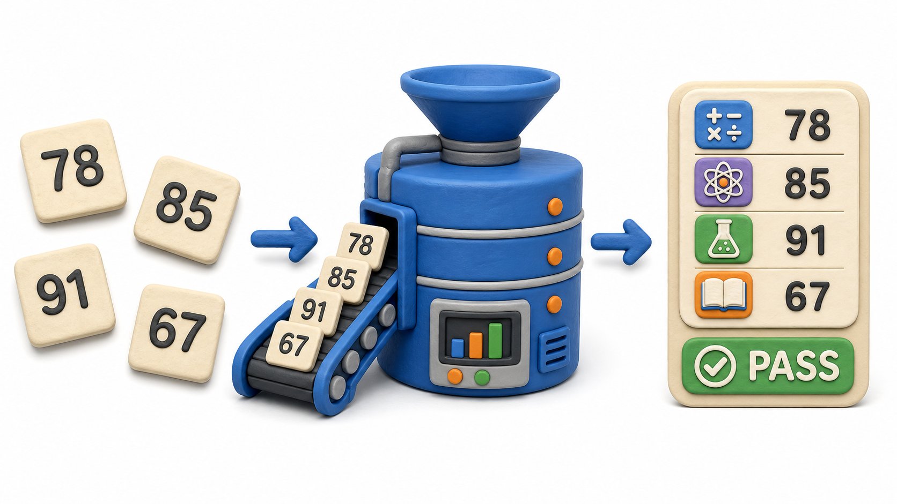
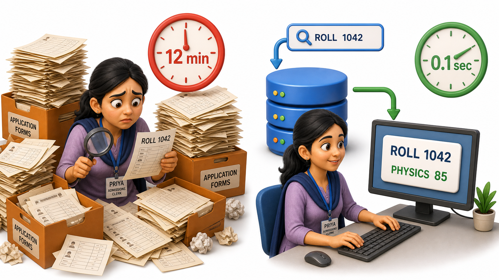

## Introduction

Priya works the front desk at a college admissions office. On her desk sits a stack of filled-in forms, and on each form a student has written a roll number, a name, a date of birth, and a set of marks: 78, 85, 91, 67. Taken alone, that string of numbers means almost nothing. Is 78 a mark out of 100, a percentage, or an age? Nobody looking at the bare number can say.

Now Priya opens the college's result system and types in the roll number. The screen responds: "Ananya Rao, B.Sc. Computer Science, Semester 3: Mathematics 78, Physics 85, Chemistry 91, English 67, overall percentage 80.25%, result PASS." Suddenly those same four numbers carry meaning. They are attached to a name, a subject, a scale, and a verdict.

That difference is the whole idea behind this lesson. The raw numbers on the form are **data**, and the organised, meaningful summary on the screen is **information**. Data is the raw material; information is what you get once that raw material is structured, labelled, and connected to context that lets a person or a program actually use it.

## Data: Raw and Unopinionated

Data is any raw fact recorded about the world: a number, a word, a date, a temperature reading, a photograph, a click on a button. On its own, a single piece of data rarely tells a complete story.

Consider these facts sitting by themselves:

- `21`
- `"Chennai"`
- `2026-07-08`
- `4.2`

Each one is perfectly valid data, and each one is also completely ambiguous. Is 21 someone's age, a room number, or the count of pending orders? Is Chennai a delivery address, a birthplace, or a warehouse location? Data does not explain itself. It simply exists, waiting for structure to be added around it.

This is true whether the data comes from a form, a sensor, a mobile app, or a scanner at a supermarket counter. A till scanning a barcode produces data. A fitness band counting steps produces data. Neither the scanner nor the band understands what that data means for the business or the person; they only capture it faithfully.

## Information: Data with Context and Purpose

Information is what emerges once data is organised, connected, and given a purpose someone can act on. The same four lonely facts above become information the moment they are placed in context:

- `21` becomes "Ravi's age is 21, so he qualifies for the youth discount."
- `"Chennai"` becomes "This order ships to Chennai, so expect delivery in two days."
- `2026-07-08` becomes "The library book is due back on 2026-07-08."
- `4.2` becomes "The delivery partner has a rating of 4.2 out of 5."

Notice what changed. Nothing about the raw value was altered; a label, a relationship, and a purpose were attached around it. A college's result portal does exactly this at scale: it takes thousands of raw mark entries, connects each one to a student, a subject, and a grading rule, and returns something a student can actually understand and act on: pass or fail, honours or not, eligible for the next semester or not.

## Why the Distinction Matters for a Database

This distinction is not academic. It is the entire reason a database exists rather than a simple pile of files. A **database's job is to store data in a structured way so that turning it into information later is fast, reliable, and repeatable**, rather than something a person has to reconstruct by hand every single time.

Think about what Priya's office would look like without that structure. Every time someone asked "What did Ananya score in Physics?", a clerk would need to physically dig through stacks of forms, find the right one, and read off the number. With even a few thousand students, that becomes slow and error-prone. A well-organised database, by contrast, keeps roll number, name, subject, and marks tied together as structured data, so producing the information "Ananya scored 85 in Physics" is a matter of asking a precise question and getting an instant, correct answer.

## Data vs. Information at a Glance

| Aspect | Data | Information |
|---|---|---|
| What it is | Raw, unprocessed fact | Data organised with context and meaning |
| Example | `85` | "Ananya scored 85 in Physics" |
| Understood on its own? | Rarely | Usually, yes |
| Where it comes from | Forms, sensors, clicks, scans | Structuring and interpreting data |

## Your Turn: Spot the Difference

Look at this short list and decide, for each line, whether it reads as bare data or as information, and explain what context is missing or present.

1. `450`
2. "Order #4521 for Kabir Singh, total amount Rs 450, status: out for delivery"
3. `"O positive"`
4. "Patient ID 1042, blood group O positive, last donation 2026-03-14"

In lines 1 and 3, the value is floating free with no label attached, so it stays data. In lines 2 and 4, the same kind of value is tied to a name, an identifier, and a purpose, which is exactly what turns it into information. Every lesson from here forward is really about one question: how does a database hold onto data reliably enough that turning it into information stays fast and trustworthy, no matter how large the pile of forms grows?

## Conclusion

Data is the raw fact; information is that fact once it has been organised, labelled, and connected to something a person can use. A database's whole purpose is to make that transformation dependable at scale, instead of leaving it to a tired clerk searching through paper. Priya no longer has to dig through a stack of forms to answer "What did Ananya score in Physics?"; the result system does in an instant what would otherwise cost her office minutes per student and hours per class. With that distinction fixed in mind, the next question becomes obvious: what actually goes wrong when an organisation tries to manage growing piles of data using plain files instead of a proper database.
