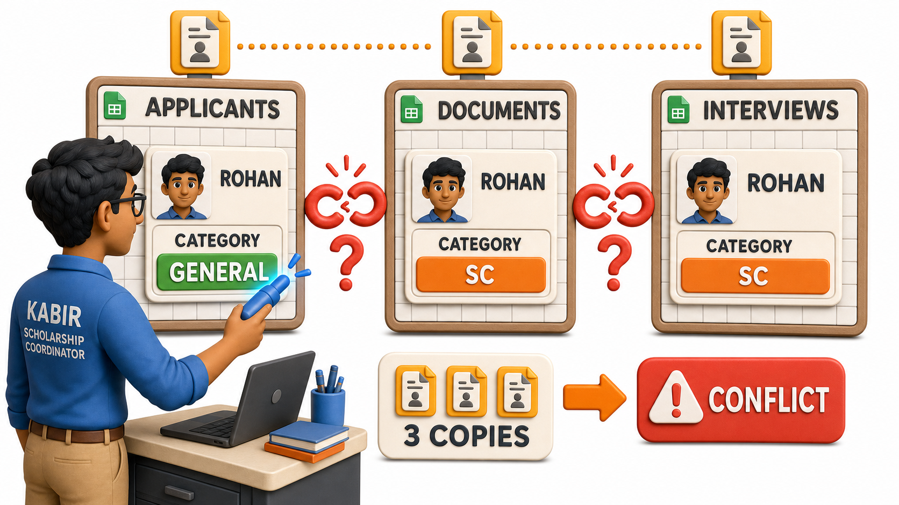
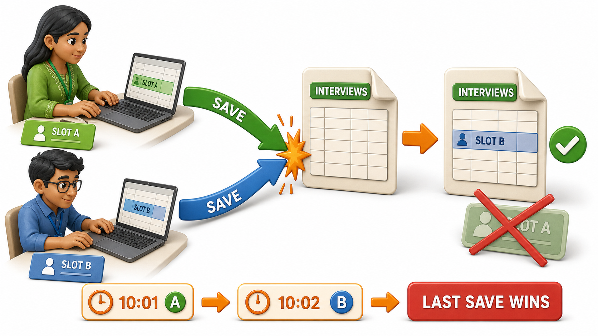

## Introduction

Kabir joined Priya's admissions office as a scholarship coordinator three weeks ago, and his job so far has felt manageable: track every scholarship applicant across three spreadsheets, `applicants.xlsx` for personal details, `documents.xlsx` for uploaded certificates, and `interviews.xlsx` for the shortlist and interview slots. It worked fine when there were forty applicants. This year there are four thousand.

The trouble starts small. A candidate named Rohan Verma submits a corrected category certificate, moving him from the SC scholarship pool to the General merit pool. Kabir updates `applicants.xlsx` the moment the certificate arrives. Nobody remembers to open `interviews.xlsx`, where Rohan's row still lists him under the SC panel three weeks later, on the day of his interview.

Then, on the morning the shortlist is finalized, two coordinators open `interviews.xlsx` at the same time from two different laptops, one adding a new interview slot, the other marking three candidates as confirmed. Both save their copies to the shared drive within a minute of each other. Whichever file lands last on the server simply overwrites the other, and one coordinator's honest, correct work disappears without so much as an error message.

None of this happened because Kabir or his colleagues were careless. It happened because plain files were never built to hold shared, growing data safely, and the failure has three distinct, well-known faces: **redundancy, inconsistency, and `lost updates`**.

## Redundancy: The Same Fact, Typed More Than Once

Redundancy means a single fact gets stored in more than one place. Rohan's phone number is retyped into every file that needs to be read on its own, without anyone flipping between three tabs:

- `applicants.xlsx`, next to his personal details
- `documents.xlsx`, next to his certificate upload
- `interviews.xlsx`, next to his interview slot

By itself, that repetition causes no damage. It just means one true fact about Rohan now exists in three copies, quietly waiting for someone to update only one of them.

## Inconsistency: When the Copies Stop Agreeing

That waiting ends the moment Rohan's category certificate is corrected. Kabir updates `applicants.xlsx`, the file he happened to have open, and moves on to the next candidate in the queue. Nobody touches `interviews.xlsx`, which still shows Rohan under the SC panel on interview day.

Ask a simple question now: which category is Rohan actually in? `applicants.xlsx` says General merit. `interviews.xlsx` says SC. Both files claim to hold the truth, and they disagree, which is exactly what **inconsistency** means: redundant copies of the same fact, updated in one place and left untouched in another, until nobody can say with confidence which one is correct.

## Lost Updates: When Two Changes Collide

The interview-day mix-up is the sharpest version of the same underlying problem. Two coordinators edit `interviews.xlsx` within the same minute, each making a genuine, correct change. The shared drive has no way to merge their two edits into one file that reflects both. It keeps whichever file was saved last and quietly discards the other, along with every confirmed slot the discarded coordinator had just entered.

This is a **`lost update`**: two valid, simultaneous changes to the same shared file, where only one survives and the other vanishes with no warning at all.

## The Three Symptoms at a Glance

| Symptom | What happens | Admissions office example |
|---|---|---|
| Redundancy | The same fact is stored in more than one file | Rohan's phone number typed into applicants, documents, and interviews files |
| Inconsistency | Redundant copies disagree after only one is updated | Rohan's category shows General in one file, SC in another |
| Lost updates | Two simultaneous edits to the same file, only one survives | A coordinator's confirmed interview slots vanish when a second save overwrites the first |

## Could More Discipline Fix This?

It is tempting to blame the people rather than the tool. Could Kabir's office simply agree on a rule: always update every file the moment anything changes, and never let two people open the same file at once?

For three files and two coordinators, that rule might survive a week. It will not survive:

- a busy interview season, with dozens of edits landing within minutes of each other
- a new volunteer who was never told the rule
- the ordinary human habit of updating the file already open and trusting that someone else will remember the rest

The moment shared data is written to and read from by more than one person, at any real scale, these three symptoms stop being rare accidents and become a routine, predictable cost of using plain files for something they were never designed to do: coordinate simultaneous, shared access to the same facts.

## Conclusion

Redundancy creeps in because the same fact has to be retyped wherever it is needed, inconsistency follows because updating one copy never guarantees the others get updated too, and `lost updates` happen because a plain file cannot merge two people's honest changes into one. None of this is a character flaw in Kabir's team, it is what plain files do, reliably, once real numbers and real deadlines arrive. The natural next question is what kind of tool would actually solve all three problems at once, and what exactly it means to say that tool holds a single, organized body of data rather than just another file.
