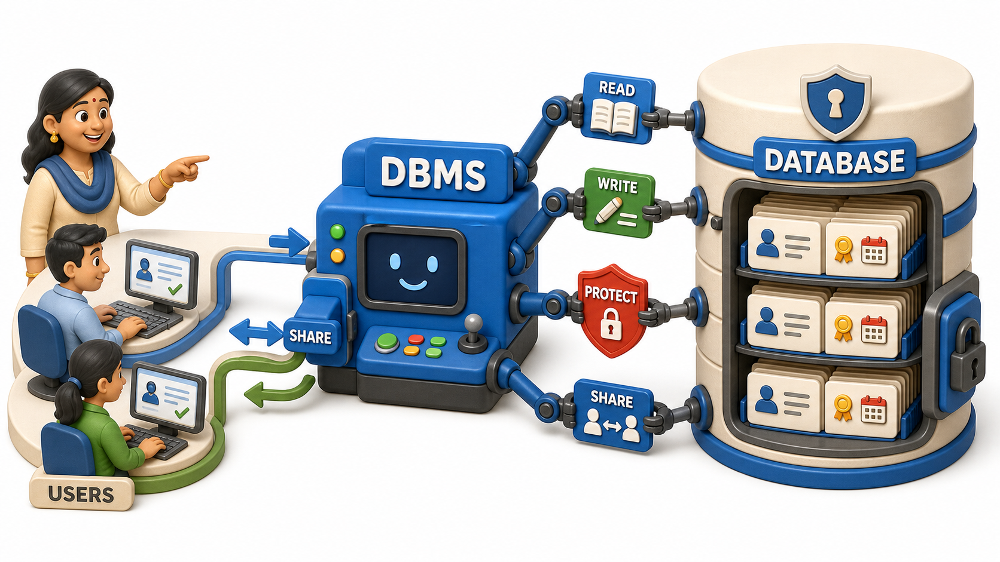
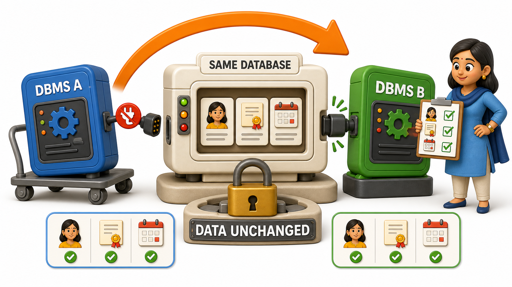

## Introduction

The lost interview slots are the final straw, and Priya's admissions office gets approval to buy proper software. The vendor's proposal document lands on Meera's desk, she is the office manager, and two words appear side by side throughout it: "database" and "DBMS." Meera had always treated them as interchangeable, the way people say "PDF" when they mean "document." One sentence in the proposal refuses to let that slide: "PostgreSQL is the DBMS that will manage your admissions database." If PostgreSQL and the admissions database are described as two separate things, then they must actually be two separate things, and Meera cannot sign off on a purchase she does not understand.

## A Database Is the Organized Data Itself

A **database** is an organized collection of related data, structured so it can be stored, retrieved, and updated reliably. For Meera's office, that means the actual facts, held together as one coordinated collection instead of scattered across `applicants.xlsx`, `documents.xlsx`, and `interviews.xlsx` with nothing enforcing how they relate to each other:

- Every applicant's details
- Every uploaded certificate
- Every interview slot and outcome

Here is a test worth applying whenever the two words blur together: if every computer in the office lost power for a week, would the database still exist? Yes, sitting untouched on disk, the same way a locked drawer of paper files would survive a power cut. A database is content, not machinery.

## A DBMS Is the Software That Manages the Data

A **DBMS**, short for Database Management System, is the software responsible for creating, storing, retrieving, updating, and protecting that data on its behalf. PostgreSQL, in the vendor's proposal, is not the admissions office's actual records. It is the program that will sit between Kabir's team and those records, refusing to save an interview slot for an applicant ID that does not exist, letting two coordinators' simultaneous edits through without silently discarding one, and keeping the data intact even if a server crashes mid save.

PostgreSQL, MySQL, and SQLite are three real, separate pieces of software that each do this same job, each capable of managing a database, and each speaking a very similar language to do it, the language this course reaches directly once tables are on the table.

## Database vs. DBMS at a Glance

| | Database | DBMS |
|---|---|---|
| What it is | The organized data itself | The software that manages that data |
| Admissions example | The applicant records, documents, and interview schedule | PostgreSQL, the software named in the vendor's proposal |
| Survives a power cut untouched | Yes, it is stored content | The program itself also just sits on disk, but its job is acting on the data while running |
| Safe to edit directly by hand | No, that risks the exact redundancy and lost-update problems already seen | Yes, this layer exists specifically to make safe, coordinated editing possible |

## Why Meera Cannot Treat Them as the Same Word

Before Meera signs anything, she asks the vendor a pointed question: if the college later switches from PostgreSQL to a different product, does the admissions office lose any applicant records, certificates, or interview history? The honest answer is no. The applicant names, categories, and interview outcomes are one fixed body of facts, and only the software reading and writing them would change. A vendor who blurs "database" and "DBMS" together is quietly steering Meera toward worrying about the wrong thing. Her real concern should be whether the data itself survives any future change untouched, not which brand happens to be managing it this year.

## What Buying a Real DBMS Actually Buys

Held up against the familiar failures of plain shared files, a DBMS earns its price directly:

- **Against redundancy**, it lets a fact such as an applicant's phone number be stored once and referenced wherever it is needed, instead of retyped into every file that mentions it.
- **Against inconsistency**, because that fact now lives in exactly one place, updating it there is enough, with no forgotten second copy left disagreeing later.
- **Against `lost updates`**, it coordinates two people saving changes at nearly the same moment, so one genuine update is never silently thrown away by the other, the exact failure that cost a coordinator her confirmed interview slots.

## Conclusion

A database is the organized data, and a DBMS is the separate software built specifically to manage that data safely on its behalf, and the two words are never interchangeable no matter how often vendors blur them together. The test survives any real scrutiny: swapping the DBMS should never touch the underlying data, and any proposal that confuses the two is quietly asking the wrong question. Meera can now sign off on Priya's admissions software with a clear answer to her own question, the applicant records, documents, and interview slots are the database, and PostgreSQL is simply the replaceable software minding them. With that vocabulary settled, it is worth noticing that this same pattern, a database quietly managed by a DBMS, is not unique to one admissions office, it is already running behind the ordinary apps that fill an average evening.
