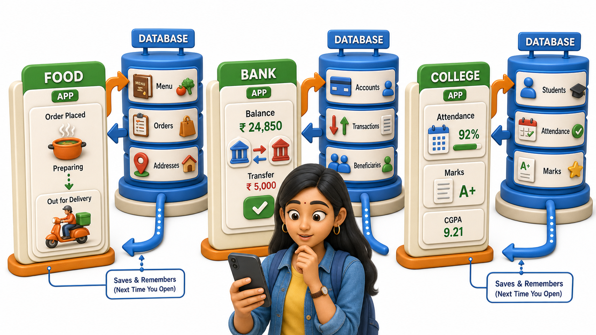
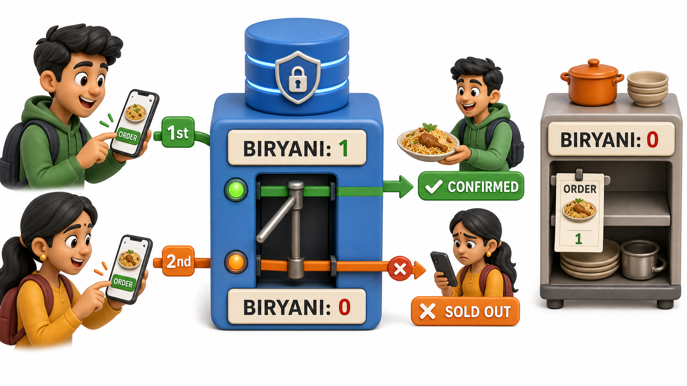

## Introduction

Tara is a second-year student waiting for her dinner order to arrive, half-watching the food delivery app as its little tracker slides from "preparing" to "picked up." A thought stops her mid-scroll: her cousin, who works in IT, mentioned last week that apps like this one lean on something called a database for almost everything they remember. Curious, Tara opens her banking app to check her balance, then the same college portal she uses every morning to see her attendance, and starts noticing the same pattern everywhere she looks. Three apps, ten minutes, and every one of them is quietly built on a database doing real work behind a screen she never has to think about.

## The Food Delivery App: A Race Against Itself

The instant Tara taps "confirm order," several related pieces of data are read and written almost simultaneously:

- Her saved address
- The restaurant's remaining stock of each dish
- The new order itself
- A status field that will crawl from "preparing" to "on the way" to "delivered" over the next half hour

A database is what stops two customers, both ordering the restaurant's last plate of biryani within the same few seconds, from both being told "confirmed."

Picture that same moment running on plain shared files instead. Two orders save at nearly the same instant, one overwrites the other's stock count, and the kitchen ends up promising a dish it no longer has, discovered only once a rider is already three streets away. That is the same lost-update failure a growing pile of spreadsheets runs into, just wearing a restaurant's apron.

## The Banking App: Where a Mistake Costs Real Money

Checking a balance is a simple read: the app asks "what is the current balance on this account" and gets back one trustworthy number. A transfer is a far riskier write, because it must decrease one account and increase another by the exact same amount, as a single coordinated action. If the connection dropped between those two steps and only the decrease was saved, the money would not sit in either account, it would simply cease to exist anywhere, undiscoverable by rechecking a balance.

This is exactly where a real database's coordination stops being a nicety and becomes the entire reason a bank can be trusted with money at all. The same guarantee is what lets Tara walk up to an ATM in another city, insert her card, and withdraw cash: the machine reads her balance from the same database her banking app reads from, and the withdrawal is written back to that same place, so the two never quietly disagree about how much money she actually has left.

## The College Portal: Tara's Own Attendance and Marks

Every morning, Tara logs into her college portal to check attendance and, once a term, her marks. Both screens are live reads from the same underlying data that the college office writes to. When a professor uploads marks for two hundred students at six in the evening, Tara's portal already reflects it five minutes later, with no manual syncing between two separate files and none of the drift that once let a single fact disagree with itself across two spreadsheets.

## The Pattern, Once You Know to Look For It

| App | What it reads | What it writes | What breaks without a real database |
|---|---|---|---|
| Food delivery | Menu, prices, saved address | New orders, live status updates | Two customers "confirmed" for the same last dish |
| Banking | Account balance | Transfers, deposits, withdrawals | Money vanishing mid-transfer |
| College portal | Attendance, marks, timetable | New marks, updated attendance | The same student's marks showing differently on two screens |

## A Habit Worth Building on Any App

Try this on any app still open on your own phone: name the data it must be remembering between one visit and the next, and ask what would actually go wrong if that data lived in three unsynchronized files instead of a properly managed database. A step counter drifting by a few hundred steps is a minor annoyance. A hospital's record of a patient's allergies drifting even slightly is not a minor annoyance at all, and neither is a transfer of five thousand rupees. Apps that feel instantly trustworthy earn that trust from a database working correctly every single time, not from good luck.

Tara starts keeping a mental list on her walk back from collecting her order: the ride-hailing app that just dropped a friend home was reading live driver locations from a database, the online class portal that reminds her of tomorrow's assignment deadline was reading it from a database, and even the campus Wi-Fi login screen that checked her roll number against a list of registered students was really just a database lookup wearing a login form. None of these felt like "database moments" while she was using them, which is precisely the point: the best-run databases are the ones nobody notices at all.

## Conclusion

Databases are not machinery reserved for banks or large corporations, they sit invisibly behind almost every app that remembers anything from one visit to the next, from a plate of biryani to a bank transfer to a set of exam marks. Every one of those examples is really the same coordination problem, solved at the scale of millions of users instead of a handful of office coordinators. Tara's ten minutes of scrolling through her food delivery order, her bank balance, and her attendance portal were really ten minutes spent watching the same kind of database quietly do its job three different times. Once you accept that databases are everywhere, a more interesting question follows: whether all of that data, across such different apps, is actually organized in the same shape underneath, or whether the word "database" quietly covers more than one kind of structure.
