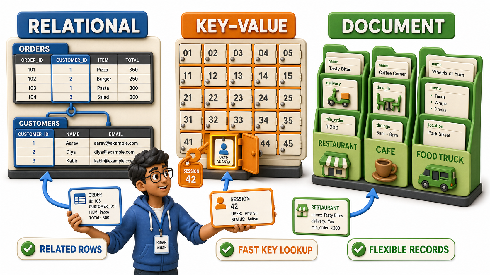
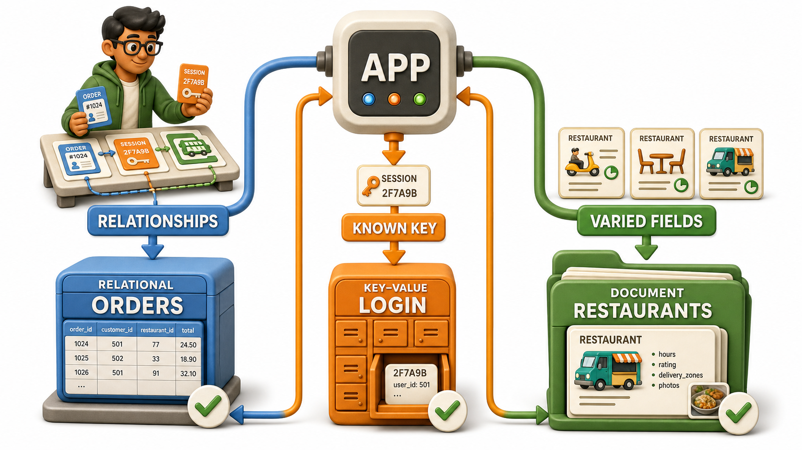

## Introduction

Kiran, a final-year student interning with a small software team, is given her first real task: help sketch out how the food delivery app her team is building should store its data. She assumes there is exactly one correct way to build a database, the way there is one correct way to build a spreadsheet, and says as much to her mentor. He laughs, not unkindly, and pulls up three very different systems already running behind apps she uses daily. "Database," she learns, does not mean one shape of storage. It means a family of shapes, each built for a different kind of data.

## The Relational Model: Neat Rows and Columns

A relational database stores data in tables, rows, and columns, similar to a strict, disciplined spreadsheet with fixed rules about what each column may hold and how separate tables connect to one another. The order history her team's app needs to keep, every order, its customer, its restaurant, and its final bill, fits this shape naturally, because every order has the same fields:

- An order ID
- A customer
- A total
- A status

Tables link to each other through shared identifiers instead of retyped detail.

This is the model PostgreSQL, MySQL, and SQLite are all built around, and it is the model this course spends most of its time on, for reasons that become clear once its structure is examined properly.

## Key-Value Stores: A Locker With a Number on It

A key-value database stores information as pairs: a key that is already known, and a value it returns instantly, with no relationships between different keys and no fixed set of fields at all. Picture a locker room where every locker carries a number and holds whatever was placed inside it. Asking "what is in locker 42" is instant. Asking "which lockers contain a red bag" is not a question this shape was built to answer, someone would need to open every locker to find out.

This fits the app's login sessions perfectly. The moment Kiran's app needs to answer "who is logged in right now, given this session key," it needs one instant answer, and that answer has no need to relate to any other user's session at all.

## Document Databases: Records Allowed to Differ

A document database stores each record as a single, self-contained bundle, often resembling a small nested form, where different records in the same collection are allowed to hold different fields entirely. One restaurant listing in the app might include a delivery-time estimate and a minimum order value, another restaurant in the exact same list might skip both and instead carry a "dine-in only" flag the first restaurant never needed.

A relational table would resist this kind of variation, since every row in a relational table is expected to share the same columns. A document database is built to embrace that variation rather than fight it.

## Comparing the Three Shapes

| Model | Shape of the data | Fits best when | Example from Kiran's app |
|---|---|---|---|
| Relational | Tables, rows, and columns with defined relationships | Data is structured and consistent, and relationships matter | Orders, customers, and restaurants, all sharing fixed fields |
| Key-value | A known key that returns its value instantly | Fast lookups by one key, no relationships needed | Remembering who is logged in, by session key |
| Document | Flexible, self-contained records that can vary in shape | Records genuinely differ from one another | Restaurant listings, each with its own mix of details |

## Choosing Is About Fit, Not Rank

None of these three models outranks the others, each simply fits a different shape of problem better. The app's order history, structured and tightly interrelated, is a natural fit for the relational model. The same app likely reaches for a key-value store for login sessions and a document database for its varied restaurant listings, three different shapes inside one single app, each chosen because it fits the job in front of it.

A habit worth carrying forward from this internship onward: before reaching for any particular database technology, ask what shape the data naturally takes on its own, structured and interconnected, a simple key-driven lookup, or flexible and record by record, and let that answer, not familiarity, decide the tool. This course chooses to go deep on one shape first.

## Conclusion

"Database" names a family of tools rather than one single structure. Relational databases organize data into related tables built for consistent, interconnected records, key-value stores trade relationships for extremely fast lookups by a known key, and document databases embrace records that vary in shape from one to the next inside the same collection. This course settles on the relational model as its foundation, because structured, interrelated data of exactly this kind is what most everyday systems, from an admissions office to a delivery app's order history, actually need to hold. Kiran can now walk back into her team's planning meeting and defend a design with three different stores, tables for orders, a key-value store for sessions, a document store for restaurant listings, as a deliberate choice rather than the one-size-fits-all system she originally assumed a database had to be. Having named the shapes data can take on the outside, the next question turns inward: what does the software that manages any of them actually look like on the inside.
