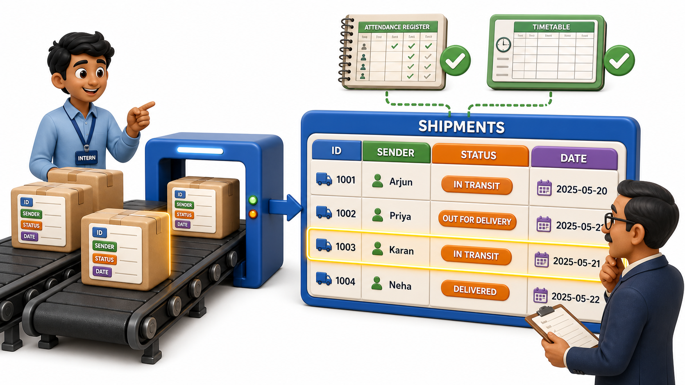
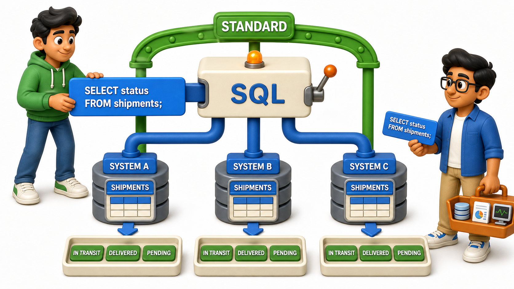

## Introduction

Farhan is interning at a logistics startup, and his manager hands him two proposals from two different engineers for the same delivery-tracking system. The first engineer wants to store every shipment as a neat grid of rows and columns: one row per shipment, columns for sender, receiver, status, and delivery date. The second engineer wants to store each shipment as a flexible bundle of key-value pairs, so that a shipment involving a customs form can simply carry extra fields that a normal domestic shipment never needs. Farhan cannot see why one option would clearly beat the other, so his manager asks him a different question first: "Forget which one is more flexible. Which one could literally any developer at this company sit down and query correctly on their very first day, without asking you a single question?" That question is really about the **relational model**, and specifically about why tables and a shared, standard query language remain the default starting point for building a serious database system, even when other shapes of storage exist.

## Tables Are Something Everyone Already Understands

A relational table is not a clever invention that requires special training to read. It is a grid, rows and columns, the same shape as a spreadsheet, an attendance register, or a printed timetable. Anyone who has ever glanced at a class list with names down the side and subjects across the top already has the right mental model for a relational table before they write a single line of code.

That familiarity has a real, practical payoff. When Farhan's manager reviews the shipments table, she does not have to reconstruct its shape in her head, she already knows what a row means and what a column means. Compare that to the flexible bundle-of-fields approach, where one shipment record might carry a field the next record does not, and understanding what "a shipment" even looks like requires reading through many examples first, or asking the person who designed it. A shape that everyone already understands is a shape that fewer people get wrong.

## SQL: One Language, Understood Everywhere

The second half of the answer is the query language itself. Relational databases are queried with **SQL**, a language for describing what result is wanted rather than the exact steps to fetch it. SQL was standardized decades ago and has stayed remarkably stable since, which means a query written for one relational database usually reads correctly, or very close to it, on a completely different relational database from a different vendor.

This matters enormously for Farhan's company. A developer who already knows SQL from a previous job can be productive on the shipments table within a day, because the language itself, the way conditions are written, the way results are shaped, does not need to be relearned from scratch. Compare that to a storage system with its own unique query syntax invented specifically for that one product; every new hire has to learn that syntax before they can be trusted to touch production data, and that knowledge rarely transfers anywhere else.

## Why "Industry Standard" Is Not Just a Slogan

Calling something an industry standard can sound like marketing, but here it describes something concrete and checkable: decades of accumulated tooling, documentation, hiring pools, and battle-tested behavior. This is the kind of everyday tooling that overwhelmingly expects a relational database with SQL underneath it, because that is what the vast majority of production systems have run on for a very long time:

- Backup tools
- Reporting dashboards
- Spreadsheet import and export features
- Monitoring systems

Farhan's manager makes this concrete with a small test: she asks him to imagine the company needing to hire three more backend developers next quarter. If the shipments system is built on tables and SQL, almost any candidate who has worked on a backend before can be productive quickly. If it is built on a system invented specifically for this one company, every hire needs weeks of ramp-up just to understand the storage layer before they can be trusted to write a single feature. Standardization is not glamorous, but it is exactly the kind of thing that saves real time and money once a system has to be maintained by more than one person, for more than one year.

## Relational Databases at a Glance

| Reason | What it means in practice |
|---|---|
| Tables match everyday intuition | Rows and columns are already familiar from spreadsheets and lists |
| SQL is standardized | A query written for one relational database mostly transfers to another |
| Huge hiring pool | Most backend developers already know SQL before joining a team |
| Mature tooling | Backup, reporting, and monitoring tools are built assuming a relational database |
| Strong guarantees | Relational systems are built around keeping data consistent and correct, not just fast |

## This Is a Starting Point, Not a Verdict

None of this means every kind of data belongs in a table, or that other storage shapes never make sense. Some data genuinely fits a flexible, bundle-of-fields shape better, and plenty of successful systems combine a relational database for their core data with a different kind of store for a specific specialized need. What makes tables and SQL the sensible starting point is that they are the shape most developers already understand, the language most systems already speak, and the approach with the deepest, most mature ecosystem behind it. Learning that shape first means every other kind of database encountered later gets compared against a solid, well-understood baseline instead of being the very first thing ever learned.

Farhan's manager makes her decision by the end of that conversation: the shipments system will be built as tables, queried with SQL. Not because the other proposal was wrong to consider, but because starting with the option that every future teammate can already read, query, and reason about correctly is simply the safer bet for a system meant to last.

## Conclusion

Relational databases earn their place as the default starting point because tables are a shape people already understand, and SQL is a language that transfers across systems, jobs, and years instead of expiring the moment one particular product falls out of fashion. That combination of familiarity, standardization, and mature tooling is why this course, like most serious backend systems, begins here rather than with a less conventional alternative. Farhan's manager settles on the shipments table precisely because it is the option any future hire, not just today's team, can already read, query, and reason about correctly. With the reason for that choice settled, the more human question remains: once a relational database like this one is actually running, who exactly is on the other end of it day to day, typing the searches, writing the code, and keeping the whole thing healthy.
