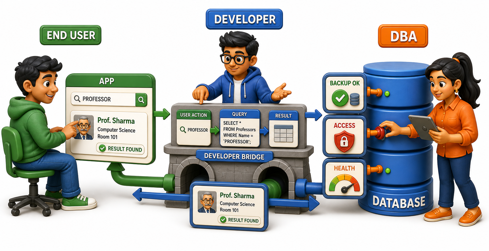
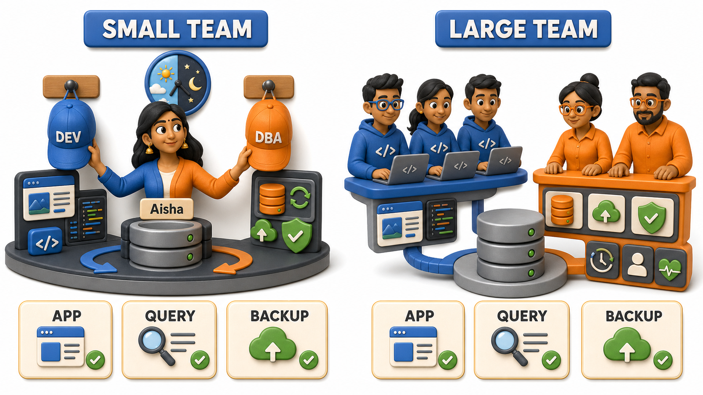

## Introduction

Ravi, a first-year student, types a professor's name into his college portal's search box and gets office hours and a contact email back in under a second. He never wonders how that search actually works, and he never needs to, he has already moved on to checking his timetable. That same afternoon, Kiran, the developer who built the portal, spends an hour writing the exact instruction that decides what counts as a professor's name "matching" a search, whether a partial spelling should count, for instance. That evening, the college's database administrator, a woman named Aisha, spends twenty minutes confirming that the previous night's backup of the entire portal actually completed without errors. Same database, same single day, three completely different relationships to it.

## End Users: People Who Never See the Data Directly

An **end user** interacts with a database only through an application's screen, never through the database itself. Ravi typed a professor's name into a search box and read a result, he has no idea, and no need to have any idea, whether that search ran against a relational database or something else entirely.

This describes nearly everyone encountered so far: the food delivery customer waiting on a status update, the banking app user checking a balance, the student checking attendance on a portal. Their entire experience of a database is a screen that simply works, correctly and quickly, with every internal part staying completely out of sight.

## Developers: People Who Build the Bridge

A **developer** writes the code that sits between an end user's screen and the database itself, translating an action such as typing a name and pressing "Search" into an actual request the query processor can answer, and translating the result back into something readable on screen. The portal's search box did not build itself. Someone had to decide precisely what request to send the moment a name is typed, and precisely what "matching" should mean, the exact question Kiran spent her afternoon on.

This is the audience most technical courses are built for. Learning to speak directly and precisely to a database is exactly the skill that turned "should a partial spelling count as a match" from an offhand question into a real, working piece of logic.

## Administrators: People Who Keep the Whole System Healthy

A **database administrator**, often shortened to DBA, is responsible for the database as a whole:

- Who is allowed to access which data
- Whether backups are actually completing
- Whether the system holds up under real load
- What happens if a server fails outright

Aisha does not write the portal's search logic, but she decided that only staff may view a student's full academic history while students may view only their own, and she is the one who spent twenty minutes this evening confirming last night's backup genuinely finished, rather than discovering a gap only once something is already lost.

None of this work shows up as a feature anyone can point to. Nobody thanks Aisha when a search returns fast results or when a semester passes without a single lost record, because a DBA's success looks exactly like nothing going wrong. It is only the rare bad week, a server that crashes during exam result uploads, or a backup that silently failed for a month, that makes her job visible at all, which is precisely why colleges and companies alike are willing to pay for someone to do it full time.

## The Three Roles at a Glance

| Role | What they do | Today's example |
|---|---|---|
| End user | Uses an application built on top of a database, never the database directly | Ravi, searching for a professor's name |
| Developer | Builds the application that talks to the database on the end user's behalf | Kiran, deciding what counts as a matching search |
| Administrator | Manages access, backups, and the health of the database itself | Aisha, confirming last night's backup completed |

## One Person, More Than One Role

These roles are not always three separate people. A small college might have Aisha wearing both the developer's and the administrator's hats on different days, while a large company might split each role across whole teams, dozens of developers writing features and a separate team of DBAs watching over the servers those features depend on. What matters is not the headcount but recognizing, moment by moment, which relationship to the database a given task actually requires, since each one demands genuinely different knowledge. Ravi needed none of it. Kiran needed to think precisely about how a search should behave. Aisha needed to understand backups and access rules that neither of the other two had any reason to think about that day.

## Conclusion

A database rarely serves just one kind of person across its lifetime. End users interact with it only through an application's surface, developers build that application by speaking to the database directly, and administrators keep the whole system healthy, secure, and running underneath both of them. Ravi will never need to know this, and that is exactly the point, his simple search for a professor's name only works instantly because Kiran built the matching logic and Aisha kept the backups and access rules quietly intact underneath it. Most of what comes next in this course is aimed squarely at the developer's relationship with a database, learning to ask it precise questions and trust the answers it returns. But every piece of data behind those questions has its own life story, from the moment it is first entered to the moment it is finally deleted, and that story is worth following start to finish.
