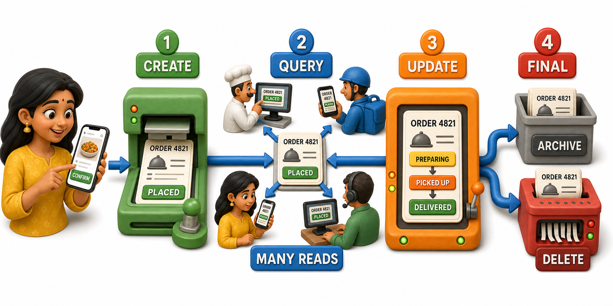
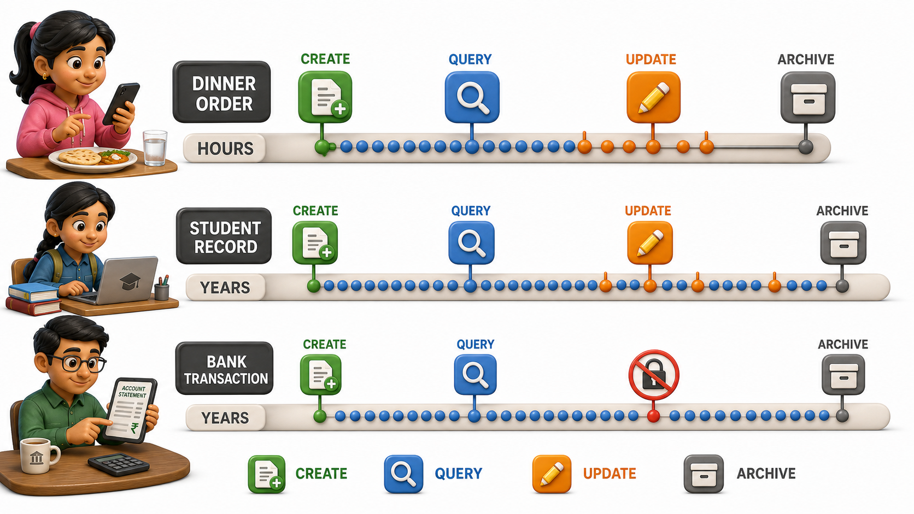

## Introduction

Asha orders dinner through a food delivery app on a Tuesday evening, a small, unremarkable action she has repeated hundreds of times. Somewhere behind that one tap, a single row of data is born, and over the next few hours, weeks, and eventually months, that row will be read, changed, read again, and finally either deleted or quietly filed away. Most people, Asha included, never think about what happens to their data once the food arrives. Following her one order from start to finish reveals a pattern every piece of data in every database eventually goes through, called its **lifecycle**.

## Creation: The Order Is Born

The moment Asha taps "confirm order," a new record is created, holding:

- Her order ID
- The restaurant
- The items she chose
- The total amount
- Her delivery address
- A status field that begins as `placed`

This is the first stage of the lifecycle, and it is the simplest to picture, a brand new fact entering the database for the very first time, exactly once.

Nothing about this record is finished yet. It has only just begun its working life.

## Query: The Record Is Read, Many Times Over

Between the moment Asha's order is placed and the moment it reaches her door, that single record is read far more often than it is changed. The restaurant's kitchen screen reads it to know what to cook. The delivery app reads it every few seconds to update the little tracker Asha keeps refreshing. The rider's app reads it to know where to go. Asha herself reads it half a dozen times, checking the estimated arrival time.

This is the ordinary, everyday shape of most data in most systems: created once, then queried repeatedly by many different people and programs, each asking for the same underlying facts for a different reason.

## Update: The Record Changes as Life Moves On

The order record does not stay frozen at `placed`. As the evening goes on, its status field is updated: `preparing`, then `picked up`, then `delivered`. Each update changes the same row rather than creating a new one, which is precisely why Asha's tracker shows one order moving through stages instead of a growing list of separate, disconnected orders.

Updates are not limited to status. If Asha calls the restaurant to add an extra item before the kitchen starts cooking, the total amount and item list on that same record change too, again in place, still the same order.

## Deletion or Archival: The Record's Final Stage

Once Asha's food is delivered and paid for, the order does not usually vanish immediately. Most apps keep it around for a while, since Asha will likely want to see it in her order history, reorder the same items next month, or raise a complaint if something arrived wrong. Eventually, though, very old orders are either deleted outright or moved into long-term storage the app rarely touches directly, often called archiving, to keep the active, frequently searched data lean and fast.

Which choice a system makes, delete outright or archive quietly, depends on why the data might still matter later: a bank keeps transaction records for years because law and trust demand it, while a temporary discount code might be deleted the day it expires because nothing will ever need to look at it again.

## The Lifecycle at a Glance

| Stage | What happens to Asha's order | How often it happens |
|---|---|---|
| Creation | The order record is inserted the moment she confirms it | Exactly once |
| Query | Kitchen, rider, and Asha's own app repeatedly read the record | Many times, by many different readers |
| Update | Status moves from placed to preparing to delivered, and details can change | A handful of times |
| Deletion or archival | The record is eventually removed or moved to long-term storage | Once, much later |

## Why This Pattern Matters Beyond One Order

This same shape, created once, queried constantly, updated occasionally, and eventually deleted or archived, repeats across almost every kind of data a database ever holds. A student's admission record is created once, queried every time attendance or marks are checked, updated when a category or address changes, and eventually archived long after graduation. A bank transaction is created once, queried whenever a statement is generated, essentially never updated once it is confirmed, and retained for years before any thought of deletion. Recognizing which stage a given piece of data is usually sitting in helps explain why some systems are built to answer reads blazingly fast, while others are built to guard every single update far more carefully.

## Conclusion

Every piece of data in a database moves through the same rough arc: it is created once, read far more often than it is changed, updated as circumstances shift, and eventually deleted or set aside once it stops earning its place among the actively used records. Asha's dinner order lived out that entire arc in a single evening, while an admission record or a bank transaction might take years to reach its final stage. Seeing data this way, as something with a beginning, a working life, and an end, sets up the deeper question of exactly how that data ought to be shaped and connected from the very first moment it is created, so that every stage of its life goes as smoothly as Asha's dinner did.
