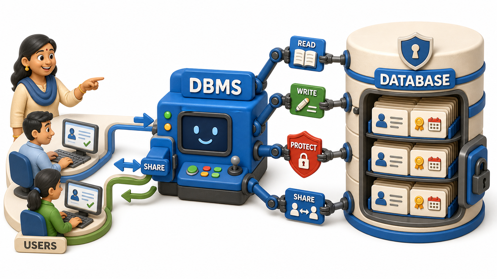
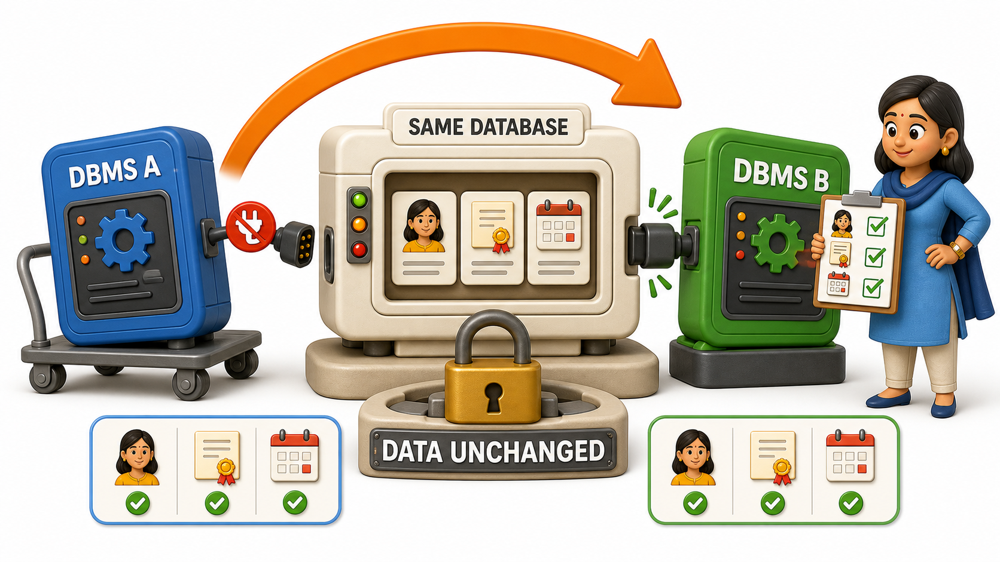

## Introduction

The lost interview slots are the final straw, and Priya's admissions office gets approval to buy proper software.

The vendor's proposal document lands on Meera's desk, she is the office manager, and two words appear side by side throughout it: "`database`" and "DBMS." Meera had always treated them as interchangeable, the way people say "PDF" when they mean "document." One sentence in the proposal refuses to let that slide: "PostgreSQL is the DBMS that will manage your admissions `database`." If PostgreSQL and the admissions `database` are described as two separate things, then they must actually be two separate things, and Meera cannot sign off on a purchase she does not understand.

## Definition

**Definition:** A `database` is the organized data, and a DBMS is the separate software built specifically to manage that data safely on its behalf, and the two words are never interchangeable no matter how often vendors blur them together.

## A Database Is the Organized Data Itself

A **`database`** is an organized collection of related data, structured so it can be stored, retrieved, and updated reliably. For Meera's office, that means the actual facts, held together as one coordinated collection instead of scattered across `applicants.xlsx`, `documents.xlsx`, and `interviews.xlsx` with nothing enforcing how they relate to each other:

- Every applicant's details
- Every uploaded certificate
- Every interview slot and outcome

Here is a test worth applying whenever the two words blur together: if every computer in the office lost power for a week, would the `database` still exist? Yes, sitting untouched on disk, the same way a locked drawer of paper files would survive a power cut. A `database` is content, not machinery.

## A DBMS Is the Software That Manages the Data

A **DBMS**, short for Database Management System, is the software responsible for creating, storing, retrieving, updating, and protecting that data on its behalf. PostgreSQL, in the vendor's proposal, is not the admissions office's actual records.

It is the program that will sit between Kabir's team and those records, refusing to save an interview slot for an applicant ID that does not exist, letting two coordinators' simultaneous edits through without silently discarding one, and keeping the data intact even if a server crashes mid save.

PostgreSQL, MySQL, and SQLite are three real, separate pieces of software that each do this same job, each capable of managing a `database`, and each speaking a very similar language to do it, the language this course reaches directly once `tables` are on the `table`.

## Database vs. DBMS at a Glance

<table style="border-collapse: collapse; width: 100%; margin: 1rem 0; font-size: 0.95rem;">
  <thead>
    <tr>
      <th style="border: 1px solid #c8d7ea; padding: 10px 12px; text-align: left; background-color: #dceeff; color: #102a43; font-weight: 700;"></th>
      <th style="border: 1px solid #c8d7ea; padding: 10px 12px; text-align: left; background-color: #dceeff; color: #102a43; font-weight: 700;">Database</th>
      <th style="border: 1px solid #c8d7ea; padding: 10px 12px; text-align: left; background-color: #dceeff; color: #102a43; font-weight: 700;">DBMS</th>
    </tr>
  </thead>
  <tbody>
    <tr style="background-color: #ffffff;">
      <td style="border: 1px solid #d8e2ef; padding: 9px 12px; vertical-align: top;">What it is</td>
      <td style="border: 1px solid #d8e2ef; padding: 9px 12px; vertical-align: top;">The organized data itself</td>
      <td style="border: 1px solid #d8e2ef; padding: 9px 12px; vertical-align: top;">The software that manages that data</td>
    </tr>
    <tr style="background-color: #f7fbff;">
      <td style="border: 1px solid #d8e2ef; padding: 9px 12px; vertical-align: top;">Admissions example</td>
      <td style="border: 1px solid #d8e2ef; padding: 9px 12px; vertical-align: top;">The applicant records, documents, and interview schedule</td>
      <td style="border: 1px solid #d8e2ef; padding: 9px 12px; vertical-align: top;">PostgreSQL, the software named in the vendor&#x27;s proposal</td>
    </tr>
    <tr style="background-color: #ffffff;">
      <td style="border: 1px solid #d8e2ef; padding: 9px 12px; vertical-align: top;">Survives a power cut untouched</td>
      <td style="border: 1px solid #d8e2ef; padding: 9px 12px; vertical-align: top;">Yes, it is stored content</td>
      <td style="border: 1px solid #d8e2ef; padding: 9px 12px; vertical-align: top;">The program itself also just sits on disk, but its job is acting on the data while running</td>
    </tr>
    <tr style="background-color: #f7fbff;">
      <td style="border: 1px solid #d8e2ef; padding: 9px 12px; vertical-align: top;">Safe to edit directly by hand</td>
      <td style="border: 1px solid #d8e2ef; padding: 9px 12px; vertical-align: top;">No, that risks the exact redundancy and lost-update problems already seen</td>
      <td style="border: 1px solid #d8e2ef; padding: 9px 12px; vertical-align: top;">Yes, this layer exists specifically to make safe, coordinated editing possible</td>
    </tr>
  </tbody>
</table>

## Why Meera Cannot Treat Them as the Same Word

Before Meera signs anything, she asks the vendor a pointed question: if the college later switches from PostgreSQL to a different product, does the admissions office lose any applicant records, certificates, or interview history? The honest answer is no. The applicant names, categories, and interview outcomes are one fixed body of facts, and only the software reading and writing them would change.

A vendor who blurs "`database`" and "DBMS" together is quietly steering Meera toward worrying about the wrong thing. Her real concern should be whether the data itself survives any future change untouched, not which brand happens to be managing it this year.

## What Buying a Real DBMS Actually Buys

Held up against the familiar failures of plain shared files, a DBMS earns its price directly:

- **Against redundancy**, it lets a fact such as an applicant's phone number be stored once and referenced wherever it is needed, instead of retyped into every file that mentions it.
- **Against inconsistency**, because that fact now lives in exactly one place, updating it there is enough, with no forgotten second copy left disagreeing later.
- **Against `lost updates`**, it coordinates two people saving changes at nearly the same moment, so one genuine update is never silently thrown away by the other, the exact failure that cost a coordinator her confirmed interview slots.

## Your Turn: Database or DBMS?

For each item below, decide whether it is describing the **`database`** (the organized data itself) or the **DBMS** (the software managing it).

1. The list of every registered student, their roll numbers, and their attendance records, sitting on the college server.
2. MySQL, installed on that same server, running the process that answers every query the portal sends.
3. The moment the college migrates from MySQL to PostgreSQL and every student record is copied across untouched.

Item 1 is the `database`: it is the organized content, the actual facts about students and attendance. Item 2 is the DBMS: it is the software doing the work of storing, retrieving, and protecting that content. Item 3 is the clearest proof of the distinction: if the two words meant the same thing, swapping the software would mean swapping the data too, but the records survive the migration completely unchanged, exactly because a `database` and its DBMS are two separate things.

## Conclusion

A `database` is the organized data, and a DBMS is the separate software built specifically to manage that data safely on its behalf, and the two words are never interchangeable no matter how often vendors blur them together. The test survives any real scrutiny: swapping the DBMS should never touch the underlying data, and any proposal that confuses the two is quietly asking the wrong question.

Meera can now sign off on Priya's admissions software with a clear answer to her own question, the applicant records, documents, and interview slots are the `database`, and PostgreSQL is simply the replaceable software minding them. With that vocabulary settled, it is worth noticing that this same pattern, a `database` quietly managed by a DBMS, is not unique to one admissions office, it is already running behind the ordinary apps that fill an average evening.
