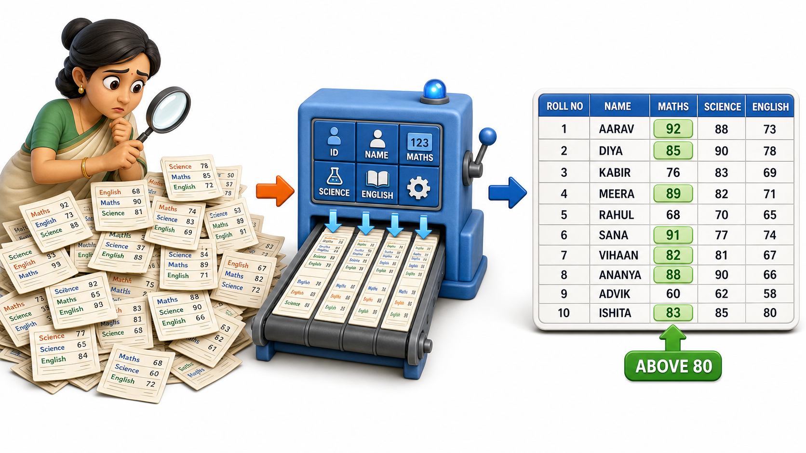
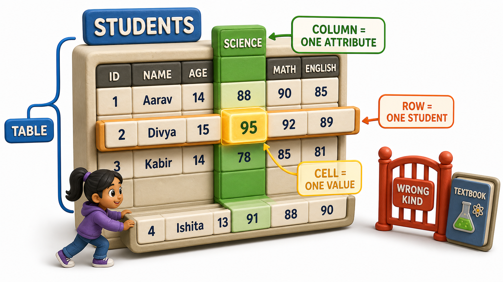

## Introduction

Meera teaches Class 10 at a school in Pune, and every exam season she ends up with the same forty loose sheets of paper on her desk, one per student, each filled in by hand: a name at the top, then Maths, Science, and English marks scribbled underneath in whatever order the student felt like writing them. When the vice-principal asks her, "Which students scored above 80 in Maths?", Meera has no shortcut. She has to lift each sheet, hunt for the Maths line, note the number, and move to the next sheet. Forty times.

One evening she gets tired of this and rules a grid into her notebook instead. Across the top she writes headings: Roll No, Name, Maths, Science, English. Down the side, one row per student, in the same roll-number order every time. Now the vice-principal's question takes ten seconds. Meera runs her finger down the Maths column and simply reads off the names sitting above 80.

Nothing about the underlying facts changed. The marks are the same marks. What changed is the shape she put them in. A grid where every row describes one student, and every column describes one fact that is true of every student in exactly the same way, is what a database calls a **table**. Learning to think in tables, rows, and columns, rather than in loose freeform notes, is the very first habit a database designer builds, and it is the idea this entire course rests on.

## From a Pile of Sheets to a Table

Here is roughly what Meera's grid looks like once she has ruled it out properly.

| Roll No | Name | Maths | Science | English |
|---|---|---|---|---|
| 101 | Ananya Rao | 78 | 85 | 91 |
| 102 | Kabir Mehta | 88 | 74 | 69 |
| 103 | Divya Nair | 92 | 95 | 88 |
| 104 | Rohit Sharma | 65 | 70 | 73 |

Notice what this small grid buys her. Every student's information lives in exactly one row, so nothing about Divya is scattered across three different pieces of paper. Every column holds exactly one kind of fact, so the Maths column never accidentally contains an English score. And because every row has the same set of columns in the same order, comparing student to student, or scanning a single column, becomes mechanical instead of a treasure hunt.

This is precisely what a relational database does at a much larger scale. Instead of forty loose sheets, it might hold four hundred thousand student records, and instead of a ruled notebook page, it stores the grid as a proper structure the software understands. But the underlying idea is identical to what Meera arrived at with a pencil and a ruler.

## A Table Is a Named Collection of the Same Kind of Thing

A table is not just any grid. It has a name, "Students," "Orders," "Books," and every single row inside it represents one instance of that same kind of thing. A Students table holds students and nothing else. It would be strange, and genuinely confusing, to slip a row describing a textbook into the middle of a table meant to hold students, even though both a student and a textbook can be described using words and numbers.

Two ideas fall out of this naturally:

- A **row** is one specific instance of the thing the table is about. In the grid above, the row for roll number 103 is Divya Nair specifically, her marks and nobody else's. Add a new student to the class, and you add exactly one new row. Databases sometimes call a row a "record" or a "tuple," but the idea stays the same: one row, one instance.
- A **column** is one named attribute that every row in the table has, whether or not that particular row's value is exciting. Every student has a Maths score, even the student who scored zero. Every student has a Name, even if two students happen to share one. A column defines a slot that exists for every row, consistently, so that the same question ("what is this student's Science mark?") always has a predictable place to be answered from.

## Why Rows Must Stay Uniform

It is tempting, especially when a spreadsheet is being built quickly, to let one row grow an extra column that no other row has, say, a "Sports Quota" note scribbled only next to Rohit's name. A relational table resists this. Every row in a table shares exactly the same columns, in the same order, meaning the same thing for each row. If Sports Quota genuinely matters, it becomes a proper column that every row has, even if most rows simply leave it blank. This uniformity is what lets Meera's finger-scan down the Maths column work at all: if some rows quietly had "Maths" and others had "Mathematics" or "Maths (retest)," scanning a single column would stop being reliable.

This same uniformity is what makes a table something a computer can process quickly and correctly at massive scale, long after Meera's notebook has run out of pages.

## Tables, Rows, and Columns at a Glance

| Term | What it represents | In Meera's grid |
|---|---|---|
| Table | A named collection of things of the same kind | The Students table |
| Row | One specific instance of that kind of thing | The row for Divya Nair, roll number 103 |
| Column | One named attribute every row has | Maths, Science, English |
| Cell | The single value where a row meets a column | Divya's Science mark, 95 |

Once you can look at any everyday list, a class register, a hostel occupancy sheet, a cricket team's scorecard, and instantly ask "what would the table, the rows, and the columns be here?", you already possess the relational way of thinking that every database design decision in this course builds on.

## Conclusion

A relational database is, at its heart, nothing more mysterious than Meera's ruled grid: a named table holding rows of the same kind of thing, with columns that describe one consistent fact about every single row. That simple discipline of uniform rows and named columns is what turns a pile of scattered facts into something a person, or a program, can search, sort, and trust.

Once a table's shape is settled, a natural question follows almost immediately: what exactly is allowed to sit inside a given column, and what would count as an obviously wrong value for it to hold.
