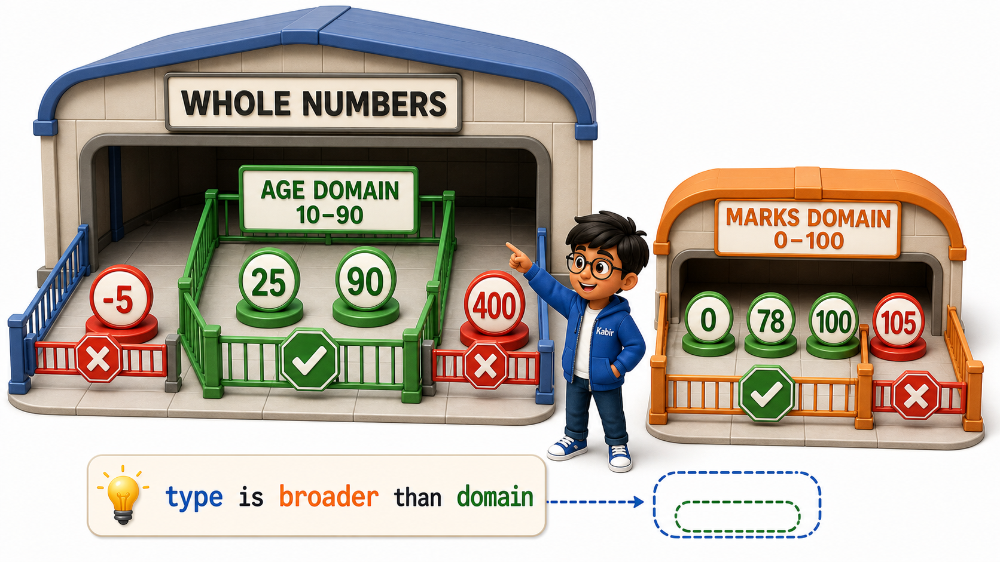

## Introduction

Kabir runs a small gym membership desk in Bengaluru and keeps a signup register for new members. One afternoon a new member fills in the form: name, phone number, and age. Under "Age," the member, in a hurry, writes "twenty-five." Under "Phone," someone else once wrote "call my brother instead." Kabir stares at both entries and realises his register has a problem that has nothing to do with the people filling it in. The register never told anyone what kind of answer belonged in each box.

He redraws the form. Next to "Age," he now prints a small note: "whole number, 10 to 90." Next to "Phone," he prints: "10 digit mobile number, digits only." Suddenly the boxes are no longer just blank spaces waiting for whatever someone feels like writing. Each box has a personality of its own: a set of answers that are acceptable, and everything else that simply is not.

That personality is exactly what a database means by a column's **domain**. Every column, or **attribute**, in a table has a name, and behind that name sits a domain, the complete set of legal values that column is ever allowed to hold. An "Age" column's domain might be whole non-negative numbers within a sensible range. An "Email" column's domain is the set of text values shaped like a valid email address. Understanding attributes and domains is what lets a database catch a nonsense entry before it ever becomes a row.

## An Attribute Is More Than Just a Label

A column is a named attribute every row has, but that name alone is only half the story. Consider Kabir's Members table.

| Member ID | Name | Age | Phone | Email |
|---|---|---|---|---|
| 1 | Farah Sheikh | 25 | 9845012233 | farah.sheikh@example.com |
| 2 | Vivek Iyer | 31 | 9900112244 | vivek.iyer@example.com |
| 3 | Naina Kapoor | 19 | 9811223344 | naina.kapoor@example.com |

The column named "Age" is not just a label sitting at the top of the grid. It is a promise about every single value underneath it: each one will be a whole number, it will never be negative, and it will realistically fall somewhere a human lifespan makes sense, say 10 to 90. The column named "Email" carries a different promise entirely: every value underneath it will look like text with an "@" symbol and a domain name, never a bare number, never a sentence, never someone's phone number typed into the wrong box.

## Domain: The Set of Legal Values

A **domain** is the complete set of values a given attribute is permitted to hold. Age's domain is not "any number at all," it deliberately excludes -5, 400, and "twenty-five" written as words. Phone's domain is not "any text," it excludes "call my brother instead" just as firmly as it excludes a five-digit number. Defining a domain is really answering one question in advance, for every future value that column will ever receive: what does a correct answer here actually look like?

A few everyday examples make this concrete.

- A column for **age** should only ever hold whole, non-negative numbers, realistically bounded, since nobody's age is -5 or 3.7.
- A column for **email** should only hold text shaped like a valid email address, containing an "@" and a domain part, not a phone number and not a random sentence.
- A column for **date of birth** should only hold values that are genuine calendar dates, and never a date sitting in the future.
- A column for **gender** at many organisations is restricted to a short, fixed list of allowed labels, rather than accepting any free text a person types in.
- A column for **marks out of 100** should only hold numbers from 0 to 100, since 105 or -10 cannot be a real score on that scale.

Notice that a domain is not just about the type of value, whole number versus text, it is also about which values within that type actually make sense. Both -5 and 25 are whole numbers, but only one of them belongs in Age.

## Why Domains Matter Before a Single Row Is Ever Entered

Kabir's original, undefined register let anyone write anything, and the result was chaos: an age written as a word, a phone number that was not a phone number at all. The moment he wrote down a domain for each box, the boxes themselves started doing part of his job for him. A person filling the age box now knows, before writing anything, that the expected answer is a small whole number, not a sentence.

This matters even more inside an actual database, because a database is meant to answer questions reliably at scale. If even a handful of rows in a million-row Members table have "Age" values like "young" or "N/A" or "25 years," any calculation that tries to find the average age, or list members between 20 and 30, either breaks outright or quietly produces a wrong answer. Defining a strict domain for every attribute, before data starts arriving, is what keeps a table trustworthy as it grows from four rows to four million.

## Attributes and Domains at a Glance

| Attribute | What it represents | A sensible domain |
|---|---|---|
| Age | A member's age in completed years | Whole numbers, roughly 10 to 90 |
| Email | A member's contact email address | Text shaped like name@domain, containing an "@" |
| Phone | A member's mobile number | Exactly 10 digits, digits only |
| Gender | A member's recorded gender | One of a short fixed list of allowed labels |
| Marks | A score out of 100 on an exam | Whole numbers from 0 to 100 |

A useful habit, whenever you meet a new column in any table for the rest of this course, is to pause and ask two questions: what kind of value is this attribute meant to hold, and what values, even though they might technically be the same type, would actually be nonsense here. That second question is usually the more revealing one.

## Conclusion

An attribute is a column's name, but its domain is the promise behind that name, the exact boundary of values the column will ever legitimately hold. Fixing that boundary in advance, before a single row exists, is what stops a database from quietly filling up with entries that look like data but mean nothing, an age written as a word, a phone number that is really a sentence. Kabir's redrawn signup form is really an early, informal version of exactly this idea, the moment he wrote "whole number, 10 to 90" next to Age, he was defining a domain, and no new member will ever again be able to write "twenty-five" in that box.

Once a table's attributes and their domains are settled, a sharper question naturally follows: among all these columns, which one, or which combination of them, can be trusted to tell two rows apart with total certainty, even when every other value in those rows happens to match.
