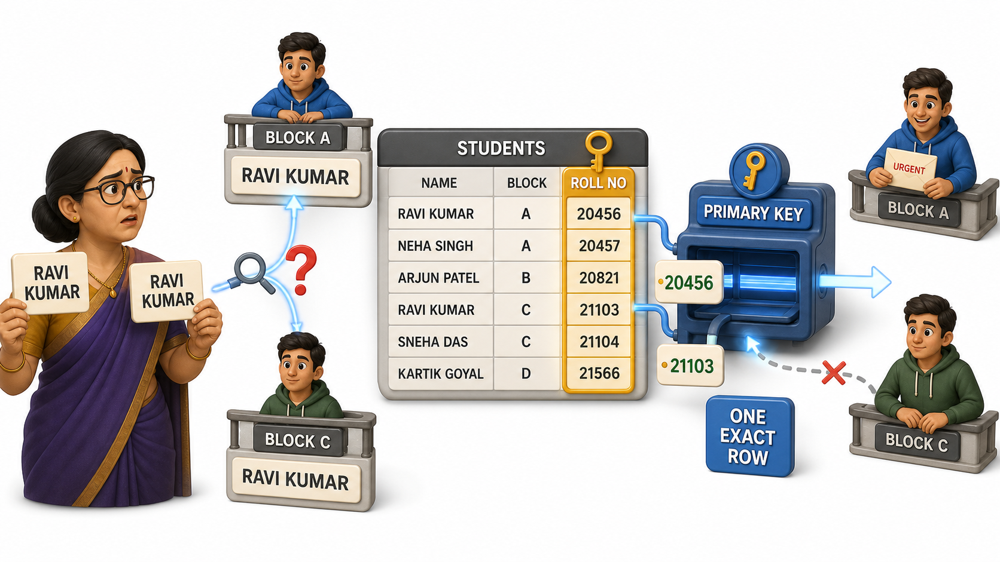
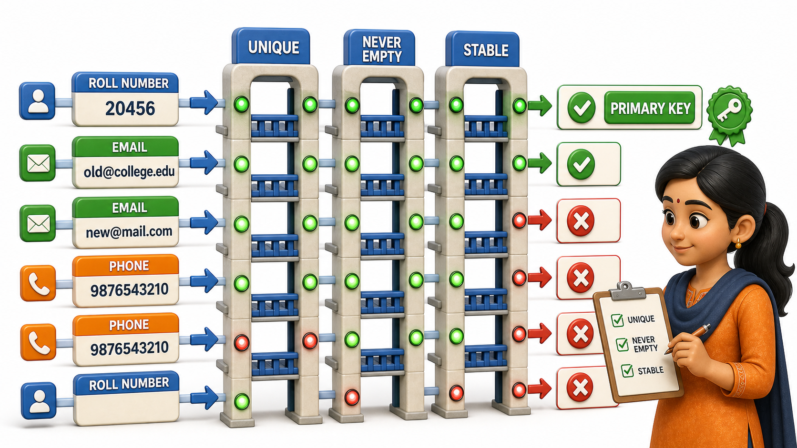

## Introduction

Tara is a hostel warden at a college in Manipal, and her hostel register has an entry problem she only discovers the hard way. Two students, both named Ravi Kumar, are staying in the hostel this year, one in Block A and one in Block C. When the college office calls to say "Ravi Kumar has an urgent message from his family," Tara has no way to know which Ravi Kumar they mean. Name alone cannot tell the two apart, because a name is just another attribute, and nothing stops two different people from sharing one.

That night, Tara adds a new column to her register that she had never bothered with before: Roll Number. Every student at the college is issued a roll number when they join, and no two students, ever, share the same one. From that point on, "Ravi Kumar, Roll No. 20456" and "Ravi Kumar, Roll No. 21103" are two names that can never be confused for each other again, no matter how many more Ravi Kumars enrol in future years.

What Tara stumbled into is one of the most important ideas in the relational model. A table needs some column, or combination of columns, whose value is guaranteed to be different for every single row, so that any one row can always be picked out with total certainty. That column is called the table's **`primary key`**.

## Why "Just Search by Name" Falls Apart

It is tempting to think a database can always find the row it needs by searching on whatever attribute seems most natural, a name, a title, a city. The trouble is that almost none of those attributes are actually guaranteed to be unique. Look at what Tara's Students table would contain without a dedicated identifying column.

| Name | Block | Course |
|---|---|---|
| Ravi Kumar | A | B.Tech CSE |
| Ravi Kumar | C | B.Tech ECE |
| Aisha Fernandes | B | B.Sc Physics |

Ask this table "give me Ravi Kumar's details," and it cannot answer with confidence, because two rows both satisfy that description. This is not a rare edge case invented for a lesson, it is an everyday reality the moment a table grows past a handful of rows: names repeat, cities repeat, even phone numbers occasionally get reassigned. Without something that is guaranteed unique, a table cannot promise that any question about "this one row" has a single, correct answer.

## What a Primary Key Actually Guarantees

A **`primary key`** is a column, or a small combination of columns, whose value uniquely identifies each row in a table, so that no two rows ever share the same `primary key` value. Add Roll No. to Tara's table, and the ambiguity disappears entirely.

| Roll No | Name | Block | Course |
|---|---|---|---|
| 20456 | Ravi Kumar | A | B.Tech CSE |
| 21103 | Ravi Kumar | C | B.Tech ECE |
| 20789 | Aisha Fernandes | B | B.Sc Physics |

Now "give me the student with Roll No. 20456" has exactly one possible answer, always. A `primary key` carries two firm promises that every other column in the table is free to ignore:

- It must be **unique**: no two rows are ever allowed to hold the same `primary key` value, not by accident and not by design.
- It must never be left **empty**: every row must have a `primary key` value, because a row with no identifying value is a row nothing else in the database can reliably refer back to.

## Choosing a Good Primary Key

Not every unique-looking column makes a wise `primary key`. A student's email address happens to be unique in Tara's hostel today, but students occasionally change their email addresses, and a `primary key` that can change underneath a table is far more fragile than one that cannot. A phone number is similarly risky, since phone numbers get reassigned to new owners over the years. Roll number, by contrast, is assigned once by the college, never reused for a different student, and never changed for the life of that student's enrolment. That combination, unique and stable for the row's entire lifetime, is exactly what makes a strong `primary key`.

Real-world tables reach for the same pattern constantly, because most collections of things already have some naturally unique code attached to them.

| Table | A natural primary key |
|---|---|
| Students | Roll number |
| Books in a library | ISBN |
| Employees | Employee ID |
| Bank accounts | Account number |
| Passengers on a flight | Ticket / PNR number |

## Primary Keys at a Glance

| Property | What it means |
|---|---|
| Uniqueness | No two rows in the table may share the same primary key value |
| Never empty | Every row must have a primary key value, with nothing left blank |
| Stability | A good primary key rarely, if ever, changes once assigned |
| Purpose | Lets any single row be picked out with total, unambiguous certainty |

A quick way to test whether a column deserves to be a table's `primary key` is to imagine the table growing to a hundred thousand rows and ask: could two rows ever, even by rare coincidence, end up with the same value in this column? If the honest answer is yes, that column cannot be trusted alone as the `primary key`, and the table needs either a different column or, sometimes, more than one column working together to guarantee uniqueness.

## Conclusion

A `primary key` is the column, or combination of columns, a table leans on to guarantee that every row can always be told apart from every other row, no matter how large the table grows or how many rows happen to share the same name, city, or course. Without one, a table can only ever offer probable answers, and a database that only deals in probabilities is not one anyone can fully trust. Tara's hostel register no longer has to guess which Ravi Kumar the office is calling about; Roll No. pins down 20456 in Block A or 21103 in Block C with total certainty, exactly the guarantee a `primary key` exists to provide.

Once a table can reliably identify each of its own rows, the next natural step is letting one table reach across and point at a specific row living inside a completely different table, which is exactly the problem a related kind of key exists to solve.
