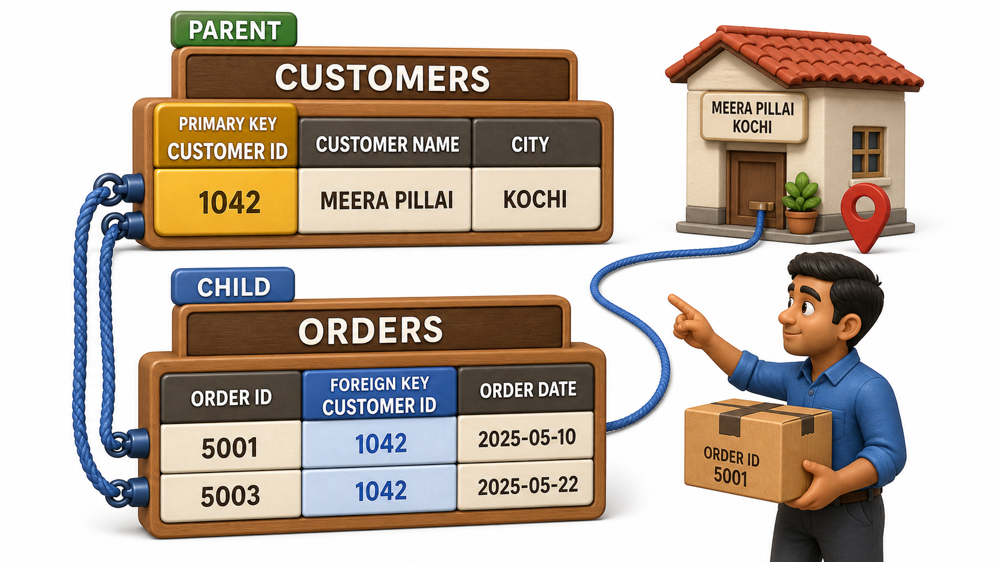
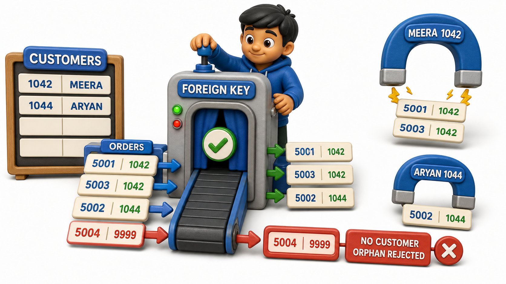

## Introduction

Ravi runs the back office for a small online stationery shop in Kochi. He keeps two separate registers: a Customers register with one row per customer, and an Orders register with one row per order placed. One busy Friday, an order sheet comes to him with the note "Deliver to Customer, urgent," and nothing else. No name, no address, nothing that says whose order this actually is. Ravi is stuck holding a perfectly valid-looking order that points at absolutely nobody.

He fixes the problem the next week by adding a column to every row in the Orders register: Customer ID. From then on, every order carries the exact ID of the customer who placed it, the same ID that already uniquely identifies that customer over in the Customers register. An order for "Customer ID 1042" can always be traced back to exactly one row in the Customers table, the row belonging to Meera Pillai, no confusion possible.

That Customer ID column sitting inside the Orders table, referring back to a row that actually lives in a different table, is what a database calls a **`foreign key`**:

- It is a column in one table that points to the `primary key` of another table.
- It is the mechanism that lets separate tables stay connected to each other instead of existing as unrelated, disconnected piles of rows.

## Two Tables That Need to Talk to Each Other

Look at Ravi's two tables side by side.

**Customers**

| Customer ID | Name | City |
|---|---|---|
| 1042 | Meera Pillai | Kochi |
| 1043 | Sanjay Verma | Kochi |
| 1044 | Farah Sheikh | Kozhikode |

**Orders**

| Order ID | Customer ID | Item | Amount |
|---|---|---|---|
| 5001 | 1042 | A4 Notebooks x 10 | 450 |
| 5002 | 1044 | Fountain Pen | 320 |
| 5003 | 1042 | Sketch Pens Set | 180 |

Customer ID is the `primary key` of the Customers table, the value that uniquely identifies each customer. Inside the Orders table, that same Customer ID column reappears, but it is playing a different role there: it is not identifying an order, Order ID already does that. It is reaching across into the Customers table and saying, plainly, "this particular order belongs to whichever customer holds this ID." Order 5001 and order 5003 both carry Customer ID 1042, so both orders belong to Meera Pillai, even though they are two separate rows in a completely separate table.

## What Makes a Column a Foreign Key

A **`foreign key`** is a column, or set of columns, in one table whose values are meant to match the primary key values of another table, called the referenced or "parent" table. In Ravi's setup, the Orders table is often called the child or referencing table, since each of its rows depends on, and points toward, a row in the parent Customers table.

This relationship carries a quiet but important promise: every Customer ID that appears inside Orders should correspond to a Customer ID that genuinely exists inside Customers. If someone tried to insert an order with Customer ID 9999, and no customer with that ID exists anywhere in the Customers table, that order would be pointing at nobody, exactly the "Deliver to Customer, urgent" problem Ravi started with. A `foreign key` is the database's way of refusing to let that dangling, meaningless reference happen in the first place.

## Why This Matters Beyond One Shop

The pattern of one table pointing at another through a `foreign key` shows up constantly, anywhere one kind of record naturally belongs to, or depends on, another kind of record.

| Referencing table | Foreign key column | Points to |
|---|---|---|
| Orders | Customer ID | Customers |
| Enrolments | Roll Number | Students |
| Book Issues | ISBN | Books |
| Salary Slips | Employee ID | Employees |
| Match Scorecards | Team ID | Teams |

In every one of these pairs, the child table would be meaningless without knowing which parent row it belongs to. An order with no customer, an enrolment with no student, a book issue with no book, none of these make any real-world sense, and a `foreign key` is precisely what stops such orphaned, unattached rows from quietly existing in a database.

## Foreign Keys Are What Make "Relational" Mean Something

It is worth pausing on why this whole family of databases is called "relational" in the first place. The word does not refer to tables being related to each other the way relatives are related in a family, though that is a fair way to remember it. It refers to how each table represents a mathematical relation, and foreign keys are the threads that stitch those separate relations, those separate tables, into one coherent, connected system. Without foreign keys, Ravi's shop would just be two unrelated grids of numbers and text sitting side by side, each one blind to the other. With a `foreign key` in place, asking "show me every order Meera Pillai has ever placed" becomes a question the two tables can answer together, by matching Customer ID in one table against Customer ID in the other.

## Foreign Keys at a Glance

| Term | What it means |
|---|---|
| Foreign key | A column in one table that refers to the primary key of another table |
| Parent table | The table being referenced, holding the primary key being pointed at |
| Child table | The table holding the foreign key, referring outward to the parent |
| The promise it keeps | Every foreign key value must match a value that genuinely exists in the parent table |

## Conclusion

A `foreign key` is how one table reaches out and anchors itself to a specific, real row living inside another table, turning two separate grids of data into one connected, trustworthy structure. Ravi's Orders table only became useful the moment every order could be traced, with certainty, back to the customer who actually placed it.

Not every column that could uniquely identify a row ends up chosen as the `primary key`, and understanding the fuller family of keys, the ones that could have served as the identifier, the ones built from more than one column together, and the ones invented purely for convenience, rounds out the picture of how a well-designed table actually gets its identity.
