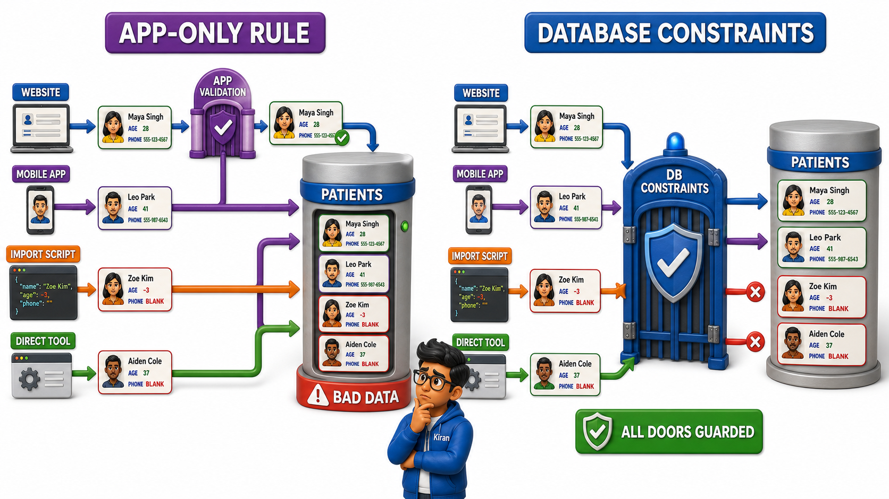

## Introduction

Kiran manages patient registration at a small clinic in Hyderabad, and for years the front desk kept records on a spreadsheet that let anyone type anything into any box. One week, a new receptionist left the phone number field empty for an entire day's worth of patients, because the form did not insist otherwise. Another week, the same patient, Farah Sheikh, got registered twice under two slightly different spellings, and the clinic ended up mailing two separate appointment reminders to one confused person. A third patient's age was entered as -3, a typo nobody caught until a nurse read it aloud in disbelief.

None of these were failures of the receptionists' intelligence. They were failures of the spreadsheet, because the spreadsheet never enforced a single rule about what counted as an acceptable entry. It simply accepted whatever was typed and moved on.

When Kiran's clinic finally moved to a proper database, the software itself started refusing bad entries before they could ever be saved. Leave the phone number blank, and the system stops you right there. Try to register the same patient twice under the same ID, and the system rejects it outright. Type -3 into the age field, and the system will not accept it. These automatic, built-in rules that a database enforces on every single row, without needing a human to double-check by hand, are called **`constraints`**, and they are what quietly turns a database from "a place that stores whatever it's given" into "a place that only ever holds data you can actually trust."

## A Constraint Is a Rule the Database Enforces For You

A `constraint` is simply a rule attached to a column, or sometimes to a whole table, that every row must satisfy before the database will accept it. The rule is not a suggestion written in a manual somewhere that a busy receptionist might forget to follow. It is enforced automatically, every single time, by the database software itself, regardless of who is entering the data or how tired they are.

This builds directly on the idea of a domain, the set of legal values a column is allowed to hold. A domain describes, in the abstract, what values belong in a column. A `constraint` is the database actually standing guard at that boundary and turning away anything that does not belong.

## The Most Common Everyday Rules

A handful of rule shapes cover most of what a real table needs, and every one of them maps onto something Kiran's clinic genuinely needed:

- **Must never be missing.** A patient's phone number, in Kiran's clinic, must always be present, because there is no way to send an appointment reminder to a blank field. Whenever a piece of information is essential for a row to make sense at all, the database can be told that column may never be left empty.
- **Must be unique.** No two patients should ever be able to register under the exact same Patient ID, and, depending on how the clinic wants to run things, perhaps no two patients should share the same email address either. A uniqueness rule stops accidental duplicates and outright double-registrations from slipping in.
- **Must fall within a certain range.** A patient's age must be a realistic number, certainly never negative, and probably never above some sensible upper bound. An appointment date must never fall in the past. Range rules keep obviously impossible values, like an age of -3, from ever being saved.
- **Must come from a fixed, allowed set.** A patient's blood group can only ever be one of a short list of real blood groups, never a typo or a made-up label. A membership status might only ever be "Active," "Inactive," or "Suspended," nothing else.
- **Must always point at something real.** When one table refers to another, as a `foreign key` does, the database can insist that the value being pointed at genuinely exists, so an appointment can never be booked for a patient ID that does not correspond to any real patient.

## Constraints in Everyday Language, Not Syntax

It helps, at this stage, to describe every one of these rules in plain English rather than as any particular piece of code, because the same underlying rule can be expressed in more than one database system, and the exact wording used to switch it on comes later in this course. For now, the discipline worth building is simply learning to spot, for any table you are designing, which of its columns need which kind of rule.

- "A phone number must be present" describes a value that must never be missing.
- "An email must be unique" describes a value that must never repeat across rows.
- "An age must be between 0 and 120" describes a value that must fall within a range.
- "A grade must be one of A, B, C, D, or F" describes a value restricted to a fixed set.
- "Every appointment's patient ID must match a real patient" describes a value that must point at something real.

## Why Constraints Belong to the Database, Not the Application

It is tempting to think these rules could just as well live inside whatever app or website is collecting the data, and indeed most well-built applications do check things on their end too. But an application is only one door into a database. Larger systems often have several doors: a website, a mobile app, a batch import script run by an administrator, a direct connection used by another internal system. If the rule about a missing phone number is only checked by the website's form, then the batch import script, which never passes through that form, can quietly slip bad data straight past it. A `constraint` enforced by the database itself guards every single door at once, because no data can ever reach the table without passing the database's own checks first.

## Constraints at a Glance

| Kind of rule | What it prevents | Example from Kiran's clinic |
|---|---|---|
| Must not be missing | A row saved with an essential value left blank | Every patient must have a phone number on file |
| Must be unique | Two rows silently duplicating the same identity | No two patients share the same Patient ID |
| Must fall within a range | Impossible or nonsensical numeric values | A patient's age must be between 0 and 120 |
| Must be one of a fixed set | Typos or invented values sneaking into a category | Blood group must be a genuine blood group |
| Must reference something real | A row pointing at a record that does not exist | An appointment's patient ID must match a real patient |

Take a moment, with any table you can picture, a college's Students table, a shop's Products table, and ask which of its columns genuinely needs which of these five rule shapes. Almost every column you can imagine will need at least one.

## Conclusion

A `constraint` is a promise the database itself keeps on every single row, automatically and without exception, so that the trustworthiness of a table never depends on how careful, or how tired, the person entering the data happens to be that day. Kiran's clinic did not become more reliable because its receptionists suddenly became more careful. It became more reliable because the database stopped trusting anyone to be careful and started enforcing the rules itself.

Rules about individual values are only part of the picture, and there is one more question every relational database has to answer: when a row that other rows depend on through a `foreign key` is deleted, or its identifying value changes, what should happen to all of those dependent rows left pointing at something that may no longer exist.
