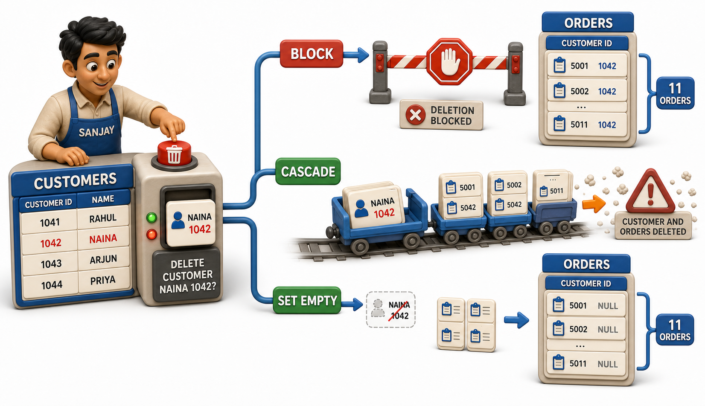
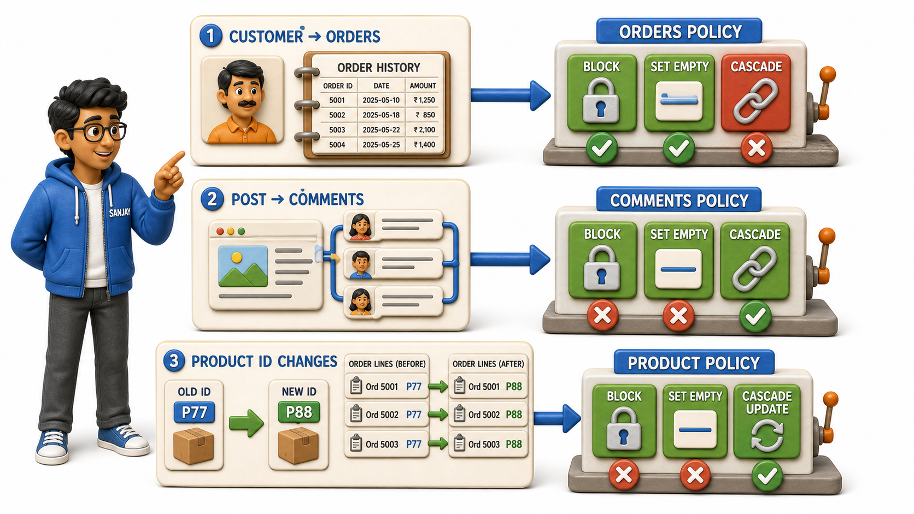

## Introduction

Sanjay handles account closures for a small online bookstore in Chennai, and one Tuesday a customer, Naina Kapoor, writes in asking for her account to be permanently deleted. Sanjay opens the Customers table, finds her row, and is about to remove it, when a colleague stops him with an uncomfortable question. Naina has eleven past orders sitting in the Orders table, every one of them pointing back at her Customer ID through a `foreign key`. If her customer row simply vanishes, what happens to those eleven orders? Do they vanish too? Do they stay behind, now pointing at a customer who no longer exists anywhere in the system? Does the deletion just fail outright until someone deals with the orders first?

Sanjay realises this is not a question the Orders table can answer by accident. Someone has to decide, deliberately, what a dependent row should do the moment the row it depends on disappears or changes. This is exactly the dilemma every relational database has to face wherever a `foreign key` exists, and it is a decision the database lets a designer make in advance, rather than leaving it to chance the day a real customer actually asks to be deleted.

## The Dilemma, In Plain Terms

Whenever a `foreign key` connects a child row to a parent row, as an order connects to the customer who placed it, two kinds of change to the parent can leave the child stranded:

1. The parent row might be deleted entirely, as Naina's account closure threatens to do.
2. The parent row's identifying value might change, for instance if the bookstore ever decided to reassign customer IDs during a system migration.

Either way, the child row is left holding a reference to something that, a moment ago, was solid ground, and now might not be.

A database needs a clear answer to both situations, one for deletion and one for updating the identifying value, because leaving it unanswered would mean orders quietly pointing at customers who no longer exist, which is precisely the kind of dangling, meaningless reference the whole idea of a `foreign key` was built to prevent in the first place.

## The Choices, Described Without Any Syntax

There are, broadly, three sensible ways Sanjay's bookstore could handle Naina's request, and every relational database lets you configure which one applies.

The first option is to **block** the change. The database simply refuses to delete Naina's customer row while her eleven orders still exist, pointing back at her. Sanjay would have to deal with those orders first, perhaps archiving them or reassigning them, before the deletion is even allowed to happen. This is the safest option, and often the sensible default, because it forces a human to make a conscious decision about the dependent rows rather than letting anything happen automatically.

The second option is to **cascade** the change. Deleting Naina's customer row automatically deletes all eleven of her orders along with it, in one sweep, since the orders were never meant to exist independently of the customer who placed them. This makes sense in relationships where the child truly has no purpose once the parent is gone, but it is also the option that can do the most damage if applied carelessly, since a single deletion can ripple outward and remove far more than the row a person actually meant to touch.

The third option is to **set the link empty**. Naina's customer row is deleted, but her eleven orders are kept, with their Customer ID reference simply cleared, so the orders remain in the system as a historical record, only now unattached to any particular customer. A bookstore that needs to keep sales figures and inventory history intact, even after a customer account is closed, might prefer this option over cascading the deletion into its order history.

The very same three choices apply, separately, to the case where a parent row's identifying value changes rather than the row being deleted outright. If customer IDs were ever renumbered during a system migration, the bookstore would again have to decide whether dependent orders should block that renumbering, automatically update to follow the new ID, or have their link cleared instead.

## Matching the Choice to the Real-World Relationship

None of the three options is universally "correct." The right choice depends entirely on what the relationship between the two tables actually means in the real world.

| Situation | A sensible choice | Why |
|---|---|---|
| Deleting a customer with past orders on record | Block, or set the link empty | The order history is valuable and should not vanish silently |
| Deleting a course that no student has ever enrolled in | Block | There should be no dependent rows to worry about at all |
| Deleting a blog post along with its own comments | Cascade | Comments have no meaning once the post itself is gone |
| Deleting a department that employees still belong to | Block | Employees should not be left with no department at all |
| Renaming or renumbering a product's ID during a catalogue cleanup | Cascade the update | Every order line referencing that product should simply follow the new ID |

Notice the pattern. Cascading suits relationships where the child row's entire reason for existing is tied to the parent, comments belonging to a post, line items belonging to an order. Blocking suits relationships where the dependent rows represent something valuable in their own right, like an order history that a business genuinely wants to keep intact. Setting the link empty sits in between, useful when the dependent rows should survive on their own even after losing their connection to the parent.

## A Decision Every Database Lets You Make Deliberately

The reassuring part of this whole dilemma is that a database never forces a single, one-size-fits-all answer on every relationship in a system. When a `foreign key` is defined, the designer decides, for that particular link, what should happen on deletion and what should happen if the referenced value ever changes. Sanjay's bookstore might reasonably choose to block deletion on the Customers-to-Orders relationship, since order history matters, while cascading deletion on a Posts-to-Comments relationship elsewhere in the same system, since a comment truly has no life of its own once its post is gone. Both choices can live side by side in the same database, each one matched carefully to what the relationship actually represents.

## Conclusion

Every `foreign key` eventually forces the same honest question: if the row being pointed at disappears or changes, what should happen to the rows depending on it, and a relational database lets that answer be blocking, cascading, or clearing the link, chosen deliberately for each relationship rather than left to chance. Sanjay's eleven orders did not need to vanish, or become orphaned nonsense, the moment Naina asked to close her account, because the choice of what should happen was one the bookstore could make in advance, on its own terms.

With tables, keys, `constraints`, and this last question of dependent rows all in place, the pieces are now ready to be looked at from a wider angle, seeing how a database engine actually organises and manages all of these interlocking structures as one coherent system.
