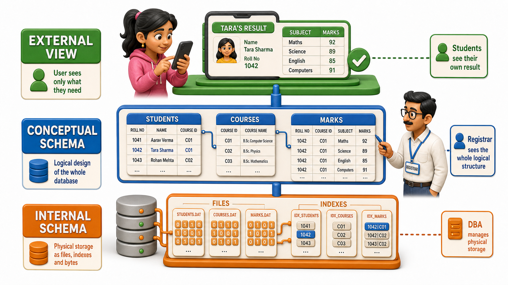

## Introduction

It is results day, and Tara is refreshing the college portal from a hostel corridor, her phone screen too bright against the tube light. The page finally loads and shows her name, her roll number, and four subject scores, nothing else. She cannot see Kabir's results from the next room, and she certainly cannot see the raw files sitting on a server somewhere in the college's data centre. She sees exactly one thing, laid out exactly the way a student is meant to see it.

Two floors below, in the registrar's office, an entirely different picture exists. When the registrar's team built the results system years ago, they were not thinking about any single student's phone screen. They were thinking about a much larger design: a Students table, a Courses table, a Marks table, and the relationships that tie a roll number to a set of scores across a semester. That design has to hold up for every student, every course, and every report the college will ever want to pull from it.

Further down still, none of this looks like tables or portals at all. It is bytes arranged into files and `indexes` on a disk, read and written by storage hardware that has no idea what a "student" or a "semester" is. Three very different pictures of the exact same underlying data, each one correct at its own level, each one built for a different audience. This layered way of describing a database, from what one user sees, to how the data is logically organised, to how it is physically stored, is called the **`three-schema architecture`**.

## Three Views of One Database

A `schema`, in database terms, is simply a description of structure, what pieces of data exist and how they relate to each other. The `three-schema architecture` says that a database does not have just one such description. It has three, stacked on top of each other, each answering a different question for a different audience.

### The External Level: What One User Sees

This is the level closest to the person actually using the system. When Tara opens the results portal, the database does not hand her the entire Students table, the entire Marks table, and the entire Courses table and let her go find her own row. It hands her a narrow, purpose-built slice: her name, her roll number, and her marks for the current semester, nothing that belongs to another student, nothing about fee dues or hostel allotment.

A professor logging into the same underlying database might see a completely different external `view`: a class list with average scores, no individual contact details. A different application built on the same data, say the college's fee portal, would show yet another `view` again, this time built around dues and payments rather than marks. Same database underneath, several different external `views`, each shaped around what one kind of user or one application actually needs to see.

### The Conceptual Level: How the Registrar Designed It

One level down sits the conceptual `schema`, sometimes called the logical `schema`. This is the registrar's picture: the overall structure of the entire database, described independently of any one screen or any one user. It says there is a Students entity with a roll number, a name, and a programme; a Courses entity with a course code and a credit value; a Marks entity that connects a student to a course with a score. It also captures the relationships between them, such as the rule that every row in Marks must point to a real student and a real course.

Nobody outside the database team usually looks directly at the conceptual `schema`. Tara never sees it, and neither does the professor. But every external `view` Tara or the professor sees is ultimately drawn out of this one shared design. Change the conceptual `schema` carelessly, and every `view` built on top of it feels the effect sooner or later.

### The Internal Level: Where the Bits Actually Live

The lowest level is the internal, or physical, `schema`. This is concerned with none of the things a student or a registrar cares about. It cares about how rows are actually stored on disk, which files hold which table's data, what `indexes` exist to make a lookup by roll number fast, and how much space a record takes up. A database administrator tuning performance lives at this level far more than anyone else in the story.

Crucially, the internal level is invisible from above. Tara has no idea, and has no reason to care, whether her marks are stored in one large file or split cleverly across several for speed. That gap between what is stored and how it is stored is exactly the point of drawing this as a separate layer.

## The Three Levels At A Glance

| Level | Also called | Who mainly deals with it | What it describes |
|---|---|---|---|
| External | `View` level | End users, individual applications | A tailored slice of the data for one user or app, such as Tara's own result screen |
| Conceptual | Logical level | Registrar's team, database designers | The full structure of the data: entities, attributes, and relationships, independent of any one screen |
| Internal | Physical level | Database administrators | How data is actually stored on disk: files, `indexes`, and storage layout |

## Why Bother Splitting a Database Into Layers?

It would be entirely possible to build a system where the screen a student stares at is wired directly to the exact bytes on disk, with nothing in between. Some of the earliest data-handling systems worked roughly that way, and it is precisely the mess that a proper database was invented to avoid. The moment a screen depends directly on file layout, moving a file, adding an `index`, or reorganising storage for speed risks breaking the screen too.

By inserting the conceptual level as a buffer between the external `views` above it and the internal storage below it, the `three-schema architecture` keeps three very different kinds of work separate:

- The registrar's team can reason about students, courses, and marks without ever touching a disk block.
- A database administrator can reason about disk blocks and `indexes` without redesigning what a student sees.
- Whoever builds the results portal can design Tara's screen around the conceptual `schema` without needing to know a single detail about how the bytes are laid out underneath.

Each group works confidently at its own level, trusting that the layer below it is doing its job.

## Conclusion

The `three-schema architecture` is really just an honest admission that "the database" means different things to different people looking at it from different heights: a tailored screen for an end user at the external level, a shared structural design at the conceptual level, and raw stored bytes at the internal level. Keeping these three descriptions separate, rather than fusing them into one tangled picture, is what makes it possible for a student, a registrar, and a database administrator to each do their job without stepping on the other two.

That separation only earns its keep, though, if changes at one level genuinely stay contained there instead of rippling upward or downward through the whole system. Tara will never know or care which of these three levels her results portal actually touches, and that is precisely the architecture working as intended: her external `view` stays exactly the same no matter how the registrar's conceptual design or the internal storage beneath it changes. Whether that promise actually holds, and what it buys an organisation when a database administrator wants to change how data is stored without a single application noticing, is the natural next question to ask.
