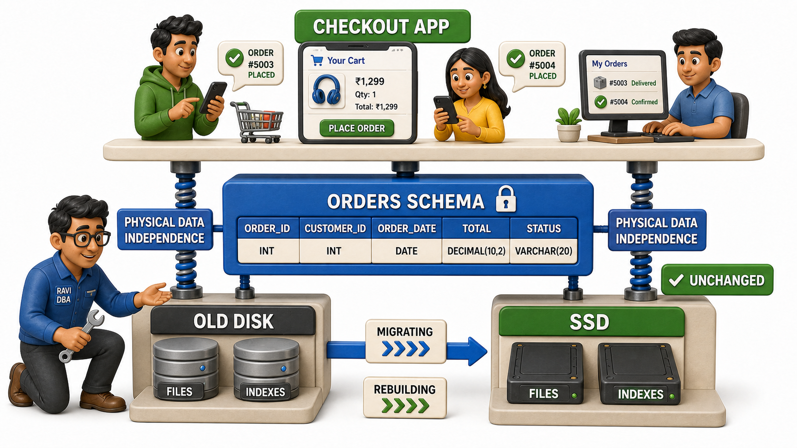
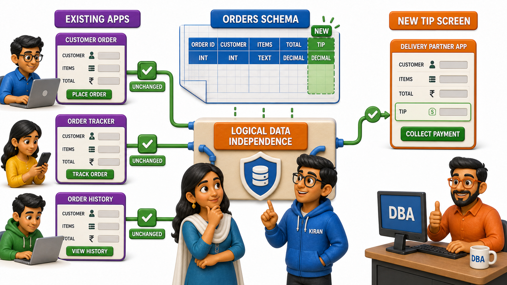

## Introduction

Ravi is the database administrator at a mid-sized food delivery company, and tonight he is nervous. The company's ageing storage disks are being swapped for faster solid-state drives, and Ravi has spent the past two weeks reorganising how order records are laid out on disk to take advantage of the new hardware: different file groupings, new `indexes`, a completely different physical arrangement than before. Somewhere else in the building, forty engineers are still writing code against the same database, and not one of them has been told any of this is happening.

Ravi's real fear is not the migration itself. It is the phone call he expects afterwards: "the checkout screen is broken." If moving data around on disk forces every application team to rewrite their queries, this "small" storage upgrade becomes a company-wide fire drill. But it does not happen that way. The morning after the migration, orders load exactly as before, the checkout screen works, and nobody outside Ravi's team even knows the disks changed. What made that possible has a name: **data independence**, the idea that a change made at one level of the database should not force a change at another level above it.

A few months later, the product team asks for something different: every order row now needs a new column recording whether the customer tipped the delivery partner. Ravi adds it. Once again, the dozens of existing screens and reports that never asked about tips keep working exactly as they did before, untouched by a change that, on paper, altered the very shape of the data they depend on.

## Physical Data Independence: Changing the Storage Without Touching the Apps

The first kind of independence is the one Ravi relied on during the hardware migration. **Physical data independence** means the internal, physical level of the database, how data is actually stored on disk, can be changed without requiring any change to the conceptual `schema` or to the applications built on top of it.

Consider what actually changed in Ravi's migration:

- The files holding order records moved to new drives.
- They got reorganised for faster reads.
- They gained new `indexes` that speed up common lookups.

None of that touched the definition of what an "order" is, how many columns it has, or how it relates to customers and restaurants. Because applications talk to the database in terms of that logical definition, an order with a customer, a restaurant, a list of items, and a total, and never in terms of "the fourth file on the second drive," the storage reshuffle stayed completely invisible above it. A checkout screen that asks for "today's orders for this customer" gets the same answer, computed the same way from the application's point of view, whether the underlying bytes sit on an old spinning disk or a new solid-state drive.

## Logical Data Independence: Extending the Schema Without Breaking Every App

The second kind of independence is what let Ravi add the tip column without a company-wide scramble. **Logical data independence** means the conceptual `schema`, the overall structural design of the data, can be extended or adjusted without forcing every application that uses it to change too.

Adding a new column to the Orders table did genuinely change the conceptual `schema`. Before, an order had no concept of a tip; now it does. But every existing report, screen, and background job that only ever asked for customer name, items, and total kept asking exactly those questions and kept getting exactly the same answers. They were never written to demand "give me every column of the Orders table, in this exact order," so a new column arriving at the end of the row simply did not concern them. Only the small handful of screens that actually needed to show or record a tip had to change, and that change was additive rather than disruptive.

## Why This Separation Is Worth Protecting

It helps to notice what would happen without either kind of independence. If every application were wired directly to disk file layout, Ravi could never touch storage without an engineering-wide outage. If every application were wired to demand the exact, unchanging shape of a table, the company could never grow its data model without rewriting every screen that touches it. Either way, the database would calcify: too risky to improve, because improving it breaks everything built on top.

Data independence is what lets a database evolve like a living system instead of a fragile one. A storage engineer can chase performance, a product team can ask for new fields, and neither has to coordinate a synchronised rewrite of every application in the company just to make a reasonable change. The separation between how data is stored, how it is structurally organised, and how any one application sees it is not academic tidiness. It is the reason Ravi can sleep the night after a migration, and the reason the product team can ask for a new column without triggering a meeting with every engineering team in the building.

## Data Independence At A Glance

| Type | What can change | What stays untouched | Ravi's example |
|---|---|---|---|
| Physical data independence | How data is stored on disk: files, layout, `indexes` | The logical structure and every application built on it | Migrating from old disks to solid-state drives without rewriting any app |
| Logical data independence | The conceptual `schema`: new columns, new relationships | Existing applications that never depended on the new addition | Adding a tip column to Orders without breaking the checkout screen |

## Conclusion

Data independence works because a database is not one flat structure but a set of separated levels, and a change confined to one level does not have to ripple through the others. Physical independence protects applications from decisions about disk and storage; logical independence protects them from the `schema` growing to meet new needs. Together they are what let Ravi treat both a hardware migration and a new column as routine maintenance rather than a company-wide emergency.

None of this happens by accident, though. Somewhere inside the database, distinct pieces of software are doing the actual work of keeping storage decisions, `schema` decisions, and query decisions from colliding with each other, and it is worth opening up the database itself to see what those pieces are and what each one is responsible for.
