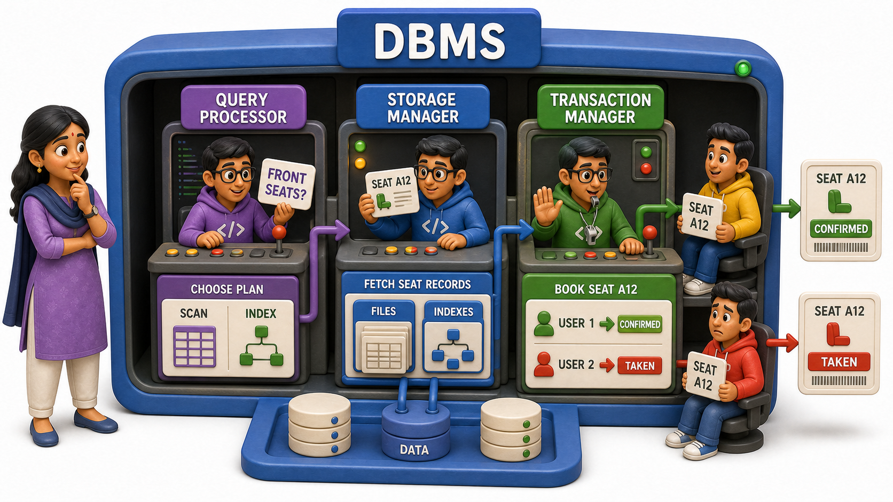
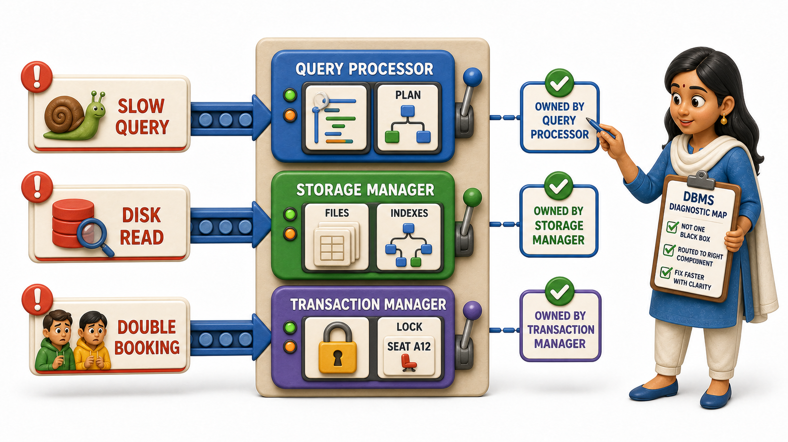

## Introduction

Meera is new to the backend team at a ticket-booking startup, and her first week is spent doing something most engineers never do: reading the internal architecture diagram of the database itself, rather than just sending it queries. On the whiteboard in the team room, a senior engineer has sketched three large boxes connected by arrows, labelled Query Processor, Storage Manager, and Transaction Manager. Meera has used databases for years without ever wondering what happens inside that single box she always drew as "the database" in her own diagrams.

The senior engineer taps the board and explains it with a scene Meera already understands from the outside: thousands of people trying to book the same concert the moment tickets go live. Somewhere inside the database, one part has to understand the request "find all available seats in the front section," another part has to actually fetch or update the seat records sitting on disk, and a third part has to make absolutely sure that when two people click "book" on the same seat within the same second, only one of them actually gets it. Those three jobs, roughly, are what the three boxes on the whiteboard do. Understanding a **DBMS's internal components** is what turns "the database" from a black box into a system Meera can reason about.

## The Query Processor: Understanding What You Asked For

When a request like "find all available seats in the front section" reaches the database, something has to make sense of it before any data gets touched. That is the job of the **query processor**. It takes the query as written, checks that it is grammatically valid, works out what the query is actually asking for, and decides on a sensible way to go and get that answer.

Think of the query processor as a very literal, very fast translator. A person asking for "available seats in the front section" is expressing an intent in a structured way, and the query processor's task is to turn that structured request into a concrete plan of action, for instance:

- Whether it is faster to scan every seat and check which ones are in the front section
- Or to jump straight to an `index` that already groups seats by section

Meera does not have to think about any of this when she writes a query; the query processor is precisely the component that thinks about it on her behalf.

## The Storage Manager: Getting Data On and Off Disk

Once the query processor has decided what needs fetching, something has to actually go and fetch it, or write it back, from wherever the data physically lives. That is the **storage manager**'s job. It is the component that deals with the internal, physical reality of the database, the files, the blocks, the `indexes`, and it handles every read and write that touches that layer.

The storage manager is what makes the physical data independence from earlier possible in the first place. The query processor never has to know whether a seat record lives in file three or file thirty; it simply asks the storage manager for "the record for seat A12," and the storage manager works out where that record actually sits and hands it back. If the disks underneath ever change, as Ravi's did in his migration, it is the storage manager's job to keep speaking the same language to everything above it, regardless of what changed beneath it.

## The Transaction Manager: Keeping Things Correct When Many Things Happen at Once

The third box on the whiteboard exists because a database is almost never doing just one thing at a time. Thousands of people are hammering the ticket-booking system in the same second, and many of them may be trying to book the very same seat. Left unmanaged, two bookings could both read "seat available," both proceed, and both believe they succeeded, leaving the venue with one seat sold twice.

The **transaction manager** is the component responsible for preventing exactly that. It treats each user's booking as a single, self-contained unit of work, a transaction, and makes sure that even when many transactions are running at the same moment, the end result looks as if they happened one after another in some sensible order, never in a way that corrupts the data. When two people try to book seat A12 in the same instant, the transaction manager ensures one booking goes through cleanly and the other is told, correctly, that the seat is already taken.

## The Three Components At A Glance

| Component | Main question it answers | What it touches |
|---|---|---|
| Query processor | What is this request actually asking for, and what is the best way to answer it? | The incoming query itself, before any data is read |
| Storage manager | Where does this data physically live, and how do I read or write it? | Files, blocks, and `indexes` on disk |
| Transaction manager | How do I keep results correct when many things happen at the same time? | Concurrent requests touching the same data |

## Why the Split Matters

None of these three components could do a good job of another's work. A query processor that also worried about disk block layout would be tangled and slow to change. A storage manager that also tried to referee simultaneous seat bookings would be reinventing the transaction manager badly. By giving each concern its own dedicated component, a DBMS keeps the same discipline internally that the `three-schema architecture` enforces externally: separate responsibilities, each one free to be understood, tested, and improved on its own terms.

For Meera, the payoff of this week's reading is not that she will ever write a query processor herself. It is that the next time a query runs slowly, or two bookings conflict unexpectedly, she has a mental map of which component is actually responsible, rather than treating the whole database as one indivisible mystery.

## Conclusion

A DBMS is not one monolithic piece of software but a small society of specialists working together: a query processor that interprets and plans, a storage manager that reads and writes the physical data, and a transaction manager that keeps everything correct when many requests collide at once. Each component trusts the others to do their part, and that trust is exactly what lets a database stay fast, correct, and manageable even under heavy, simultaneous use. Meera can now walk back to that whiteboard sketch and, the next time two people scramble for the same concert seat, point straight to the transaction manager as the component keeping that race fair, rather than shrugging at "the database" as one unexplainable box.

None of these components, though, could do their job without some way of knowing what the database actually contains in the first place, what tables exist, what columns they have, and what rules govern them. That knowledge has to live somewhere inside the database too, and it turns out the database keeps a very deliberate record of itself.
