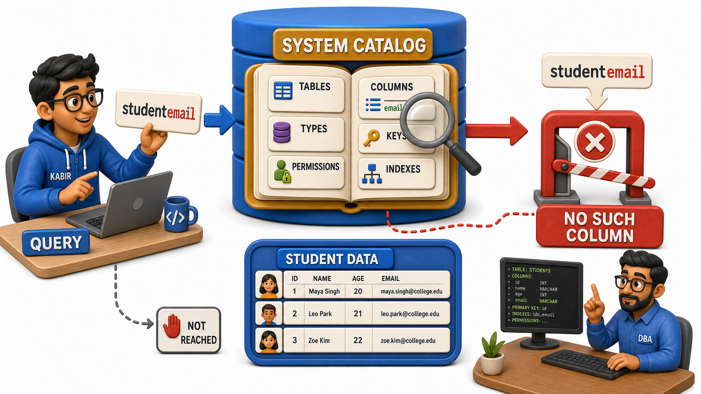
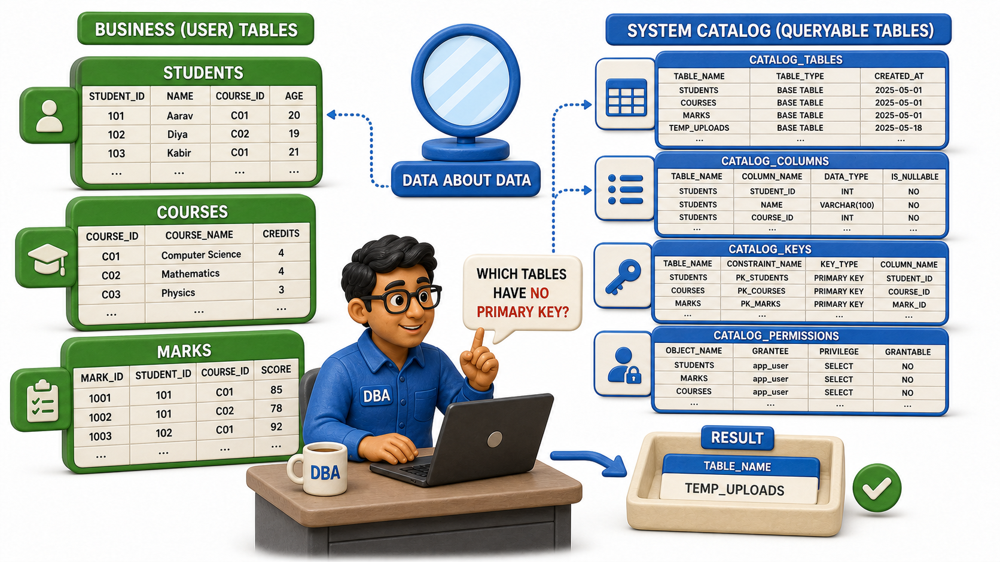

## Introduction

Kabir has just typed a query asking for a column called "studentemail" from the Students table, and before a single row comes back, the database stops him cold: no such column exists. Kabir frowns. He has not even connected to a table listing anywhere, has not opened any file explorer, has not asked the registrar's team what columns the Students table contains. Yet the database answered instantly and correctly, as if it already knew its own structure by heart.

It does. Somewhere inside every database sits a quiet, self-referential set of tables that describe the database itself: what tables exist, what columns each one has, what data type each column holds, which columns are required, which ones are unique, and who is allowed to touch what. This is the **`system catalog`**, sometimes called the data dictionary, and it is the reason Kabir's mistyped column name was caught in an instant rather than after a confusing, empty result or a cryptic crash.

Kiran, the backend developer sitting next to Kabir, put it simply: "The database does not just hold your data. It holds data about its own data too." That second kind of data, data describing data, is what the `system catalog` is built from.

## What Actually Lives in the Catalog

The `system catalog` is not one mysterious file; it is itself made of ordinary-looking tables, just tables that describe structure rather than business facts. A typical catalog keeps track of things like:

- The list of every table in the database, by name.
- For each table, the list of its columns, in order.
- For each column, its data type, whether it can be left empty, and any default value.
- Which column or columns act as the `primary key` for each table.
- Which columns are `foreign keys`, and which table and column they point to.
- Which users or `roles` have permission to read, write, or modify each table.
- What `indexes` exist, and which columns they are built on.

Every one of these facts is metadata, information about the database's own structure rather than about students, orders, or seats. When Kiran says the Students table has a roll number, a name, and an email column, she is not guessing from memory or from an old design document. She is describing exactly what the catalog itself records.

## Why a Database Needs to Know About Itself

It is worth asking why this bookkeeping matters, rather than treating it as incidental detail. The clearest answer is Kabir's mistyped column. Before the database goes anywhere near the actual rows of student data, it first checks the query against the catalog: does a table called Students exist, and does it actually have a column called studentemail? The catalog says no such column exists, and the database can refuse the query immediately, with a precise and useful error, instead of scanning through thousands of rows only to fail later, or worse, silently returning something wrong.

This same self-knowledge is what lets a database enforce its own rules. When Kiran tries to insert a new student without a roll number, the catalog is what tells the database that roll number is a required column, so the insert can be rejected before it ever touches the stored rows. When a report tries to `join` Students with Marks, the catalog is what confirms that a `foreign key` relationship actually exists between them, and how the two tables are meant to connect. Without a catalog, every one of these checks would have to be hand-coded separately into every application that ever touches the database, and every one of those checks would drift out of sync the moment someone added a column without telling every application team.

## The Catalog Is Also Just Data

There is something almost playful about how a database treats its own catalog: it stores that structural information using the very same mechanisms it uses to store a student's marks or a customer's order. The catalog's own tables have rows and columns, can be queried, and are protected by permissions, exactly like any other table in the system. A database administrator can, carefully, query the catalog directly to answer questions like "which tables in this database have no `primary key` defined?" The database, in other words, is quite capable of describing itself using its own native language.

This self-description is also what keeps the `three-schema architecture` and data independence honest. When Ravi added that tip column to the Orders table, it was the catalog that got updated first, to record that Orders now has one more column. Every other part of the database, and every application asking sensible questions of it, consults that same catalog to know what currently exists, which is exactly why the addition could be introduced without a company-wide rewrite.

## The System Catalog At A Glance

| What the catalog stores | Example fact it might hold | Why it matters |
|---|---|---|
| Table names | "Students," "Courses," "Marks" exist | Lets the database reject a query on a table that does not exist |
| Column definitions | "email" is a text column on Students, optional | Lets the database catch Kabir's mistyped column before running anything |
| Keys and relationships | Marks.roll_number references Students.roll_number | Lets the database validate `joins` and enforce referential rules |
| Access permissions | Kiran can read and write Students; Kabir can only read it | Lets the database enforce who is allowed to do what |

## Conclusion

The `system catalog` is the database's memory of its own shape: every table, every column, every type, every `constraint`, and every permission, recorded once and consulted constantly. It is what lets a database validate a query before running it, enforce the rules it was designed with, and stay internally consistent even as its structure grows and changes over time.

Kabir's rejected query was really the first, smallest step of a much longer journey a query takes once it leaves a user's fingers. Following that journey all the way through, from the moment SQL is typed to the moment a result set finally comes back, ties the catalog together with everything discussed about how a database plans and carries out a request.
