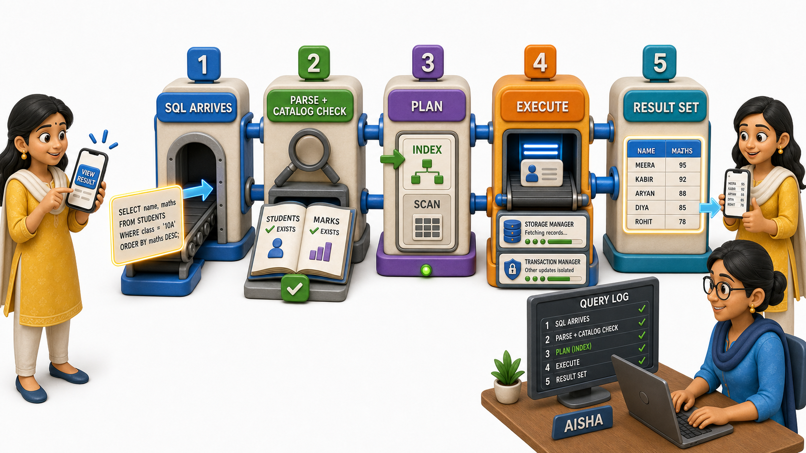
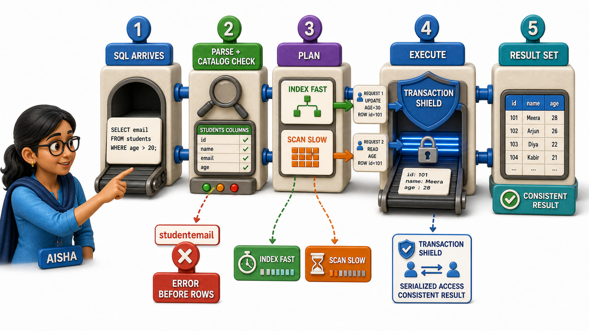

## Introduction

Aisha is shadowing the on-call engineer for her first week at the ticket-booking startup, headphones on, watching a live log stream scroll past on a second monitor. Somewhere out in the world, a student named Tara taps "View Result" on the college portal her college licenses from this same company. To Tara, nothing happens except a short pause and then a screen full of her marks. To Aisha, watching the logs, that one tap sets off a small, precise chain of events inside the database, one she has only read about until now.

Aisha had assumed, before this week, that a query is basically answered the moment it is typed, as if asking a question and getting an answer were a single, instant act. Watching the logs scroll past, she sees it is really a short journey with distinct, ordered stops: the request is checked before it is trusted, a plan is chosen before anything is fetched, and only then does an answer come back. Tracing **how a query travels from SQL to a result set** is what finally makes the whole architecture of a database click into place for her, all the pieces she had studied separately now moving together in one continuous story.

## Step One: The Request Arrives as Plain SQL

The moment Tara taps "View Result," the portal's backend sends a query to the database asking, in effect, for the marks belonging to her roll number. At this stage, the query is nothing more than text, a precisely structured sentence written in SQL. The database has not yet decided whether this request even makes sense, and it has certainly not gone anywhere near the actual stored marks. It has simply received a request, the way a receptionist receives a visitor's name before deciding which office to send them to.

## Step Two: Parsing and Checking Against the Catalog

Before anything else happens, the incoming SQL is parsed, meaning it is checked for correct grammar and broken down into its meaningful pieces:

- Which table is being asked about
- Which columns are wanted
- Which condition narrows the result down to one particular student

This is the same stage that once caught Kabir's mistyped column name before it ever touched real data. Here, the query is checked against the `system catalog`, the database's own record of what tables and columns genuinely exist. If Tara's query asked for a column that was never defined, this is exactly where the database would stop and refuse, before touching a single row of real data.

Only once the request has been confirmed to make structural sense, a real table, real columns, a real relationship between Students and Marks, does the database consider it safe to proceed any further.

## Step Three: Choosing a Plan

A validated query can usually be answered in more than one way, and someone has to decide which way is sensible. This is the job of turning "find Tara's marks" into an actual plan of attack: perhaps jumping straight to an `index` built on roll number, rather than scanning every row of the Marks table one by one looking for a match. For a small college database this choice might barely matter, but for a company running thousands of such lookups a second, a poorly chosen plan is the difference between an instant reply and a page that spins for seconds. This planning step is entirely invisible to Tara. She only ever sees the final screen, never the decision-making that happened to produce it quickly.

## Step Four: Executing the Plan Against the Stored Data

With a plan chosen, the database finally goes and gets the data. This is where the actual bytes on disk get touched, records are located, read, and assembled into the shape the query asked for. If Tara happens to check her result at the exact moment an administrator is updating another student's marks nearby, the database still has to guarantee that Tara's read is not corrupted or left half-finished by that unrelated, simultaneous activity elsewhere in the same tables. Fetching the right bytes and keeping concurrent activity from interfering with each other are two distinct jobs, handled by two distinct parts of the system working together during this single step.

## Step Five: The Result Set Comes Back

Only now, after validation, planning, and execution, does an actual answer exist: a small set of rows containing Tara's name, her subjects, and her scores. This is the **result set**, and it travels back up through the same layers it came down through, arriving at the portal's backend as structured data, which the portal then renders as the tidy little screen Tara has been staring at this whole time, still with no idea that any of this happened.

## The Journey At A Glance

| Stage | What happens | What would stop the journey here |
|---|---|---|
| SQL arrives | The request reaches the database as plain text | Nothing yet, this is just received |
| Parsing and catalog check | Grammar is checked, tables and columns are confirmed to exist | A misspelled column or a table that was never created |
| Planning | A sensible way to fetch the answer is chosen | Nothing fails here, but a poor choice can make the answer slow |
| Execution | The chosen plan runs against the actual stored data, safely alongside anything else happening at the same time | A conflict with another request touching the same data |
| Result set returned | The answer travels back as structured rows | Nothing, the journey is complete |

## Conclusion

A query is never answered in one single motion. It is checked, planned, carried out, and only then returned, and every stop along that journey belongs to a distinct part of the system responsible for it: the catalog that validates, the component that plans and the one that fetches and guards the data, and the layered design that lets each of those parts change without dragging the others down with it. Watching Tara's single tap unfold into that whole sequence is what turns "the database answered my question" from a small miracle into a system Aisha, and now you, can actually reason about.

There is still a more precise way to describe what that chosen plan is actually doing at each step, a small, formal vocabulary for operations like picking out certain rows, keeping only certain columns, or combining two tables into one, and putting a name to those exact operations is the natural next thing worth learning.
