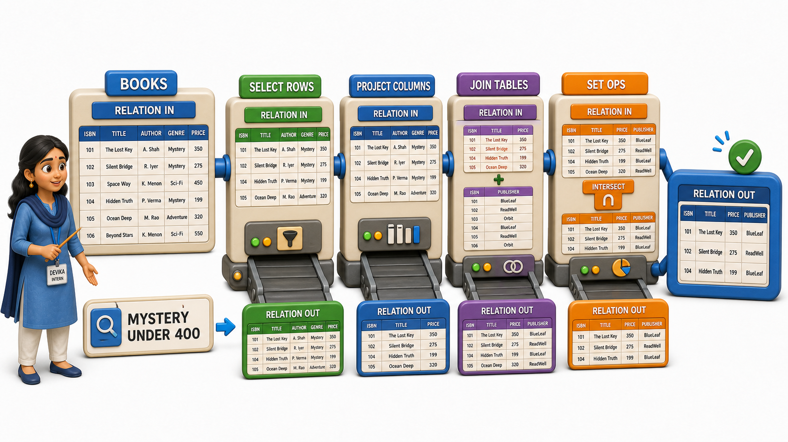
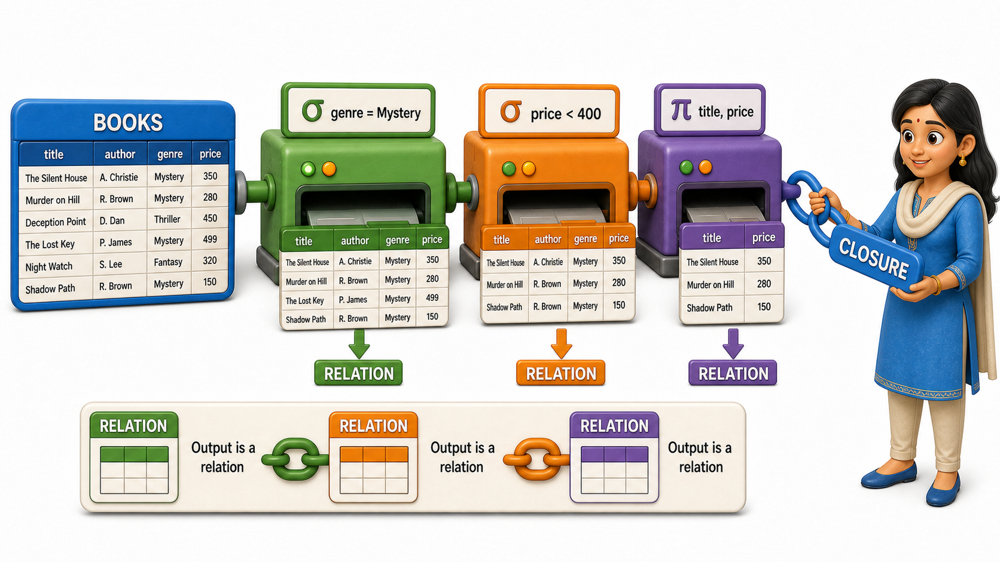

## Introduction

Devika is three weeks into her internship at a bookstore chain's data team, and her manager has just asked her a question that catches her off guard: "The reporting tool says it can answer any question about our inventory. How does it actually decide what to do with a question like 'show me every mystery novel under 400 rupees'?" Devika has used the reporting tool for weeks, typing in requests and watching tidy tables of results appear, but she has never once wondered what happens between her question and that answer.

Her manager walks her through it. Underneath every dashboard, every report, and every query a customer never sees, there is a small, precise set of operations that a database performs on its tables. Each operation takes one or more tables as input and hands back another table as output, nothing more mysterious than that. This formal toolkit, the mathematical foundation beneath every question a relational database can answer, is called **`relational algebra`**, and understanding it is what finally lets Devika see the machinery behind the dashboard instead of just trusting it blindly.

## A Relation In, A Relation Out

Start with what a "relation" actually is in this context: it is simply the formal name for a table, a set of rows sharing the same columns. Suppose the bookstore's system stores a relation called Books, looking something like this:

| book_id | title | genre | price |
|---|---|---|---|
| 101 | Silent Hills | Mystery | 350 |
| 102 | Morning Light | Poetry | 220 |
| 103 | The Long Wait | Mystery | 410 |
| 104 | Coastal Roads | Travel | 300 |

`Relational algebra` defines a handful of operations that can be applied to a relation like this one. Each operation is a small, well-defined transformation: keep only the rows that satisfy some condition, keep only certain columns, combine two relations together, or compare two relations against each other. What makes the idea powerful is a single rule that holds for every one of these operations without exception: the result of applying an operation to a relation is itself always a relation. Feed a table in, and a table comes back out, with the same rows-and-columns shape as anything else the database stores.

That single rule is what makes `relational algebra` a genuine algebra rather than just a loose collection of tricks. In ordinary arithmetic, adding two numbers gives back a number, which is why you can chain additions together, feeding the result of one into the next. `Relational algebra` works the same way. Because every operation's output is again a relation, the output of one operation can always become the input to another, and a whole chain of small, simple steps can be strung together to answer a genuinely complicated question, one step at a time.

## Why a Formal Language Matters at All

It would be reasonable to ask why any of this needs a formal name and a precise definition. Devika's manager puts it plainly: a database has to answer thousands of differently worded questions every day, and it cannot afford to treat each one as a brand new puzzle. `Relational algebra` gives the database, and the people who build it, a fixed, well-understood vocabulary of operations that any request can be broken down into.

This matters for two connected reasons:

- It gives the database a precise internal language for describing exactly what a query is asking for, stripped of the wording a person typed. "Mystery novels under 400 rupees" and "novels in the mystery genre priced below 400" are different sentences asking for the same thing, and `relational algebra` expresses both as the same underlying sequence of operations.
- Having that fixed vocabulary is what lets a database reason about a query before running it. If every request can be expressed as a combination of the same small set of operations, the database can compare different ways of carrying out those operations and choose a faster one, the same planning step that happens invisibly every time a query is answered.

Without a formal foundation like this, there would be no shared language in which to even ask "which of these two approaches is faster."

## The Operations That Make Up the Toolkit

`Relational algebra` is built from a small number of core operations, each one worth learning in turn. Two of them narrow a single relation down: one keeps only the rows that match a condition, and the other keeps only certain columns. A few more compare or combine two relations that share the same shape, treating rows almost like the members of a mathematical set. And one especially important operation stitches two different relations together based on a shared value, which is how a database connects, say, a table of books to a table of orders.

None of these operations is complicated in isolation. What makes `relational algebra` worth learning is that these few simple pieces, used together in sequence, are enough to express essentially any question a relational database can be asked. A dashboard listing "mystery books under 400 rupees, sorted by title" and a report listing "every customer who ordered a travel book this month" both reduce, underneath the wording, to short chains of the very same handful of operations.

## Relational Algebra at a Glance

| Idea | What it means |
|---|---|
| Relation | The formal name for a table: a set of rows sharing the same columns |
| Operation | A precise transformation that takes one or more relations as input |
| Closure | Every operation's output is itself a relation, so operations can be chained |
| Purpose | Gives a database a fixed vocabulary to express and compare ways of answering a query |

Devika leaves that conversation with a small but genuine shift in how she sees the reporting tool. It no longer feels like a black box that magically understands English sentences about mystery novels. It feels like a system built on a short, disciplined list of moves, moves precise enough that a machine can apply them millions of times a day without ever getting confused about what "under 400 rupees" means.

## Conclusion

`Relational algebra` is the formal, mathematical toolkit underneath every question a relational database answers: a small set of operations, each one taking relations in and producing a relation out, that together give a database a precise language for expressing and comparing ways of finding an answer. It is not a programming language a person types directly, but the theoretical bedrock that lets query planning, and eventually SQL itself, exist on solid ground rather than guesswork. Devika's reporting tool is no longer a mystery box that magically understands "mystery novels under 400 rupees"; she can now see it as a short chain of `relational algebra` operations working on the bookstore's Books relation, the same handful of moves every other request reduces to as well.

With that foundation in place, the natural next step is to meet the two simplest and most frequently used operations in the toolkit: the one that keeps only the rows worth keeping, and the one that keeps only the columns worth keeping.
