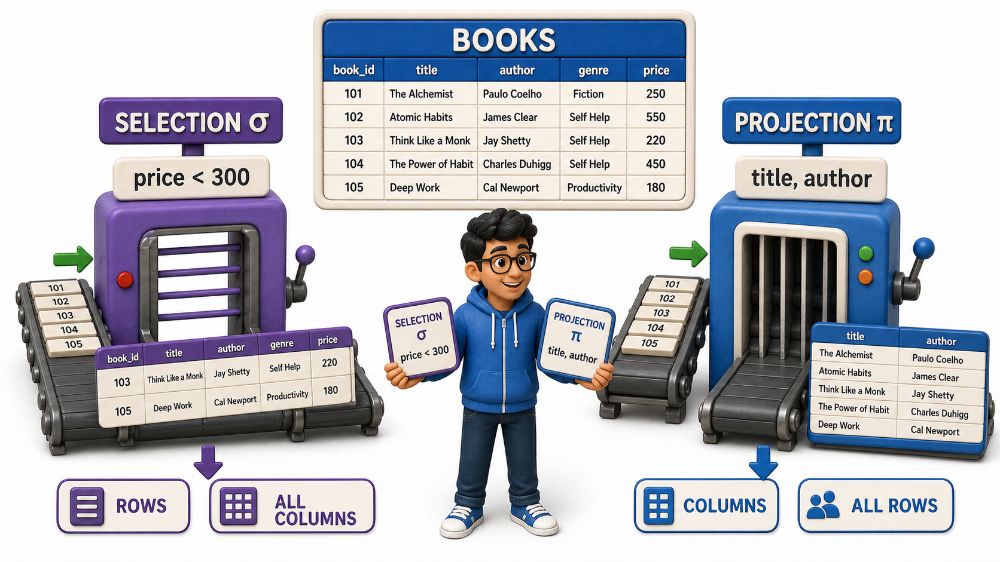
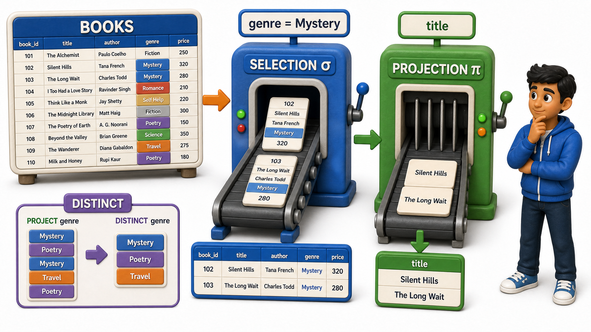

## Introduction

Rohan manages the campus library's digitised catalogue, and this week two very different requests land on his desk within an hour of each other. The first is from a librarian who wants to see every book that costs less than 300 rupees, so she can plan a budget clearance shelf. The second is from a student volunteer building a printed handout, who wants nothing but a plain list of book titles and authors, with no prices, no stock counts, and no genre codes cluttering the page.

Both requests sound like they want "a version of the catalogue," but they want completely different slices of it:

- The librarian wants fewer rows, all of the columns, but only the ones that meet her price condition.
- The volunteer wants every row, but only two of the columns. `Relational algebra` gives each of these two needs its own dedicated operation. Picking out rows that satisfy a condition is called **selection**, written with the Greek letter sigma, and picking out certain columns is called **projection**, written with the Greek letter pi. Learning to tell these two apart cleanly is the first real skill worth building here.

## The Catalogue Rohan Is Working With

Everything that follows works off one small relation, a simplified slice of Rohan's Books table:

| book_id | title | author | genre | price |
|---|---|---|---|---|
| 201 | Silent Hills | A. Menon | Mystery | 350 |
| 202 | Morning Light | R. Fernandes | Poetry | 220 |
| 203 | The Long Wait | A. Menon | Mystery | 410 |
| 204 | Coastal Roads | S. Iyer | Travel | 300 |
| 205 | Paper Boats | R. Fernandes | Poetry | 180 |

Five rows, five columns. Selection and projection are really just two different ways of trimming this one small table down to exactly what someone asked for.

## Selection: Keeping the Rows That Match

Selection, written sigma, picks out the rows of a relation that satisfy a given condition and discards the rest, while keeping every column untouched. The librarian's request, "every book under 300 rupees," is a selection on the Books relation with the condition price less than 300. Applying that selection produces:

| book_id | title | author | genre | price |
|---|---|---|---|---|
| 202 | Morning Light | R. Fernandes | Poetry | 220 |
| 205 | Paper Boats | R. Fernandes | Poetry | 180 |

Notice what stayed the same and what changed. The shape of the table did not change at all, still five columns, still book_id through price. What changed is the row count: five rows narrowed down to two, because only two rows satisfy the condition. This is the defining habit of selection, it filters rows without ever touching columns.

Selection conditions can be as simple as a single comparison, or combined for something more specific. If Rohan instead needed "every mystery novel priced above 400," that is still a selection, just with a compound condition: genre equals Mystery and price is greater than 400. Applied to the same Books relation, only one row survives:

| book_id | title | author | genre | price |
|---|---|---|---|---|
| 203 | The Long Wait | A. Menon | Mystery | 410 |

Whether the condition is a single check or several joined together, the operation is still sigma, still working row by row, still leaving every column exactly as it was.

## Projection: Keeping the Columns That Matter

Projection, written pi, works the opposite way. Instead of trimming rows, it trims columns, keeping every row but discarding any column not explicitly asked for. The volunteer's handout, wanting only titles and authors, is a projection of the Books relation onto just those two columns. Applying it produces:

| title | author |
|---|---|
| Silent Hills | A. Menon |
| Morning Light | R. Fernandes |
| The Long Wait | A. Menon |
| Coastal Roads | S. Iyer |
| Paper Boats | R. Fernandes |

All five rows are still present, since projection does not filter anything out based on a condition. What disappeared is the shape of the columns, book_id, genre, and price are simply gone from the result, because nobody asked for them. This is projection's defining habit, it filters columns without ever touching which rows survive.

There is one subtlety worth noticing. If Rohan projected the Books relation down to just the genre column, the raw result would list Mystery, Poetry, Mystery, Travel, Poetry, five values with a repeat. Because a relation is meant to represent a set, `relational algebra`'s projection removes duplicate rows from its result, leaving just Mystery, Poetry, and Travel. Projection is not simply "delete some columns and keep everything else identical," it is "keep some columns, and keep the result as a proper set of distinct rows."

## Combining Selection and Projection

Real requests rarely stop at only one operation. Suppose Rohan is asked for "the titles of every mystery novel," which combines both needs at once, filter to mystery rows, then keep only the title column. Because `relational algebra` operations always produce a relation as output, the result of the selection can be fed straight into the projection as its input. First selection narrows Books down to the two mystery rows, Silent Hills and The Long Wait. Then projection strips that narrowed relation down to just the title column:

| title |
|---|
| Silent Hills |
| The Long Wait |

This chaining is exactly the "closure" idea put to work: because sigma's output is a relation and pi's input is a relation, the two snap together cleanly, one operation feeding directly into the next, with no special glue code required in between.

## Selection and Projection at a Glance

| Aspect | Selection (sigma) | Projection (pi) |
|---|---|---|
| Trims | Rows | Columns |
| Keeps | All columns of matching rows | All rows, restricted to chosen columns |
| Driven by | A condition (for example, price less than 300) | A list of column names |
| Removes duplicates? | No | Yes, in the formal definition |
| Rohan's example | "Books under 300 rupees" | "Only title and author" |

## Conclusion

Selection and projection are the two simplest, most frequently used tools in `relational algebra`, and they solve two genuinely different problems. Selection, sigma, narrows a relation down to the rows that satisfy a condition. Projection, pi, narrows it down to the columns that were actually asked for, folding away any duplicate rows that survive. Once a request needs both, the two chain together naturally, because each one hands back a proper relation the other can work on. Rohan can now answer both requests on his desk without confusion, a selection on price gives the librarian her budget shelf, and a projection onto title and author gives the volunteer a clean handout with nothing else cluttering the page.

These two operations answer questions about a single table. The next natural question is what happens when a request involves comparing two relations against each other rather than trimming just one, which is exactly where set operations come in.
