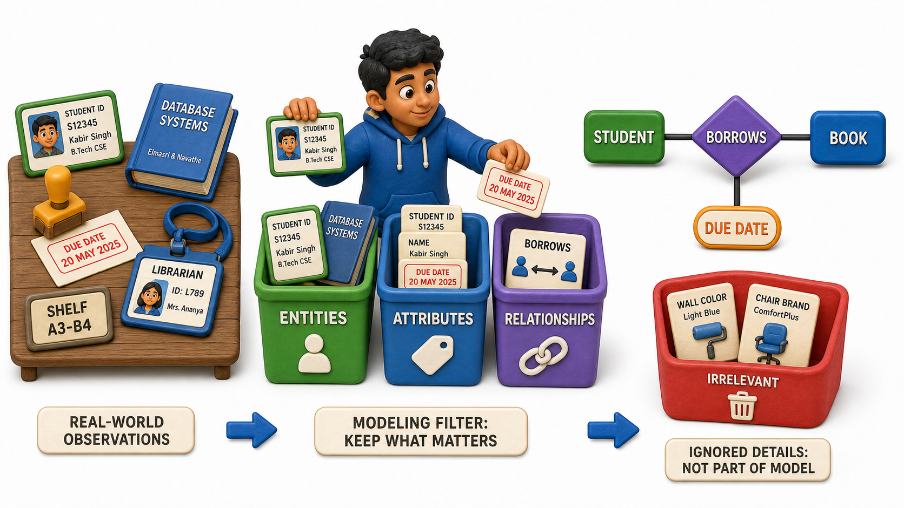

## Introduction

Kabir has just been handed his first real assignment as a trainee analyst: design a system to run the college's library. His manager slides a blank notepad across the table and says only, "Figure out what needs to be tracked, then come back to me." Kabir's instinct is to open a spreadsheet and start typing column headers, but he catches himself. He does not yet know what the columns belong to.

He starts walking the library floor instead, watching how it actually works. A student walks up to the counter holding two books and a library card. The librarian scans the card, scans each book, and notes the due date. Kabir jots down three words on his pad: student, book, librarian. Each of those is a distinct, real thing worth keeping track of on its own, something the library cares about independently of anything else. That is exactly what an **entity** is: a distinct real-world object or concept that a system needs to store information about.

Kabir's next question is what the library actually knows about each of those things. A student has a name, a roll number, a membership date. A book has a title, an author, an ISBN, a shelf location. Those properties are **attributes**, the individual facts that describe an entity. And when Kabir watches the student borrow a book, he notices something that belongs to neither the student alone nor the book alone: the act of borrowing itself, tying one particular student to one particular book on one particular date. That connection between two entities is a **relationship**. Long before any table gets created, this three-part exercise, naming the things, naming their properties, and naming how the things connect, is the real work of designing a database.

## Finding the Entities Hiding in a Domain

The hardest part of this exercise is rarely drawing a diagram; it is deciding what counts as a "thing" worth tracking in the first place. Kabir's rule of thumb, which his manager confirms over coffee later that afternoon, is simple: an entity is any noun in the domain that the system needs to remember details about over time, independently of anything else, and that can be told apart from every other instance of the same kind.

Walking through the library again with that rule in mind, Kabir lists out candidates and tests each one.

| Candidate noun | Worth tracking as its own entity? | Why |
|---|---|---|
| Student | Yes | The library needs to remember each student's details across many visits |
| Book | Yes | Each physical title has its own author, ISBN, and availability status |
| Librarian | Yes | Staff details need tracking for accountability and shift records |
| "Borrowing" event | Yes | Each borrow-and-return cycle has its own dates worth recording |
| "Reading" | No | This is an activity a student does, not a distinct thing with its own identity to track |

Notice that the last row is a deliberate trap. Not every verb or activity in a domain deserves to become an entity; some of them are really just describing a relationship between entities that already exist, or they carry no information worth storing on their own. Kabir learns to ask, for every candidate, "does this need its own set of facts remembered about it, separate from the things it involves?" If the answer is no, it usually collapses into an attribute or a relationship instead of standing on its own.

## Attributes: What the System Needs to Remember

Once Kabir is confident about his entities, he goes back to each one and lists the facts the library actually cares about. For the Book entity, that list looks like this.

| Attribute | Sample value |
|---|---|
| ISBN | 978-0-13-468599-1 |
| Title | Database System Concepts |
| Author | Silberschatz |
| Shelf location | Rack B-14 |
| Number of copies | 3 |

Every one of those rows is a single fact tied to one book. An attribute never floats free the way raw data can; it is always a property of some specific entity, which is exactly why the entity had to be identified first. Get the entity list wrong, and every attribute built on top of it inherits the same confusion.

## Relationships: How the Entities Connect

Entities rarely sit in isolation, and a library where students and books never interacted would not need a database at all. The interesting part of Kabir's diagram is the set of connections between entities: a student borrows a book, a librarian issues a book, a book belongs to a category. Each of these is a relationship, a meaningful association between two entities that the system needs to remember.

Kabir sketches the borrowing relationship in words before touching any notation: "A student borrows a book, and the system needs to know which student borrowed which book, and on what date." That single sentence already contains an entity (Student), another entity (Book), and the relationship joining them (Borrows), plus a fact that belongs to the relationship itself rather than to either entity alone (the borrow date). Recognising that some facts belong to the connection, not to either side of it, is a habit that will matter enormously once diagrams turn into working `schemas`.

## Entities, Attributes, and Relationships at a Glance

| Concept | What it captures | Library example |
|---|---|---|
| Entity | A distinct real-world thing worth tracking | Student, Book, Librarian |
| Attribute | A property describing one entity | Title, ISBN, roll number |
| Relationship | A meaningful connection between two entities | A student borrows a book |

## Turning Observation into a Plan

By the end of the afternoon, Kabir has not written a single line of a table definition, and that is entirely the point. What he has instead is a short list of entities, a set of attributes hanging off each one, and a handful of relationships describing how those entities interact in the real workflow he watched at the counter. When his manager asks to see progress, Kabir walks her through the list verbally, describing the library the way a librarian would describe it, not the way a spreadsheet would. She nods and tells him that is exactly the right starting point: get the real-world picture right first, because every table, column, and `constraint` that comes later is only a faithful translation of that picture into a form a database can store.

This same three-question habit, what are the things, what do we know about each thing, and how do the things connect, applies just as cleanly to other domains:

- A gym tracking members and trainers
- A hospital tracking patients and doctors
- A food delivery app tracking customers and orders

The domain changes every time; the discipline of naming entities, attributes, and relationships before reaching for a table does not.

## Conclusion

An entity is a distinct real-world thing a system needs to remember facts about, an attribute is one of those facts, and a relationship is a meaningful connection between two entities. Modelling a domain means walking through it the way Kabir walked through the library: naming the things first, describing each thing's properties second, and only then mapping out how the things relate to one another.

That naming exercise is still fairly loose so far, treating every attribute as if it were a single, simple value. Real attributes are not always that tidy, some are built out of smaller parts, some can be calculated rather than stored, and some entities can legitimately hold more than one value for the same property, which is exactly the finer detail worth sorting out next.
