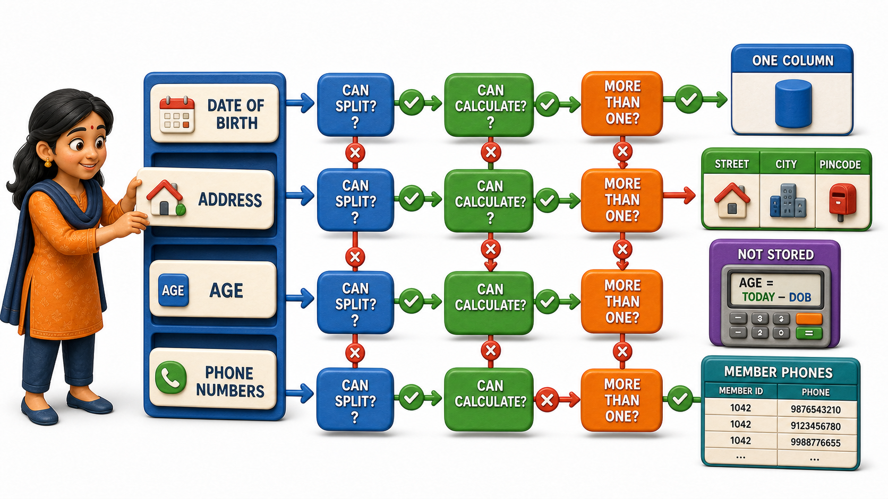

## Introduction

Meera is redesigning the member records for the gym where she works part-time as the front-desk coordinator. She pulls out the paper enrolment form the gym has used for years and starts listing what it captures about each member: name, date of birth, age, address, phone numbers. She assumes this will take five minutes. Instead, she notices that these five things are not actually the same kind of fact at all, and treating them as if they were identical is exactly what has been causing the gym's records to drift out of sync.

Three columns on the form each hide a different problem:

- **Age and date of birth:** the form asks for both, but age changes every year while date of birth never does, so whenever a member's birthday passes and nobody updates the age field by hand, the two values start contradicting each other.
- **Address:** the form squeezes it into a single line, even though it is really built from a street, a city, and a pincode that the gym often needs separately, say, to filter members by locality for a new branch opening.
- **Phone number:** more than one member has written down two numbers in the margin because the form only left room for one.

Meera's manager, watching her frown at the form, explains that this is a well-known problem with a name: not every **attribute** behaves the same way. Attributes come in a small number of recognisable types, and knowing which type an attribute is, before it ever reaches a table, determines how it needs to be stored.

## Simple Attributes: One Fact, One Value

The easiest kind of attribute to reason about is a **simple attribute**, sometimes called atomic, which holds exactly one indivisible value that cannot be meaningfully broken into smaller parts. A member's date of birth is simple: it is a single value, and splitting it further into "day" and "month" and "year" separately would not help the gym answer any question it actually has. A member's gender, a book's ISBN, an employee's blood group, all of these are simple attributes because each one is already as granular as the domain needs it to be.

| Attribute | Simple? | Reason |
|---|---|---|
| Date of birth | Yes | A single value with no useful smaller parts for this domain |
| Membership ID | Yes | One indivisible code identifying the member |
| Gender | Yes | A single categorical value |

## Composite Attributes: Built from Smaller Parts

An address is a different animal. Meera realises the gym genuinely does care about the pieces separately: it wants to send SMS reminders sorted by city, and it wants to validate pincodes against its delivery zones for supplement orders. An attribute that is made up of smaller, meaningful sub-parts, each of which could stand as its own attribute, is called a **composite attribute**.

| Composite attribute | Component sub-attributes |
|---|---|
| Address | Street, City, Pincode |
| Full name | First name, Last name |
| Emergency contact | Contact name, Relationship, Phone number |

The test Meera learns to apply is whether the pieces are ever useful on their own. If the gym never once needs to query "which members live in which city" without also needing the full address, breaking address apart would be unnecessary detail. Because the gym does need city on its own, address earns composite treatment, stored and reasoned about as a group of smaller, meaningful attributes rather than one indivisible blob of text.

## Derived Attributes: Computed, Not Stored

Age is the attribute that started Meera's whole investigation, and it turns out to be a textbook example of a **derived attribute**: a value that can be computed from another attribute already being stored, rather than one that needs to be kept and maintained separately. Age is derived from date of birth. The moment date of birth is known, age can always be worked out by comparing it to the current date, which means storing age as its own separate fact is not just unnecessary, it is actively dangerous, because the stored value slowly drifts out of truth every time a birthday passes without anyone remembering to update it.

Other everyday examples follow the same shape. A person's number of years of membership can be derived from their join date. An order's total amount can be derived from the prices and quantities of the items within it. A student's overall percentage can be derived from individual subject marks. In every one of these cases, the source attribute (date of birth, join date, item prices) is what actually gets stored, and the derived attribute is calculated whenever it is needed rather than kept in permanent storage.

| Derived attribute | Computed from |
|---|---|
| Age | Date of birth |
| Years of membership | Join date |
| Order total | Item prices and quantities |

## Multivalued Attributes: More Than One Value at Once

The last surprise on Meera's form is phone number. A single member legitimately might have a home number and a mobile number, and the form's one-line design simply cannot represent that honestly. An attribute that a single entity instance can hold more than one value of, at the same time, is called a **multivalued attribute**.

A person can have several phone numbers. A book can have several authors. A car can be available in several colours. Each of these breaks the assumption that "one entity, one value" always holds, and Meera's redesigned enrolment form has to make room for that reality rather than force every member into a single cramped field, which is exactly what had been causing members to scribble a second number into the margin in the first place.

| Multivalued attribute | Example values for one entity |
|---|---|
| Phone numbers | 98765 43210, 87654 32109 |
| Skills (for a trainer) | Yoga, Strength training, Nutrition coaching |
| Email addresses | member@example.com, member.alt@example.com |

## Attribute Types at a Glance

| Type | Meaning | Example |
|---|---|---|
| Simple | One indivisible value | Date of birth |
| Composite | Built from smaller meaningful parts | Address = Street + City + Pincode |
| Derived | Computed from another stored attribute | Age, from date of birth |
| Multivalued | An entity can hold more than one value | Phone numbers |

## Why This Sorting Exercise Matters

Meera's redesigned form now separates date of birth from age, breaks address into street, city, and pincode, drops age entirely as a stored field since it can always be computed, and leaves proper room for a member to list more than one phone number. None of this required a single table or column definition yet; it required only a careful look at what each attribute actually is. That distinction carries forward directly into how a database eventually gets built, because a composite attribute usually becomes several columns, a derived attribute usually becomes no column at all, and a multivalued attribute usually needs a structure of its own rather than a single cramped field.

## Conclusion

Attributes are not all the same shape. A simple attribute holds one indivisible value, a composite attribute is built from smaller meaningful parts, a derived attribute can always be recalculated from something already stored, and a multivalued attribute allows more than one value for a single entity at the same time. Sorting an attribute into the right one of these four categories, before ever drawing a table, is what keeps a design honest about the data it is actually meant to hold. Meera's redesigned gym enrolment form now drops the drifting age field in favour of date of birth, splits address into street, city, and pincode, and finally leaves room for a member's second phone number instead of forcing it into the margin.

With entities and their attributes properly understood, the next question is how the entities themselves relate to one another in terms of quantity, whether one student links to one desk, one department links to many employees, or many students link to many courses, which is where the shape of a relationship starts to matter as much as its existence.
