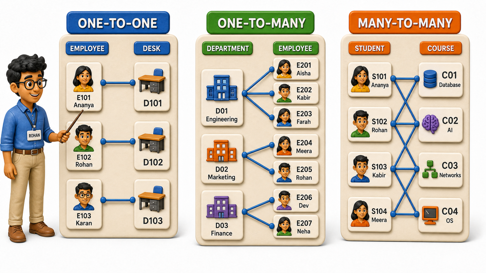
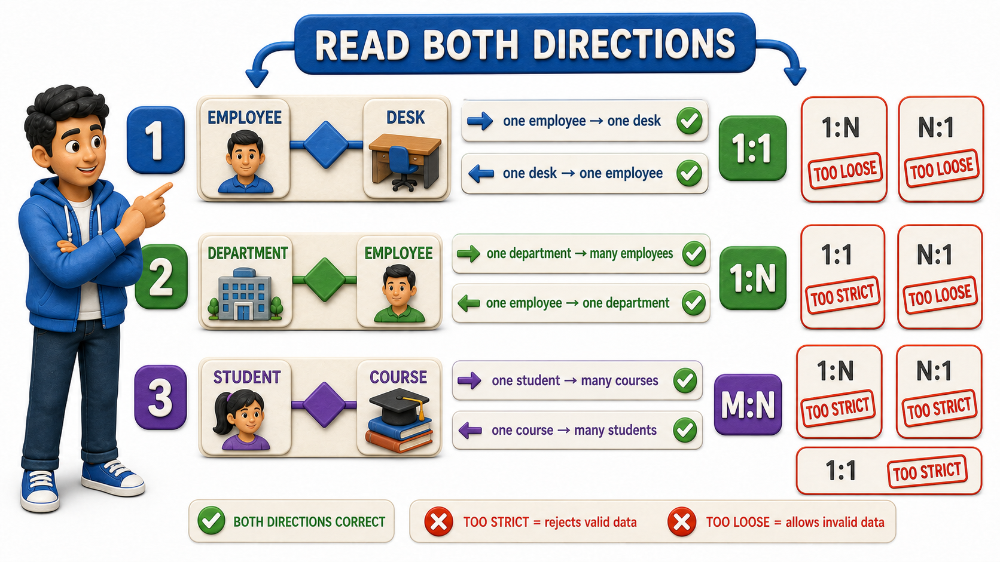

## Introduction

Rohan is mapping out the office system for a mid-sized company, and his manager keeps asking him the same follow-up question no matter which pair of entities he brings up: "For every one of these, how many of the other thing can it have?" Rohan mentions that an employee has a desk, and his manager asks whether an employee could ever have two desks, or whether two employees could ever share one desk. Rohan mentions that a department has employees, and his manager asks how many employees a single department can have, and whether an employee can belong to more than one department at once. Rohan mentions that students enrol in courses, and his manager just smiles, because that one is the trickiest of the three.

What Rohan is being pushed to nail down is **cardinality**, the count of how many instances of one entity can be associated with how many instances of another entity through a given relationship. It is not enough to know that two entities are related:

- A design has to know precisely how many of one side can connect to how many of the other side.
- That number changes everything about how the relationship eventually gets stored.

## One-to-One: A Single Match on Both Sides

The simplest cardinality is a **one-to-one relationship**, where one instance of the first entity is associated with exactly one instance of the second entity, and vice versa. Rohan's desk example fits perfectly: at this company, every employee is assigned exactly one desk, and every desk is assigned to exactly one employee. No desk sits shared between two people, and no employee has a second desk tucked away somewhere else.

| Employee | Desk |
|---|---|
| Rohan Mehta | Desk 14-A |
| Sanjay Iyer | Desk 14-B |
| Farah Khan | Desk 15-A |

Notice how clean this table looks: each row pairs exactly one employee with exactly one desk, and no employee or desk name repeats anywhere in the list. One-to-one relationships are the least common of the three, in practice, because most real associations do allow more of one thing to attach to another. Other genuine examples include a country and its capital city, or a passport and the one citizen it is issued to.

## One-to-Many: One Side Can Have Several

Far more common is a **one-to-many relationship**, where one instance of the first entity can be associated with many instances of the second entity, but each instance of the second entity is associated with only one instance of the first. Rohan's department example is the classic case: one department can have many employees working in it, but any single employee belongs to exactly one department.

| Department | Employees in that department |
|---|---|
| Engineering | Rohan Mehta, Sanjay Iyer, Farah Khan |
| Marketing | Devika Rao |
| Finance | Aisha Patel, Kiran Shah |

Read this relationship from each side and the asymmetry becomes obvious. From the department's side, the answer to "how many employees" is "many." From an employee's side, the answer to "how many departments" is "exactly one." That asymmetry is the entire definition of one-to-many, and it shows up constantly: one customer can place many orders, one author can write many blog posts, one teacher can lead many classroom sections, but each order, post, or section traces back to only one customer, author, or teacher.

## Many-to-Many: Both Sides Can Have Several

The trickiest of the three, and the one Rohan's manager was smiling about, is a **many-to-many relationship**, where one instance of the first entity can be associated with many instances of the second entity, and one instance of the second entity can equally be associated with many instances of the first. Students and courses show this perfectly: one student can enrol in several courses in a single semester, and one course, naturally, has many students sitting in it.

| Student | Courses enrolled in |
|---|---|
| Rohan Mehta | Database Systems, Operating Systems |
| Sanjay Iyer | Database Systems, Computer Networks |
| Farah Khan | Operating Systems, Computer Networks, Database Systems |

Unlike the one-to-many case, there is no side here that can be pinned down to "exactly one." A single course, say Database Systems, has three students sitting in it, and a single student, say Rohan Mehta, sits in two different courses. Both directions genuinely allow more than one connection, which is precisely what makes this cardinality harder to represent later than the other two, a detail worth remembering once the moment comes to turn this kind of relationship into an actual table structure.

## Reading Cardinality from Both Directions

Rohan's manager has one more piece of advice that sticks with him: never describe a relationship's cardinality from only one side. "A department has employees" tells only half the story until it is paired with the other half, "an employee belongs to one department." Getting into the habit of stating both directions out loud, "one department to many employees, one employee to one department," is what prevents a design from silently sliding into the wrong cardinality further down the line.

## Relationship Cardinality at a Glance

| Cardinality | Meaning | Example |
|---|---|---|
| One-to-one | Exactly one instance on each side | Employee and their desk |
| One-to-many | One instance on the first side, many on the second | Department and its employees |
| Many-to-many | Many instances possible on both sides | Students and the courses they take |

## Why Getting This Right Matters Early

Rohan closes his notes with a simple observation: cardinality is not a detail to sort out after the design is finished, it is a decision that shapes the design itself. Mislabel a one-to-many relationship as one-to-one, and the finished system will reject a perfectly legitimate department that happens to have three employees rather than one. Mislabel a many-to-many relationship as one-to-many, and the system will silently refuse to let a student enrol in a second course. Every one of these mistakes traces back to the same root cause: nobody sat down and asked, plainly, "for one of these, how many of the other can there be, and for one of the other, how many of this can there be?"

## Conclusion

Cardinality describes how many instances of one entity can be linked to how many instances of another through a relationship, and it comes in three familiar shapes: one-to-one, where both sides are capped at a single match; one-to-many, where one side can have several matches but the other side cannot; and many-to-many, where both sides can have several matches at once. Naming the cardinality correctly, from both directions, is what keeps a relationship faithful to how the real world actually behaves. Rohan can now answer his manager's three questions without hesitating: employee and desk is one-to-one, department and employees is one-to-many, and students and courses is many-to-many.

Cardinality answers "how many," but it leaves a second, equally important question untouched: whether every single instance of an entity is actually required to take part in the relationship at all, or whether some instances are allowed to sit out of it entirely, which is exactly the distinction worth examining next.
