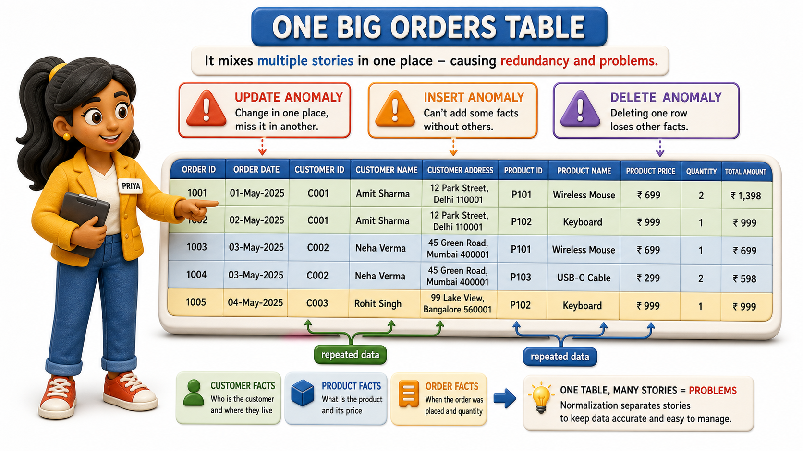
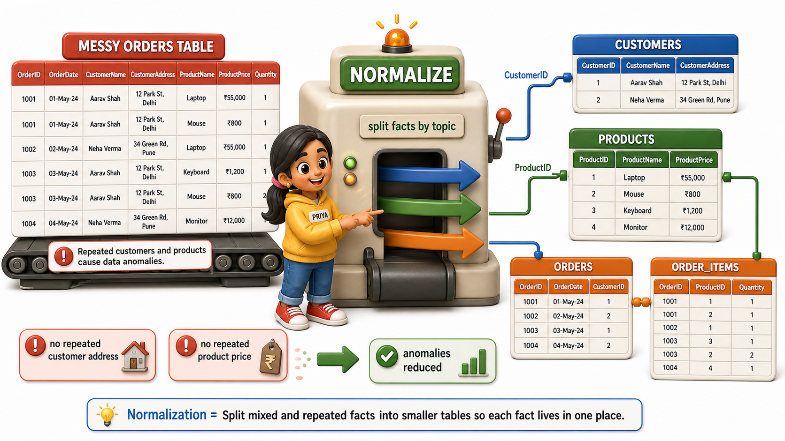

## Introduction

Priya runs the order desk at Sunrise Traders, a wholesale stationery distributor that supplies notebooks, pens, and files to retail shops across the city. When she joined, she inherited a single spreadsheet-turned-table that recorded everything about every order in one place: who ordered, what they ordered, and how much it cost. It seemed efficient. One table, one place to look, no need to hunt across files the way Sunrise Traders used to before it got a proper database.

The trouble surfaced in her second week. A shop owner named Ilyas Bakery Supplies called to say Sunrise Traders had sent an invoice to his old shop address, even though he had updated it "ages ago." Priya searched the Orders table and found Ilyas's address written four different ways across four different rows, because his shop had placed four separate orders, and his address had only been corrected on the most recent one. She fixed that row and moved on, not yet realizing she was looking at a symptom of something much bigger, a design flaw that database designers have a name for: the table needed to be **normalized**, split apart so that each fact about the business lives in exactly one place instead of scattered across every row that happens to mention it.

## One Table Trying to Hold Three Different Stories

Here is a trimmed version of the Orders table Priya was working from:

| OrderID | CustomerID | CustomerName | CustomerAddress | CustomerPhone | ProductID | ProductName | ProductPrice | Quantity |
|---|---|---|---|---|---|---|---|---|
| O501 | C12 | Ilyas Bakery Supplies | 14 MG Road | 98450xxxxx | P01 | A4 Notebook | 45 | 100 |
| O502 | C12 | Ilyas Bakery Supplies | 14 MG Road (New) | 98450xxxxx | P03 | Gel Pen Box | 120 | 20 |
| O503 | C07 | Meenal Stationers | 9 Church Street | 99001xxxxx | P01 | A4 Notebook | 45 | 200 |
| O504 | C12 | Ilyas Bakery Supplies | 14 MG Road (New) | 98450xxxxx | P02 | File Folder | 30 | 50 |

Look closely and three separate stories are tangled into one table:

- Facts about the order itself (which product, how many, on what date)
- Facts about the customer (name, address, phone)
- Facts about the product (its name and price)

Every time a customer places another order, their name, address, and phone number get retyped into a new row. Every time a product is ordered again, its name and price get retyped too. This is exactly the kind of redundancy that causes trouble the moment anyone tries to change, add, or remove anything, and those three kinds of trouble each have a name.

## Update Anomaly: One Fact, Many Places to Fix

Notice that Ilyas's address appears three times in the table, once for each of his three orders. When his shop moved and Priya updated one row, the other two still said "14 MG Road" for a few days until she caught them, because nothing in the table forced all three copies to change together. This is an **`update anomaly`**: changing a single real-world fact requires updating it in every row where it happens to be repeated, and if even one row gets missed, the table ends up telling two different stories about the same customer at the same time. A table with an `update anomaly` is not lying on purpose, it simply has no way of knowing that three separate rows are secretly describing the same shop.

## Insert Anomaly: Data You Cannot Record Yet

A few weeks later, Sunrise Traders' warehouse manager asked Priya to add a new product, a box of highlighters, to the catalog ahead of a launch. Priya opened the Orders table and realized she had no way to do it. Every row in that table represents an order, and an order needs a customer and a quantity. There is nowhere in this table to record "here is a product that exists" without also inventing a fake order to attach it to. This is an **`insert anomaly`**: a table structured around one kind of event, here an order, cannot hold a fact about something else, here a product, until that something else happens to become involved in an event. The highlighters could not officially exist in the system until somebody actually bought some.

## Delete Anomaly: Losing Facts You Never Meant to Delete

The sharpest problem showed up when Meenal Stationers, a small shop that had placed exactly one order and then closed for renovations, asked Sunrise Traders to cancel that single order. Priya deleted row O503, and only afterward realized that row was the only place Meenal Stationers' address and phone number were stored anywhere in the system. Cancelling one order had silently erased the shop's entire contact record. This is a **`delete anomaly`**: removing a row for one reason, here cancelling an order, accidentally destroys an unrelated fact, here a customer's contact details, simply because the two facts were never separated in the first place.

## The Three Anomalies at a Glance

| Anomaly | What triggers it | What goes wrong |
|---|---|---|
| Update anomaly | Editing one fact that is repeated across rows | Some copies get updated, others are missed, and the table disagrees with itself |
| Insert anomaly | Adding a fact about something before it has taken part in an event | There is no row to hold the new fact without inventing a fake event |
| Delete anomaly | Removing a row for one reason | An unrelated fact stored only in that row disappears along with it |

## Why This Points Toward Splitting the Table

All three anomalies share one root cause: the Orders table is asking a single row to answer three unrelated questions at once, who is this customer, what is this product, and what happened in this particular order. Whenever one row is forced to carry facts about more than one real-world thing, some of those facts inevitably get repeated across other rows, and repetition is where every one of these anomalies breeds. The fix Priya eventually reaches for is not a clever trick or a stricter data-entry policy, it is a disciplined way of reorganizing the table so that each fact is stored exactly once, attached to the one thing it actually describes.

## Conclusion

An update anomaly, an insert anomaly, and a `delete anomaly` are three different symptoms of the same underlying disease: a table that mixes facts about several different real-world things into one set of rows, so that a single fact ends up copied wherever it is needed. Sunrise Traders' combined Orders table shows all three at once, a customer's address scattered across every order they place, a product that cannot be recorded until someone buys it, and a shop's contact details vanishing the moment its only order is cancelled. Priya now has a name for the mess she found in Ilyas Bakery Supplies' four rows, and a real reason to expect that splitting the table apart will finally stop his address from drifting out of sync every time he places a new order.

Fixing this requires a precise way of deciding which facts belong together in the same table and which do not, and that precision comes from looking closely at which columns actually depend on which other columns, a relationship far more exact than "these seem related."
