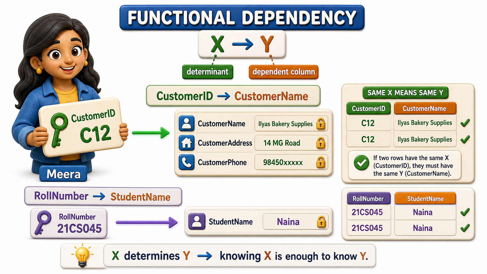
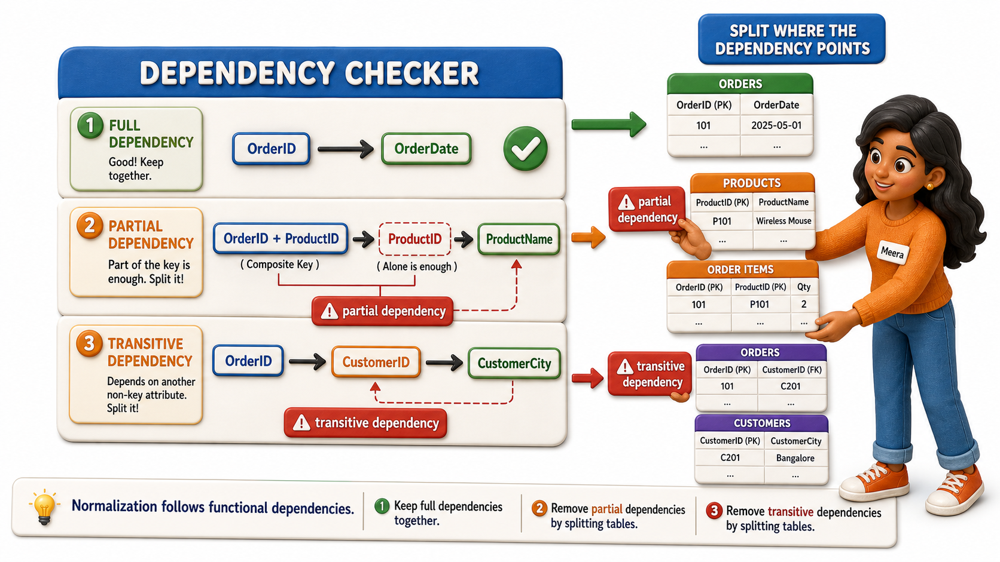

## Introduction

Meera is a business analyst brought in to help Sunrise Traders untangle the anomalies Priya kept running into with the combined Orders table, the address that forgot to update everywhere, the product that could not be added until someone bought it, the customer record that vanished when an order was cancelled. Meera's manager asks her a deceptively simple question: "Before we redesign anything, can you tell me exactly which column depends on which?" Meera realizes she needs a precise, almost mathematical way to answer that, not a vague sense that "these seem related."

The tool she reaches for is called a **`functional dependency`**, and it says something very specific: if you know the value in one column, does that guarantee you can know the value in another column, every single time, without exception?

If CustomerID C12 always means the shop is Ilyas Bakery Supplies, and it can never mean anything else, then CustomerID determines CustomerName. `Functional dependencies` are the precise, rule-based foundation that every later decision about splitting or keeping a table rests on, and Meera spends her first afternoon simply writing them down.

## What "X Determines Y" Actually Means

A `functional dependency` is usually written as X determines Y, meaning that for any two rows that share the same value of X, they must also share the same value of Y. It is not enough for X and Y to usually match up, the rule has to hold with certainty, for every row, always. Meera tests this against Sunrise Traders' data using CustomerID and CustomerName. Every row with CustomerID C12 says "Ilyas Bakery Supplies," with no exceptions anywhere in the table. So CustomerID determines CustomerName.

She writes it the way database designers do:

CustomerID -> CustomerName

The column on the left, CustomerID, is called the determinant. The column on the right, CustomerName, is the dependent column. Once Meera fixes a CustomerID, the CustomerName is no longer free to vary, it is pinned down completely.

## A Familiar Shape: Roll Number and Student Name

Meera explains the idea to a colleague using a simpler, more familiar example first: in any properly run college, a Roll Number determines a Student Name. Given Roll Number 21CS045, there is exactly one correct answer to "whose roll number is this," and that answer never changes depending on which row of a table you happen to be looking at.

| RollNumber | StudentName |
|---|---|
| 21CS045 | Naina Fernandes |
| 21CS046 | Arjun Rao |
| 21CS047 | Naina Fernandes |

Even though "Naina Fernandes" appears twice in this small table, attached to two different roll numbers, that does not break the dependency. A `functional dependency` only requires that the same X always produces the same Y, it says nothing about whether the same Y can come from more than one X. RollNumber -> StudentName holds perfectly here, because every occurrence of a given roll number brings the same name with it.

## Reading Functional Dependencies Out of Sunrise Traders' Data

Back at Sunrise Traders, Meera lists out every `functional dependency` she can spot in the old combined Orders table.

| Determinant | Dependent column | Why it holds |
|---|---|---|
| CustomerID | CustomerName, CustomerAddress, CustomerPhone | Every order placed by the same customer shows the same name, address, and phone |
| ProductID | ProductName, ProductPrice | Every order line for the same product shows the same name and price |
| OrderID | OrderDate, CustomerID | Each order happened on exactly one date, placed by exactly one customer |

Each row in this table represents a rule Meera can rely on absolutely. Given a CustomerID, the customer's name, address, and phone are no longer in question. Given a ProductID, the product's name and price are settled. These are the threads that, once pulled apart, tell Meera exactly which facts belong together in the same table.

## Partial Dependency: When Only Part of the Key Is Needed

Some of Sunrise Traders' data is identified not by a single column but by a combination, an OrderID together with a ProductID uniquely identifies one line of an order, since the same order can include several different products. Meera notices something odd when she looks at ProductName under this combined key: ProductName does not actually need the OrderID at all, it is fully explained by ProductID alone. A dependency where a column depends on only part of a `composite key`, rather than the whole key, is called a **partial dependency**. It is a warning sign that a fact is being stored in a table keyed by more information than that fact actually needs.

## Transitive Dependency: A Chain of Two Hops

Meera spots a second, subtler pattern while looking at a simplified Orders table that stores OrderID, CustomerID, and CustomerCity together. OrderID determines CustomerID, since each order belongs to one customer, and CustomerID determines CustomerCity, since each customer has one registered city. But notice what that means for OrderID and CustomerCity: OrderID does not describe CustomerCity directly, it only gets there by first passing through CustomerID. This two-hop chain, where a column depends on the key only indirectly, through another non-key column, is called a **transitive dependency**. Meera flags it for later, sensing that a fact reached only by a detour through another fact is probably not sitting in the right table.

## Functional Dependencies at a Glance

| Idea | What it means | Sunrise Traders example |
|---|---|---|
| Functional dependency (X -> Y) | Knowing X guarantees Y, with no exceptions | CustomerID -> CustomerAddress |
| Determinant | The column on the left, the one doing the determining | CustomerID |
| Partial dependency | A column depends on only part of a composite key | ProductName depends on ProductID alone, not on OrderID + ProductID together |
| Transitive dependency | A column depends on the key only through another non-key column | CustomerCity depends on CustomerID, which depends on OrderID |

## Conclusion

A `functional dependency` turns "these columns seem related" into a precise, testable rule: given a value in one column, exactly one value in another column is guaranteed, every time. Meera's afternoon of writing down CustomerID -> CustomerName, ProductID -> ProductPrice, and OrderID -> CustomerID gave Sunrise Traders something Priya's instinct never could, an exact map of which facts belong to which real-world thing.

Along the way, Meera also noticed two shapes worth watching for:

- A dependency on only part of a `composite key`
- A dependency reached only by a detour through another column

Both turn out to be exactly the patterns that a disciplined, step-by-step process checks for, one refinement at a time, when it decides how a table ought to be split.
