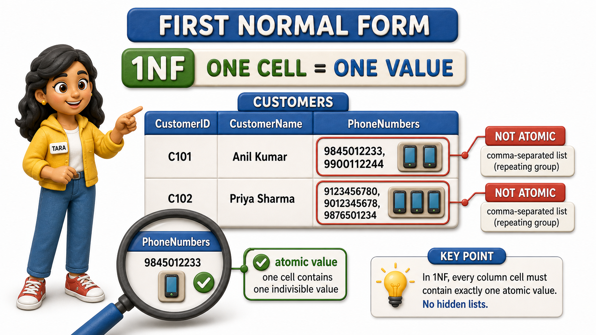
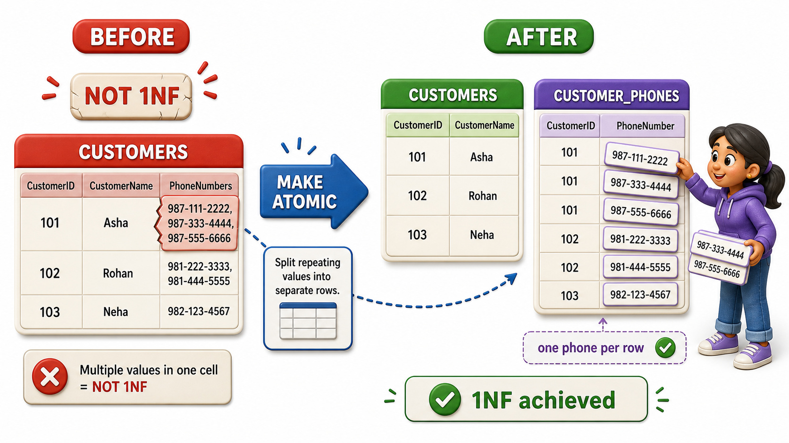

## Introduction

Tara is the systems person tasked with actually rebuilding Sunrise Traders' tables, now that Priya has documented the anomalies and Meera has mapped out the `functional dependencies` hiding inside them. Tara starts with what looks like the simplest table in the whole system, a Customers table listing each shop's ID, name, and contact number. She pulls up the real data and immediately spots a problem in the phone number column.

| CustomerID | CustomerName | PhoneNumbers |
|---|---|---|
| C12 | Ilyas Bakery Supplies | 9845012233, 9900112244 |
| C07 | Meenal Stationers | 9988776655 |
| C15 | Rao General Store | 9123456780, 9012345678, 9876501234 |

Ilyas Bakery Supplies has two phone numbers crammed into a single cell, separated by a comma. Rao General Store has three. Tara knows immediately this cannot stay as it is, because a single column is supposed to hold a single value, not a hidden list pretending to be one piece of text. Getting this right is the very first checkpoint in redesigning any table, and it has a name: **First `Normal Form`**, usually written 1NF, the rule that every column in every row must hold one atomic, indivisible value, never a repeating group or a comma-separated bundle disguised as a single entry.

## Why a Comma-Separated Cell Is Not Actually One Value

It is tempting to think "9845012233, 9900112244" is just a slightly long piece of text, no different from a long address. But an address, however long, is genuinely one fact, the shop's location. A cell holding two phone numbers is secretly holding two separate facts squeezed into one box, and that causes real damage the moment anyone tries to use the data properly.

Tara tries two simple checks against the table as it stands:

- "Find every customer whose phone number is 9900112244." Against the PhoneNumbers column, that search either has to awkwardly scan for a substring inside a longer piece of text, or it silently misses Ilyas Bakery Supplies entirely because the number is not stored on its own.
- "Count how many phone numbers Sunrise Traders has on file in total." There is no clean way to get that count out of a column where some cells hold one number and others hold three. Both tasks should be trivial for a database to answer, and both become clumsy or wrong the moment a column stops being atomic.

## What "Atomic" Actually Requires

A column is atomic when it holds exactly one value of its stated kind, for every row, with nothing further to split apart. PhoneNumbers holding "9845012233, 9900112244" fails this test outright, it holds two phone numbers. But atomicity is not only about commas. A single date column holding "March, 2026" instead of an exact day would also fail, because it is bundling a month and a year loosely rather than storing one precise value. The test Tara settles on is simple: can this cell's contents mean two different things to two different readers, or does it need to be split further to answer an ordinary question about the data? If the answer is yes, the column is not atomic yet.

## Splitting the Table to Reach 1NF

Tara's fix is to stop trying to force a variable number of phone numbers into a fixed number of columns, or into one overstuffed cell, and instead give phone numbers a table of their own, one row per number.

Customers table, now holding only genuinely single-valued facts:

| CustomerID | CustomerName |
|---|---|
| C12 | Ilyas Bakery Supplies |
| C07 | Meenal Stationers |
| C15 | Rao General Store |

CustomerPhones table, one row for every individual phone number, linked back to the customer it belongs to:

| CustomerID | PhoneNumber |
|---|---|
| C12 | 9845012233 |
| C12 | 9900112244 |
| C07 | 9988776655 |
| C15 | 9123456780 |
| C15 | 9012345678 |
| C15 | 9876501234 |

Every cell in both tables now holds exactly one value. Ilyas Bakery Supplies having two phone numbers is no longer a formatting trick inside one crowded cell, it is simply two ordinary rows in CustomerPhones, both pointing back to CustomerID C12. Rao General Store having three numbers is three rows, not a longer string. "Find every customer whose phone number is 9900112244" is now a plain, direct lookup, and "count how many phone numbers Sunrise Traders has on file" is just counting rows.

## A Table Can Fail 1NF in More Than One Way

Comma-separated lists are the most visible violation, but the same underlying mistake shows up whenever a table tries to hold a variable amount of the same kind of fact using a fixed, awkward shape. A design that uses separate columns like Phone1, Phone2, Phone3 has the identical problem wearing a different disguise, it still assumes every customer has the same number of phone numbers, wastes space for customers with fewer, and simply breaks for the customer who eventually needs a fourth. 1NF is not really a rule about commas specifically, it is a rule about refusing to let one column secretly represent more than one fact.

## First Normal Form at a Glance

| Check | Fails 1NF | Meets 1NF |
|---|---|---|
| One phone number per cell | "9845012233, 9900112244" in a single PhoneNumbers cell | One row per phone number in a separate CustomerPhones table |
| Fixed repeating columns | Phone1, Phone2, Phone3 columns, mostly empty | A separate table with one row per value, however many there are |
| Searching for one value | Requires scanning inside text for a match | A direct, exact match on a single column |

## Conclusion

First `Normal Form` asks for the most basic kind of honesty a table can offer: every column holds exactly one value, never a hidden list dressed up as a single entry. Tara's fix for Sunrise Traders' phone numbers, moving from one crowded PhoneNumbers cell to a proper CustomerPhones table with one row per number, is the smallest possible step in restructuring a table, and yet it is the one every other refinement depends on, because none of the later checks make sense against a column that is still secretly plural.

Reaching 1NF only guarantees that every cell is honest about holding a single value, it says nothing yet about whether every column in a table actually belongs with the rest of that table's key, which is exactly the question a `composite key` like OrderID and ProductID together forces Sunrise Traders to confront next.
