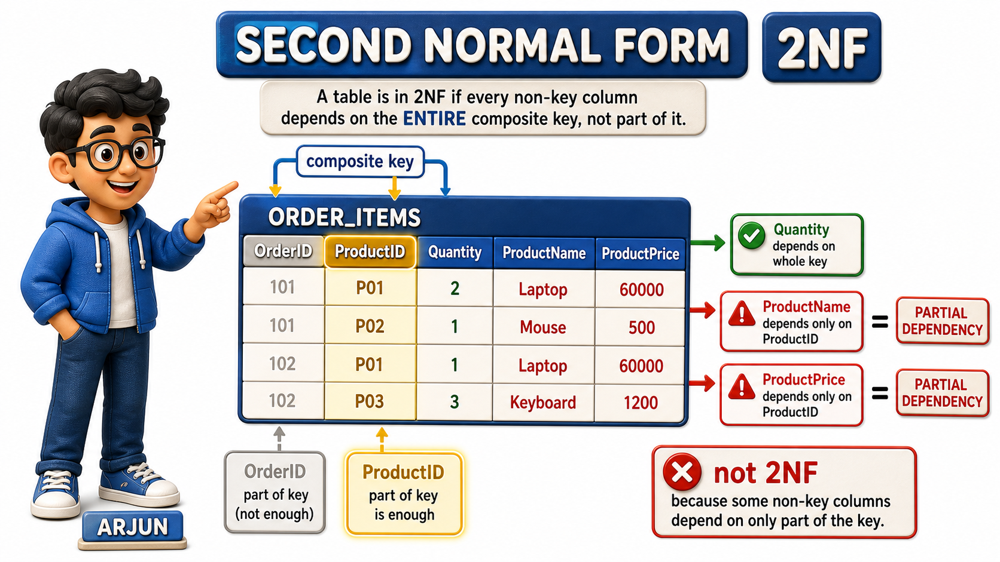
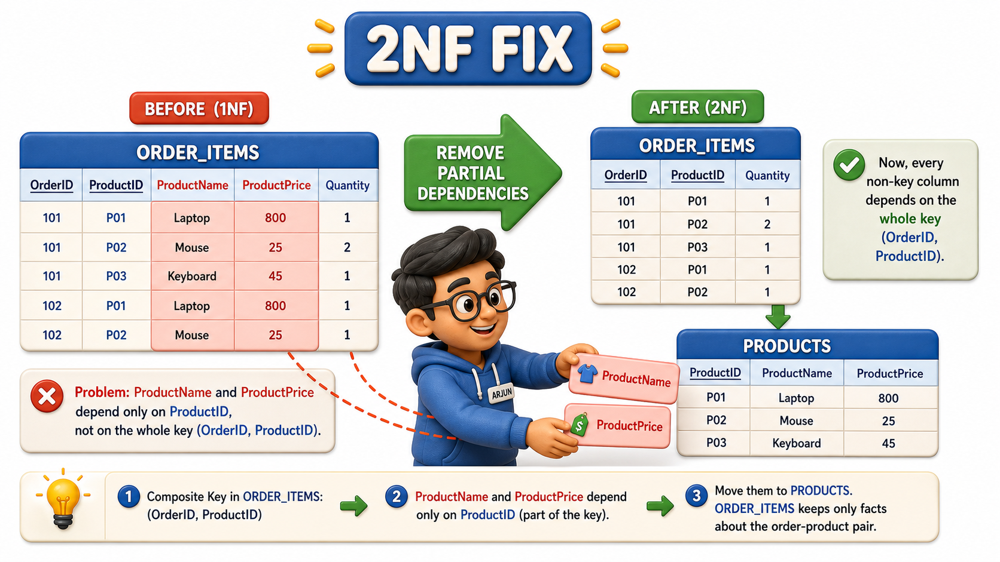

## Introduction

Arjun inherits the OrderItems table from Tara once the phone number mess is sorted out, and his job is to model the fact that a single order at Sunrise Traders can include several different products. An order for Ilyas Bakery Supplies might include notebooks and pens in the same order, so no single OrderID is enough to identify one line of that order, Arjun needs both the OrderID and the ProductID together. That pair becomes the table's composite `primary key`.

| OrderID | ProductID | ProductName | ProductPrice | Quantity |
|---|---|---|---|---|
| O501 | P01 | A4 Notebook | 45 | 100 |
| O502 | P03 | Gel Pen Box | 120 | 20 |
| O503 | P01 | A4 Notebook | 45 | 200 |
| O504 | P02 | File Folder | 30 | 50 |

Every row here is already in 1NF, each cell holds one atomic value, no comma-separated lists anywhere. But Arjun notices something uncomfortable when he thinks about what the key actually needs:

- Quantity genuinely depends on both OrderID and ProductID together, since the same product ordered in two different orders can have two completely different quantities.
- ProductName and ProductPrice, though, do not care about OrderID at all, they are fully settled by ProductID alone. This mismatch, where some columns lean on only part of a composite key rather than the whole thing, is exactly what **Second `Normal Form`**, or 2NF, exists to catch and correct.

## Second Normal Form Builds Directly on First Normal Form

2NF has a prerequisite: a table must already be in 1NF before 2NF is even a meaningful question to ask, since 2NF is entirely about how non-key columns relate to the key, and that relationship is only worth examining once every column is confirmed to hold a single atomic value. Arjun's OrderItems table clears that bar already. The new requirement 2NF adds is this: every non-key column must depend on the whole `primary key`, not on just a piece of it. A table with a single-column `primary key` automatically satisfies this, since there is no "part" of a single column to partially depend on. The question only becomes interesting, and only becomes a risk, once a table's key is composite, built from two or more columns working together.

## Finding the Partial Dependency

Arjun writes out exactly what each non-key column in OrderItems depends on.

| Column | Depends on | Full key or partial key? |
|---|---|---|
| Quantity | OrderID and ProductID together | Full key, the quantity is specific to this exact order line |
| ProductName | ProductID alone | Partial key, OrderID is irrelevant to the product's name |
| ProductPrice | ProductID alone | Partial key, OrderID is irrelevant to the product's price |

ProductName and ProductPrice are sitting in a table keyed by OrderID plus ProductID, but neither of them actually needs the OrderID half of that key at all. This is a **partial dependency**, a non-key column that depends on only part of a `composite key` rather than the whole thing, and it drags the same redundancy problem back in that 1NF just cleaned up. Look at rows O501 and O503, both order A4 Notebook, and both repeat "A4 Notebook" and "45" all over again. If Sunrise Traders ever changes the price of an A4 Notebook, every single order line that ever ordered one needs to be found and updated, exactly the update anomaly Priya ran into with customer addresses, now showing up again for products.

## Splitting Off the Partially Dependent Columns

The fix follows directly from the dependency table Arjun just wrote. Any column that depends on only part of the key gets moved into a table keyed by that part alone.

OrderItems, keeping only what genuinely needs the full `composite key`:

| OrderID | ProductID | Quantity |
|---|---|---|
| O501 | P01 | 100 |
| O502 | P03 | 20 |
| O503 | P01 | 200 |
| O504 | P02 | 50 |

Products, keyed by ProductID alone, holding everything that only ever needed ProductID:

| ProductID | ProductName | ProductPrice |
|---|---|---|
| P01 | A4 Notebook | 45 |
| P02 | File Folder | 30 |
| P03 | Gel Pen Box | 120 |

Now A4 Notebook's name and price exist exactly once, in one row of Products, no matter how many order lines across Sunrise Traders' entire history have ever included it. Changing its price is a single edit in a single row. OrderItems still records exactly what each order actually needs, which product, in what quantity, tied to which order, without dragging along facts that were never really about the order line in the first place.

## Why This Matters Only When the Key Is Composite

It is worth being precise about when 2NF actually bites. If OrderItems had used a single manufactured OrderItemID as its `primary key` instead of the composite OrderID-plus-ProductID pair, there would technically be no composite key for anything to be "partial" against, and the textbook definition of 2NF would already be satisfied. But the underlying redundancy, ProductName and ProductPrice repeating across every line that mentions the same product, would still be sitting right there in the data, just less visible under the formal rule. Arjun treats 2NF as a genuine warning sign to hunt for, not merely a checkbox to satisfy by renaming the key, because the goal was never to pass the rule, it was to stop retyping the same product details over and over.

## Second Normal Form at a Glance

| Check | Before (fails 2NF) | After (meets 2NF) |
|---|---|---|
| Key shape | Composite key: OrderID + ProductID | OrderItems keeps the composite key; Products gets its own single-column key |
| ProductName's true dependency | Only needs ProductID, but sits in a table keyed by both | Lives in Products, keyed by ProductID alone |
| Cost of a price change | Every order line for that product must be found and updated | One row in Products is updated |

## Conclusion

Second `Normal Form` asks a table with a composite key one pointed question: does every non-key column genuinely need the whole key, or is some column really only attached to part of it? Arjun's OrderItems table showed the classic pattern, a Quantity that truly depends on the order-and-product pair together, sitting alongside a ProductName and ProductPrice that only ever depended on the product half, and splitting the table along that seam removed the redundancy cleanly.

Not every redundant table has a `composite key` to blame, though. Sunrise Traders' Orders table, keyed by nothing more than a single OrderID, still manages to repeat a customer's city on every order that customer places, and explaining why that happens requires looking one step further down the chain of dependencies than 2NF alone can reach.
