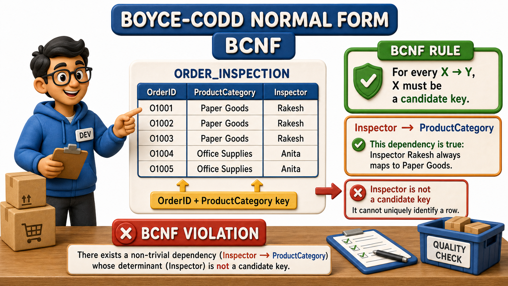
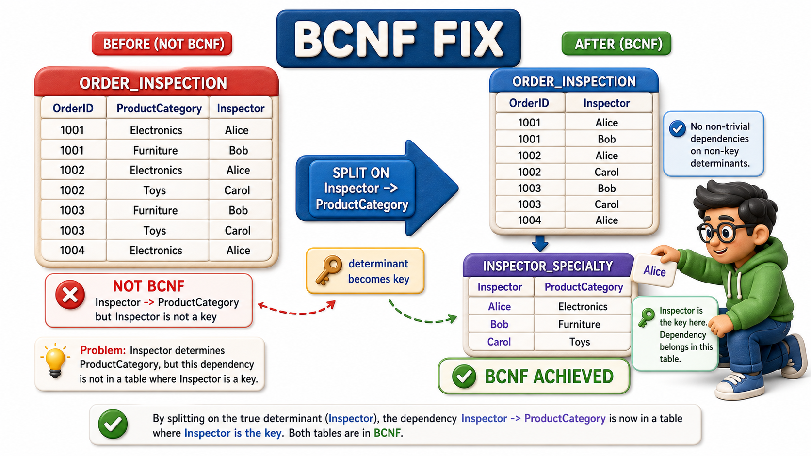

## Introduction

Dev runs quality inspection at Sunrise Traders' warehouse, where every outgoing order gets checked before it ships. A single order can include several product categories, notebooks fall under Paper Goods, pens fall under Writing Instruments, and each category on an order is checked off by one inspector. Dev keeps a straightforward table of who inspected what.

| OrderID | ProductCategory | Inspector |
|---|---|---|
| O501 | Paper Goods | Rakesh |
| O501 | Writing Instruments | Sunita |
| O502 | Paper Goods | Rakesh |
| O503 | Writing Instruments | Farah |

This table passes every rule covered so far:

- Every column holds one atomic value, so 1NF is satisfied.
- The table's key is the pair OrderID and ProductCategory, since a given order has at most one inspector per category, and Inspector depends on that whole pair rather than on just OrderID or just ProductCategory alone, so there is no partial dependency to catch, satisfying 2NF.
- Dev checks for a transitive chain and finds none, satisfying 3NF.

By every rule Naina and Arjun applied earlier, this table looks completely clean. And yet Dev notices "Rakesh" and "Paper Goods" sitting together twice, on O501 and O502, which smells exactly like the redundancy every earlier rule was supposed to have already eliminated. The reason a table can pass 1NF, 2NF, and 3NF and still hide this kind of repetition is a subtlety that a stricter rule, **Boyce-Codd `Normal Form`**, or BCNF, was built specifically to catch.

## The Rule Everyone at Sunrise Traders Already Knows About This Warehouse

Dev knows one more fact about how the warehouse actually operates, a fact that never made it into the table's structure: each inspector specializes in exactly one product category. Rakesh only ever inspects Paper Goods, Sunita only ever inspects Writing Instruments, and while a category can be handled by more than one inspector across different orders and shifts, as Writing Instruments is handled by both Sunita and Farah, no individual inspector ever crosses over into a category outside their specialty. That business rule is itself a `functional dependency`, written the same way every other one has been:

Inspector -> ProductCategory

Given an inspector's name, the product category they handle is fully determined, no exceptions. This dependency is completely genuine, and it is exactly what is causing "Rakesh" and "Paper Goods" to keep showing up together, every time Rakesh appears on an order, his specialty comes along for the ride, repeated all over again.

## Why 3NF Missed It

The reason 3NF gave this table a clean pass is worth sitting with. 3NF only worries about non-key columns depending transitively on the key through another non-key column. But in Dev's table, ProductCategory is not a plain non-key column at all, it is part of the table's `primary key`, one half of the pair OrderID-and-ProductCategory. Columns that belong to a candidate key are called prime attributes, and the version of 3NF Dev learned earlier only restricts dependencies landing on non-prime attributes. Because ProductCategory happens to be prime here, the transitive-style dependency coming from Inspector slips past 3NF's check entirely, even though it is producing the exact same redundancy 3NF exists to prevent.

## What BCNF Actually Demands

BCNF removes that loophole with one clean, stricter requirement: for every functional dependency X -> Y in the table, X must be a `candidate key`, a minimal column or combination of columns capable of uniquely identifying a row on its own. It does not matter whether Y is prime or not, the way it mattered for 3NF, BCNF cares only about whether the determinant, the X, is powerful enough to identify a whole row by itself.

Dev checks Inspector -> ProductCategory against that requirement. Is Inspector, alone, a `candidate key` of this table? No. Inspector alone cannot uniquely identify a row, since the same inspector appears in multiple rows tied to different orders, OrderID is still needed to pin a row down. Inspector determines ProductCategory perfectly well, but Inspector is not a `candidate key`, and that single mismatch is a BCNF violation, even though the table already satisfied every earlier rule.

## Splitting Along the True Determinant

The fix follows the same instinct every earlier split has used, move the dependency into a table where its determinant genuinely is the key.

OrderInspection, recording which inspector handled which order:

| OrderID | Inspector |
|---|---|
| O501 | Rakesh |
| O501 | Sunita |
| O502 | Rakesh |
| O503 | Farah |

InspectorSpecialty, recording each inspector's one product category:

| Inspector | ProductCategory |
|---|---|
| Rakesh | Paper Goods |
| Sunita | Writing Instruments |
| Farah | Writing Instruments |

In InspectorSpecialty, Inspector is now the whole `primary key`, so Inspector -> ProductCategory no longer breaks any rule, the determinant is finally a candidate key. Dev can look up which category any order-and-inspector pair covers by `joining` the two tables, and "Rakesh specializes in Paper Goods" now lives in exactly one row, however many orders Rakesh ever inspects.

## Boyce-Codd Normal Form at a Glance

| Check | Before (fails BCNF) | After (meets BCNF) |
|---|---|---|
| Suspicious dependency | Inspector -> ProductCategory, inside a table keyed by OrderID + ProductCategory | Inspector -> ProductCategory, inside InspectorSpecialty, keyed by Inspector alone |
| Is the determinant a candidate key? | No, Inspector alone cannot identify a row | Yes, Inspector is the entire key of InspectorSpecialty |
| Did 3NF catch this? | No, because ProductCategory is a prime attribute | Not applicable, the table is now split correctly |

## Conclusion

Boyce-Codd `Normal Form` closes the one gap 3NF leaves open: a table can satisfy every earlier rule and still repeat data whenever a functional dependency's determinant is not itself a candidate key, especially when the dependent column happens to be part of the primary key rather than sitting outside it. Dev's inspection table showed exactly that pattern, Inspector determined ProductCategory perfectly, but Inspector alone was never capable of identifying a row, and moving that dependency into its own InspectorSpecialty table, keyed directly by Inspector, resolved it the same way every earlier fix has, by giving the determinant a table where it truly is the key.

At this point Sunrise Traders' `schema` is about as free of redundancy as a design can get, built from small, precise tables each holding exactly one kind of fact, which raises a very different, very practical question about what all this careful splitting actually costs once someone has to pull several of these tables back together just to answer an ordinary business question.
