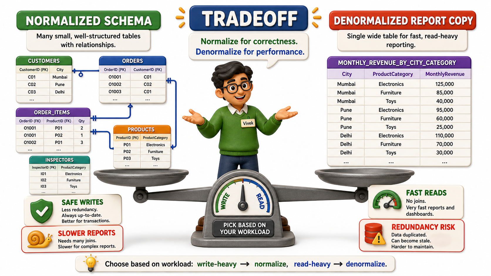
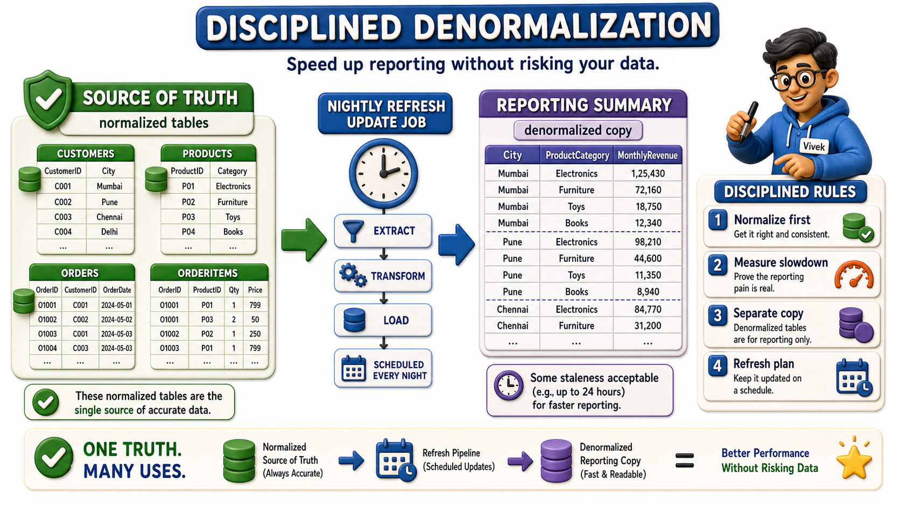

## Introduction

Vivek leads operations reporting at Sunrise Traders, and he is, on paper, thrilled with what Priya, Meera, Tara, Arjun, Naina, and Dev have built together. Customers, Products, Orders, OrderItems, InspectorSpecialty, every fact now lives in exactly one place, and the anomalies that used to plague the old combined table are gone. Then finance asks Vivek for a monthly report: total revenue per city, broken down by product category, for the last twelve months. To answer it, Vivek has to pull data from five separate tables at once, matching orders to customers to get each city, matching order lines to products to get each category, and matching products to inspections to confirm what shipped. The report that used to take a few seconds against the old, messy, single table now takes noticeably longer against the clean one, because the database has to keep combining rows from several places before it can even start adding numbers.

Vivek is not seeing a bug. He is running into the honest cost of the very discipline the team just finished applying, and it forces a question every real system eventually has to answer: when, if ever, does it make sense to deliberately reintroduce some redundancy, a practice called **denormalization**, in exchange for a faster answer.

## What Normalization Cost Sunrise Traders, in Exchange for What It Fixed

Every split Priya's team performed traded one thing for another. The old combined Orders table was fast to read from, because everything needed for a report sat in a single table with no combining required, but it was dangerous to write to, because the same fact was repeated everywhere and could quietly fall out of sync. The new, normalized `schema` is the mirror image, safe to write to, because each fact lives in exactly one row and an update can never leave two copies disagreeing, but slower to read from for exactly the kind of broad report Vivek now needs, because getting a full picture means combining several small, precise tables back together.

| Design choice | What it protects | What it costs |
|---|---|---|
| One wide combined table | Fast reads, everything sits together already | Redundant data, update and delete anomalies, as Priya discovered first |
| Fully normalized, split tables | Safe, anomaly-free writes, each fact stored once | Reports must combine several tables, which takes real computing work |

Neither design is simply "correct" in isolation. Normalization is the right default because most everyday work against a database, placing an order, updating a customer's address, adding a new product, is a write, and writes are exactly where anomalies do their damage. But Vivek's monthly report is overwhelmingly a read, run against months of accumulated history, and reads are where the cost of combining many small tables becomes most visible.

## Denormalization: Paying With Redundancy to Buy Back Speed

Denormalization means deliberately storing a piece of data in more than one place, the very thing normalization spent six separate corrections eliminating, because the speed gained on reads is worth more, for a specific, measured use case, than the small risk of the copies drifting apart. Vivek's fix is not to undo the normalized `schema` Sunrise Traders now depends on for everyday order-taking. Instead, he builds a separate summary structure specifically for reporting, one that stores CustomerCity and ProductCategory directly alongside the sales totals they get grouped by, refreshed on a schedule rather than recalculated from scratch on every request.

| Report field | Fully normalized source | Vivek's denormalized reporting copy |
|---|---|---|
| CustomerCity | Looked up via CustomerID on every report run | Stored directly on each summarized sales row |
| ProductCategory | Looked up via ProductID and InspectorSpecialty | Stored directly on each summarized sales row |
| Monthly revenue total | Recomputed by summing OrderItems each time | Pre-calculated and stored, refreshed periodically |

The order-taking side of Sunrise Traders, where Priya enters new orders and Tara maintains customer records, keeps running against the fully normalized tables, because that is exactly where correctness on every single write matters most. The reporting side runs against a separate, deliberately redundant copy, refreshed regularly, where a few hours of staleness is a completely acceptable trade for a report that used to take too long and now returns quickly.

## A Discipline, Not a Free Pass

The danger in all of this is treating denormalization as an excuse to skip the careful work Sunrise Traders' team just finished. Redundant data is still redundant data, it still carries the same risk of two copies disagreeing that caused every anomaly in the original combined table. The difference is that Vivek is choosing that risk deliberately, for one specific, measured bottleneck, rather than backing into it by accident the way the original combined Orders table did. A few habits keep the trade-off honest:

- **Normalize first, always**, as the default shape of a `schema`, because most of what a system does day to day is write data, and writes are exactly where redundancy causes real damage.
- **Denormalize only after a genuine, measured slowdown shows up**, not because combining tables sounds slow in theory. Vivek only built his reporting summary after finance's monthly report was demonstrably too slow against the properly normalized tables, not before.
- **Keep the denormalized copy clearly separate** from the tables that handle everyday writes, so the system's source of truth, where corrections and updates actually happen, is never in doubt.
- **Put a plan in place for keeping the redundant copy refreshed**, whether that means recalculating it nightly or updating it whenever the source data changes, because a denormalized copy that nobody refreshes eventually tells the same kind of lie the original combined table told Priya about Ilyas Bakery Supplies' address.

## Normalization Versus Denormalization at a Glance

| Question to ask | Favors staying normalized | Favors denormalizing |
|---|---|---|
| Is this mostly writes or mostly reads? | Mostly writes, orders being placed and edited constantly | Mostly reads, a report run repeatedly against settled history |
| Has a real slowdown been measured? | No measured problem yet | Yes, a specific report or query is demonstrably too slow |
| Does correctness on every update matter here? | Yes, this is the system of record | Less critical, some staleness is acceptable |

## Conclusion

Normalization and denormalization are not rival philosophies where one side is simply right, they are two ends of a genuine trade-off between safe, anomaly-free writes and fast, uncombined reads, and a mature `schema` uses each where it earns its keep. Sunrise Traders keeps its order-taking tables fully normalized because that is where correctness on every single write matters most, and layers a separate, deliberately redundant reporting structure on top only once a real, measured slowdown justified it, never as a shortcut taken in advance of any actual problem. Vivek's monthly revenue-by-city-and-category report, once a slow crawl through five `joined` tables, now runs quickly against his pre-calculated summary, without ever putting the order-taking tables' correctness at risk.

With the shape of the tables themselves settled, correctly split apart and reassembled only where genuinely needed, the remaining decisions in designing a `schema` turn to smaller but no less consequential choices, exactly which data type to store each fact in, how to choose the keys that identify each row, and how to name every table and column so the design stays readable to whoever inherits it next.
