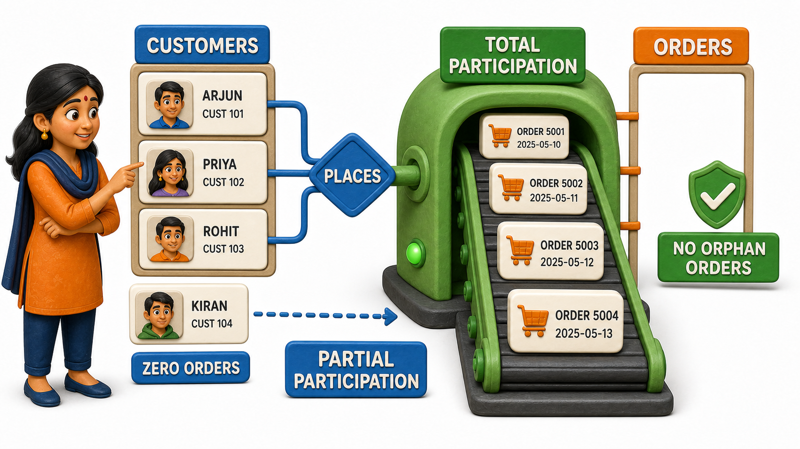
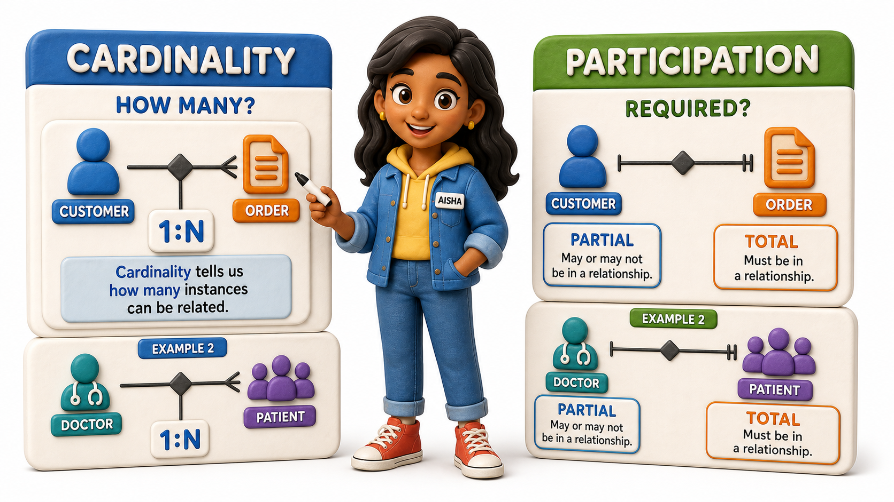

## Introduction

Aisha is reviewing the order-management design for an online electronics store, and something about the relationship between Customers and Orders is bothering her. She knows, from working through cardinality already, that this is a one-to-many relationship: one customer can place many orders, and each order belongs to exactly one customer. But cardinality alone does not answer a question her manager just asked her: "Can an order exist without a customer attached to it?.

And can a customer exist who has never placed a single order?"

Aisha thinks about it and realises the two answers are completely different:

- Every single order in the system absolutely must belong to some customer; the store has no concept of an order that simply floats free with no one to bill or ship it to.
- A customer can absolutely exist without ever having placed an order, someone who created an account, browsed a little, and never checked out.

Both of these are true at once, and the relationship's cardinality alone never told Aisha that. What she has just worked out is called **participation `constraint`**, the question of whether every instance of an entity is required to take part in a relationship, or whether some instances are allowed to sit outside it.

## Total Participation: Every Instance Must Take Part

When every single instance of an entity is required to participate in a relationship, that entity has **total participation** in the relationship. Orders is the clean example here: an order that exists in the store's system, by definition, was placed by a customer. There is no such thing as an orphaned order sitting in the `database` with no customer behind it.

Every `row` in the Orders `table`, without exception, must be tied to a `row` in the Customers `table`.

<table style="border-collapse: collapse; width: 100%; margin: 1rem 0; font-size: 0.95rem;">
  <thead>
    <tr>
      <th style="border: 1px solid #c8d7ea; padding: 10px 12px; text-align: left; background-color: #dceeff; color: #102a43; font-weight: 700;">Order ID</th>
      <th style="border: 1px solid #c8d7ea; padding: 10px 12px; text-align: left; background-color: #dceeff; color: #102a43; font-weight: 700;">Customer</th>
      <th style="border: 1px solid #c8d7ea; padding: 10px 12px; text-align: left; background-color: #dceeff; color: #102a43; font-weight: 700;">Amount</th>
    </tr>
  </thead>
  <tbody>
    <tr style="background-color: #ffffff;">
      <td style="border: 1px solid #d8e2ef; padding: 9px 12px; vertical-align: top;">ORD-2001</td>
      <td style="border: 1px solid #d8e2ef; padding: 9px 12px; vertical-align: top;">Rohan Mehta</td>
      <td style="border: 1px solid #d8e2ef; padding: 9px 12px; vertical-align: top;">4,500</td>
    </tr>
    <tr style="background-color: #f7fbff;">
      <td style="border: 1px solid #d8e2ef; padding: 9px 12px; vertical-align: top;">ORD-2002</td>
      <td style="border: 1px solid #d8e2ef; padding: 9px 12px; vertical-align: top;">Devika Rao</td>
      <td style="border: 1px solid #d8e2ef; padding: 9px 12px; vertical-align: top;">1,200</td>
    </tr>
    <tr style="background-color: #ffffff;">
      <td style="border: 1px solid #d8e2ef; padding: 9px 12px; vertical-align: top;">ORD-2003</td>
      <td style="border: 1px solid #d8e2ef; padding: 9px 12px; vertical-align: top;">Rohan Mehta</td>
      <td style="border: 1px solid #d8e2ef; padding: 9px 12px; vertical-align: top;">890</td>
    </tr>
  </tbody>
</table>

Every `row` here has a customer filled in, and that is not a coincidence of this particular sample, it is a rule the store enforces for every order that will ever be created. Total participation means the relationship is not optional from that entity's side; it is a mandatory part of what it even means for an instance of that entity to exist in the system.

## Partial Participation: Some Instances May Sit Out

The opposite case is **partial participation**, where an entity's instances are allowed to exist whether or not they take part in the relationship. Customers, in Aisha's store, has partial participation in the Orders relationship: some customers have three orders, some have one, and some, like a person who signed up yesterday, have none at all, and that is a perfectly normal, valid state.

<table style="border-collapse: collapse; width: 100%; margin: 1rem 0; font-size: 0.95rem;">
  <thead>
    <tr>
      <th style="border: 1px solid #c8d7ea; padding: 10px 12px; text-align: left; background-color: #dceeff; color: #102a43; font-weight: 700;">Customer</th>
      <th style="border: 1px solid #c8d7ea; padding: 10px 12px; text-align: left; background-color: #dceeff; color: #102a43; font-weight: 700;">Has placed an order?</th>
    </tr>
  </thead>
  <tbody>
    <tr style="background-color: #ffffff;">
      <td style="border: 1px solid #d8e2ef; padding: 9px 12px; vertical-align: top;">Rohan Mehta</td>
      <td style="border: 1px solid #d8e2ef; padding: 9px 12px; vertical-align: top;">Yes, two orders</td>
    </tr>
    <tr style="background-color: #f7fbff;">
      <td style="border: 1px solid #d8e2ef; padding: 9px 12px; vertical-align: top;">Devika Rao</td>
      <td style="border: 1px solid #d8e2ef; padding: 9px 12px; vertical-align: top;">Yes, one order</td>
    </tr>
    <tr style="background-color: #ffffff;">
      <td style="border: 1px solid #d8e2ef; padding: 9px 12px; vertical-align: top;">Kiran Shah</td>
      <td style="border: 1px solid #d8e2ef; padding: 9px 12px; vertical-align: top;">No orders yet</td>
    </tr>
  </tbody>
</table>

Kiran Shah's `row` is exactly what partial participation allows for: a legitimate customer record with zero linked orders, causing no error, no missing data, nothing broken about the design. If the store had instead insisted that every customer must have at least one order, it would be forcing every new signup to place an order the instant they register, which does not match how the business actually works.

## Reading Participation From Each Side of a Relationship

The habit that keeps Aisha from making mistakes here is the same one she learned while working through cardinality: describe a relationship's participation from both sides, separately, because the two sides are almost never symmetrical. Orders has total participation in the Customer-Orders relationship (every order must have a customer), while Customers has partial participation in the very same relationship (a customer does not need an order).

Both statements are about the same relationship, but they describe different entities, and mixing them up leads directly to a design that is too strict on one side or too loose on the other.

A second example makes the asymmetry even sharper. Consider a hospital's relationship between Doctors and Patients through an "Admits" relationship.

Every patient who is currently admitted must have been admitted by some doctor, so Patients has total participation there. But a doctor on staff might currently have zero admitted patients, perhaps they are a specialist between cases, so Doctors has partial participation in that same relationship.

<table style="border-collapse: collapse; width: 100%; margin: 1rem 0; font-size: 0.95rem;">
  <thead>
    <tr>
      <th style="border: 1px solid #c8d7ea; padding: 10px 12px; text-align: left; background-color: #dceeff; color: #102a43; font-weight: 700;">Relationship side</th>
      <th style="border: 1px solid #c8d7ea; padding: 10px 12px; text-align: left; background-color: #dceeff; color: #102a43; font-weight: 700;">Participation</th>
      <th style="border: 1px solid #c8d7ea; padding: 10px 12px; text-align: left; background-color: #dceeff; color: #102a43; font-weight: 700;">Meaning</th>
    </tr>
  </thead>
  <tbody>
    <tr style="background-color: #ffffff;">
      <td style="border: 1px solid #d8e2ef; padding: 9px 12px; vertical-align: top;">Orders (in Customer-Orders)</td>
      <td style="border: 1px solid #d8e2ef; padding: 9px 12px; vertical-align: top;">Total</td>
      <td style="border: 1px solid #d8e2ef; padding: 9px 12px; vertical-align: top;">Every order must have a customer</td>
    </tr>
    <tr style="background-color: #f7fbff;">
      <td style="border: 1px solid #d8e2ef; padding: 9px 12px; vertical-align: top;">Customers (in Customer-Orders)</td>
      <td style="border: 1px solid #d8e2ef; padding: 9px 12px; vertical-align: top;">Partial</td>
      <td style="border: 1px solid #d8e2ef; padding: 9px 12px; vertical-align: top;">A customer may have zero orders</td>
    </tr>
    <tr style="background-color: #ffffff;">
      <td style="border: 1px solid #d8e2ef; padding: 9px 12px; vertical-align: top;">Patients (in Doctor-Patient admission)</td>
      <td style="border: 1px solid #d8e2ef; padding: 9px 12px; vertical-align: top;">Total</td>
      <td style="border: 1px solid #d8e2ef; padding: 9px 12px; vertical-align: top;">Every admitted patient must have an admitting doctor</td>
    </tr>
    <tr style="background-color: #f7fbff;">
      <td style="border: 1px solid #d8e2ef; padding: 9px 12px; vertical-align: top;">Doctors (in Doctor-Patient admission)</td>
      <td style="border: 1px solid #d8e2ef; padding: 9px 12px; vertical-align: top;">Partial</td>
      <td style="border: 1px solid #d8e2ef; padding: 9px 12px; vertical-align: top;">A doctor may currently have zero admitted patients</td>
    </tr>
  </tbody>
</table>

## Why This Distinction Changes What Gets Enforced

Aisha's manager explains why this distinction earns its own name rather than being folded into cardinality.

Cardinality answers "how many," participation answers "is it required at all." A relationship can be one-to-many with total participation on the many side and partial on the one side, exactly like Customers and Orders, or it could just as easily demand total participation on both sides, as with a Marriage relationship between two Person entities in a system that only ever records people who are currently married.

Knowing both facts about a relationship, its cardinality and its participation, is what lets a design faithfully capture every rule the real business actually follows, rather than only the easy half of it.

## Participation Constraints at a Glance

<table style="border-collapse: collapse; width: 100%; margin: 1rem 0; font-size: 0.95rem;">
  <thead>
    <tr>
      <th style="border: 1px solid #c8d7ea; padding: 10px 12px; text-align: left; background-color: #dceeff; color: #102a43; font-weight: 700;">Participation type</th>
      <th style="border: 1px solid #c8d7ea; padding: 10px 12px; text-align: left; background-color: #dceeff; color: #102a43; font-weight: 700;">Meaning</th>
      <th style="border: 1px solid #c8d7ea; padding: 10px 12px; text-align: left; background-color: #dceeff; color: #102a43; font-weight: 700;">Example</th>
    </tr>
  </thead>
  <tbody>
    <tr style="background-color: #ffffff;">
      <td style="border: 1px solid #d8e2ef; padding: 9px 12px; vertical-align: top;">Total participation</td>
      <td style="border: 1px solid #d8e2ef; padding: 9px 12px; vertical-align: top;">Every instance of the entity must take part in the relationship</td>
      <td style="border: 1px solid #d8e2ef; padding: 9px 12px; vertical-align: top;">Every order must have a customer</td>
    </tr>
    <tr style="background-color: #f7fbff;">
      <td style="border: 1px solid #d8e2ef; padding: 9px 12px; vertical-align: top;">Partial participation</td>
      <td style="border: 1px solid #d8e2ef; padding: 9px 12px; vertical-align: top;">Instances of the entity may exist without taking part</td>
      <td style="border: 1px solid #d8e2ef; padding: 9px 12px; vertical-align: top;">A customer may have never placed an order</td>
    </tr>
  </tbody>
</table>

## Your Turn: Total or Partial

A ride-hailing app has a Driver-Drives-Trip relationship: every trip in the system was completed by exactly one driver, and a driver on the platform might currently have zero completed trips if they just signed up. State the participation of Trip in this relationship, and the participation of Driver, and explain the asymmetry in one sentence each.

A working answer: Trip has total participation, since a trip that exists in the system, by definition, was driven by somebody; there is no such thing as an orphaned trip with no driver. Driver has partial participation, because a newly onboarded driver is a perfectly valid record even before their first trip is logged, the same asymmetry Aisha found between Orders and Customers.

## Conclusion

Participation `constraint` asks a question cardinality never answers on its own: whether every instance of an entity is required to take part in a relationship, called total participation, or whether some instances are free to exist outside it, called partial participation.

Reading participation separately for each side of a relationship, the way Aisha learned to check both "must every order have a customer" and "must every customer have an order," catches rules a design would otherwise get quietly wrong.

With entities, attributes, cardinality, and participation all worked out in words, the only piece left is a shared visual language for writing all of this down clearly, so that anyone looking at the finished picture, not just the person who drew it, can read off exactly which things exist, how they connect, and which `connections` are required.