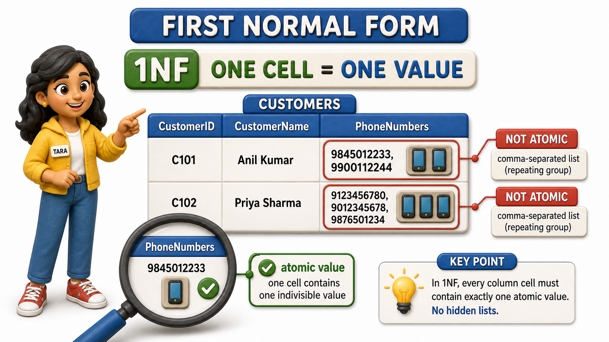
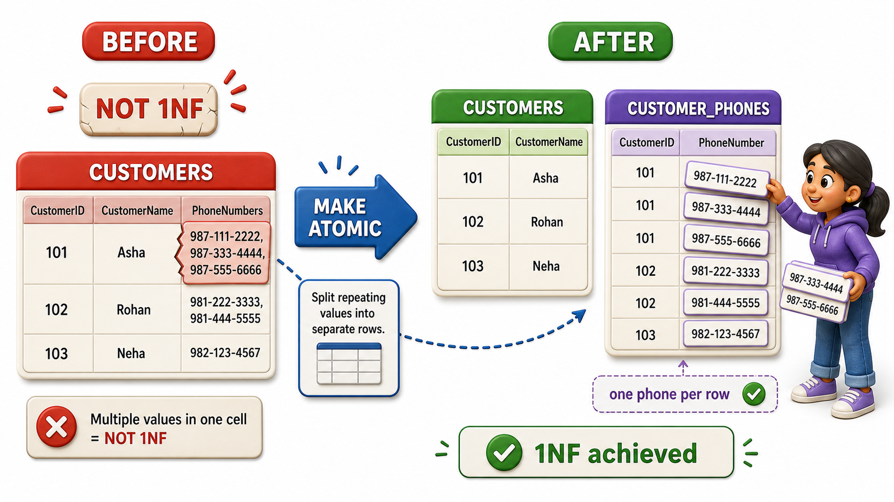

## Introduction

- Tara is the systems person tasked with actually rebuilding Sunrise Traders' `tables`, now that Priya has documented the anomalies and Meera has mapped out the `functional dependencies` hiding inside them.
- Tara starts with what looks like the simplest `table` in the whole system, a Customers `table` listing each shop's ID, name, and contact number.
- She pulls up the real data and immediately spots a problem in the phone number `column`.

<table style="border-collapse: collapse; width: 100%; margin: 1rem 0; font-size: 0.95rem;">
  <thead>
    <tr>
      <th style="border: 1px solid #c8d7ea; padding: 10px 12px; text-align: left; background-color: #dceeff; color: #102a43; font-weight: 700;">CustomerID</th>
      <th style="border: 1px solid #c8d7ea; padding: 10px 12px; text-align: left; background-color: #dceeff; color: #102a43; font-weight: 700;">CustomerName</th>
      <th style="border: 1px solid #c8d7ea; padding: 10px 12px; text-align: left; background-color: #dceeff; color: #102a43; font-weight: 700;">PhoneNumbers</th>
    </tr>
  </thead>
  <tbody>
    <tr style="background-color: #ffffff;">
      <td style="border: 1px solid #d8e2ef; padding: 9px 12px; vertical-align: top;">C12</td>
      <td style="border: 1px solid #d8e2ef; padding: 9px 12px; vertical-align: top;">Ilyas Bakery Supplies</td>
      <td style="border: 1px solid #d8e2ef; padding: 9px 12px; vertical-align: top;">9845012233, 9900112244</td>
    </tr>
    <tr style="background-color: #f7fbff;">
      <td style="border: 1px solid #d8e2ef; padding: 9px 12px; vertical-align: top;">C07</td>
      <td style="border: 1px solid #d8e2ef; padding: 9px 12px; vertical-align: top;">Meenal Stationers</td>
      <td style="border: 1px solid #d8e2ef; padding: 9px 12px; vertical-align: top;">9988776655</td>
    </tr>
    <tr style="background-color: #ffffff;">
      <td style="border: 1px solid #d8e2ef; padding: 9px 12px; vertical-align: top;">C15</td>
      <td style="border: 1px solid #d8e2ef; padding: 9px 12px; vertical-align: top;">Rao General Store</td>
      <td style="border: 1px solid #d8e2ef; padding: 9px 12px; vertical-align: top;">9123456780, 9012345678, 9876501234</td>
    </tr>
  </tbody>
</table>

- Ilyas Bakery Supplies has two phone numbers crammed into a single cell, separated by a comma.
- Rao General Store has three.
- Tara knows immediately this cannot stay as it is, because a single `column` is supposed to hold a single value, not a hidden list pretending to be one piece of text.
- Getting this right is the very first checkpoint in redesigning any `table`, and it has a name: **First `Normal Form`**, usually written 1NF, the rule that every `column` in every `row` must hold one atomic, indivisible value, never a repeating group or a comma-separated bundle disguised as a single entry.

## Why a Comma-Separated Cell Is Not Actually One Value

- It is tempting to think "9845012233, 9900112244" is just a slightly long piece of text, no different from a long address.
- But an address, however long, is genuinely one fact, the shop's location.
- A cell holding two phone numbers is secretly holding two separate facts squeezed into one box, and that causes real damage the moment anyone tries to use the data properly.

Tara tries two simple checks against the `table` as it stands:

- "Find every customer whose phone number is 9900112244." Against the PhoneNumbers `column`, that search either has to awkwardly scan for a substring inside a longer piece of text, or it silently misses Ilyas Bakery Supplies entirely because the number is not stored on its own.
- "Count how many phone numbers Sunrise Traders has on file in total." There is no clean way to get that count out of a `column` where some cells hold one number and others hold three. Both tasks should be trivial for a `database` to answer, and both become clumsy or wrong the moment a `column` stops being atomic.

## What "Atomic" Actually Requires

- A `column` is atomic when it holds exactly one value of its stated kind, for every `row`, with nothing further to split apart.
- PhoneNumbers holding "9845012233, 9900112244" fails this test outright, it holds two phone numbers.
- But atomicity is not only about commas.
- A single date `column` holding "March, 2026" instead of an exact day would also fail, because it is bundling a month and a year loosely rather than storing one precise value.
- The test Tara settles on is simple: can this cell's contents mean two different things to two different readers, or does it need to be split further to answer an ordinary question about the data?
- If the answer is yes, the `column` is not atomic yet.

## Splitting the Table to Reach 1NF

Tara's fix is to stop trying to force a variable number of phone numbers into a fixed number of `columns`, or into one overstuffed cell, and instead give phone numbers a `table` of their own, one `row` per number.

Customers `table`, now holding only genuinely single-valued facts:

<table style="border-collapse: collapse; width: 100%; margin: 1rem 0; font-size: 0.95rem;">
  <thead>
    <tr>
      <th style="border: 1px solid #c8d7ea; padding: 10px 12px; text-align: left; background-color: #dceeff; color: #102a43; font-weight: 700;">CustomerID</th>
      <th style="border: 1px solid #c8d7ea; padding: 10px 12px; text-align: left; background-color: #dceeff; color: #102a43; font-weight: 700;">CustomerName</th>
    </tr>
  </thead>
  <tbody>
    <tr style="background-color: #ffffff;">
      <td style="border: 1px solid #d8e2ef; padding: 9px 12px; vertical-align: top;">C12</td>
      <td style="border: 1px solid #d8e2ef; padding: 9px 12px; vertical-align: top;">Ilyas Bakery Supplies</td>
    </tr>
    <tr style="background-color: #f7fbff;">
      <td style="border: 1px solid #d8e2ef; padding: 9px 12px; vertical-align: top;">C07</td>
      <td style="border: 1px solid #d8e2ef; padding: 9px 12px; vertical-align: top;">Meenal Stationers</td>
    </tr>
    <tr style="background-color: #ffffff;">
      <td style="border: 1px solid #d8e2ef; padding: 9px 12px; vertical-align: top;">C15</td>
      <td style="border: 1px solid #d8e2ef; padding: 9px 12px; vertical-align: top;">Rao General Store</td>
    </tr>
  </tbody>
</table>

CustomerPhones `table`, one `row` for every individual phone number, linked back to the customer it belongs to:

<table style="border-collapse: collapse; width: 100%; margin: 1rem 0; font-size: 0.95rem;">
  <thead>
    <tr>
      <th style="border: 1px solid #c8d7ea; padding: 10px 12px; text-align: left; background-color: #dceeff; color: #102a43; font-weight: 700;">CustomerID</th>
      <th style="border: 1px solid #c8d7ea; padding: 10px 12px; text-align: left; background-color: #dceeff; color: #102a43; font-weight: 700;">PhoneNumber</th>
    </tr>
  </thead>
  <tbody>
    <tr style="background-color: #ffffff;">
      <td style="border: 1px solid #d8e2ef; padding: 9px 12px; vertical-align: top;">C12</td>
      <td style="border: 1px solid #d8e2ef; padding: 9px 12px; vertical-align: top;">9845012233</td>
    </tr>
    <tr style="background-color: #f7fbff;">
      <td style="border: 1px solid #d8e2ef; padding: 9px 12px; vertical-align: top;">C12</td>
      <td style="border: 1px solid #d8e2ef; padding: 9px 12px; vertical-align: top;">9900112244</td>
    </tr>
    <tr style="background-color: #ffffff;">
      <td style="border: 1px solid #d8e2ef; padding: 9px 12px; vertical-align: top;">C07</td>
      <td style="border: 1px solid #d8e2ef; padding: 9px 12px; vertical-align: top;">9988776655</td>
    </tr>
    <tr style="background-color: #f7fbff;">
      <td style="border: 1px solid #d8e2ef; padding: 9px 12px; vertical-align: top;">C15</td>
      <td style="border: 1px solid #d8e2ef; padding: 9px 12px; vertical-align: top;">9123456780</td>
    </tr>
    <tr style="background-color: #ffffff;">
      <td style="border: 1px solid #d8e2ef; padding: 9px 12px; vertical-align: top;">C15</td>
      <td style="border: 1px solid #d8e2ef; padding: 9px 12px; vertical-align: top;">9012345678</td>
    </tr>
    <tr style="background-color: #f7fbff;">
      <td style="border: 1px solid #d8e2ef; padding: 9px 12px; vertical-align: top;">C15</td>
      <td style="border: 1px solid #d8e2ef; padding: 9px 12px; vertical-align: top;">9876501234</td>
    </tr>
  </tbody>
</table>

- Every cell in both `tables` now holds exactly one value.
- Ilyas Bakery Supplies having two phone numbers is no longer a formatting trick inside one crowded cell, it is simply two ordinary `rows` in CustomerPhones, both pointing back to CustomerID C12.
- Rao General Store having three numbers is three `rows`, not a longer string.
- "Find every customer whose phone number is 9900112244" is now a plain, direct lookup, and "count how many phone numbers Sunrise Traders has on file" is just counting `rows`.

## A Table Can Fail 1NF in More Than One Way

- Comma-separated lists are the most visible violation, but the same underlying mistake shows up whenever a `table` tries to hold a variable amount of the same kind of fact using a fixed, awkward shape.
- A design that uses separate `columns` like Phone1, Phone2, Phone3 has the identical problem wearing a different disguise, it still assumes every customer has the same number of phone numbers, wastes space for customers with fewer, and simply breaks for the customer who eventually needs a fourth.
- 1NF is not really a rule about commas specifically, it is a rule about refusing to let one `column` secretly represent more than one fact.

## First Normal Form at a Glance

<table style="border-collapse: collapse; width: 100%; margin: 1rem 0; font-size: 0.95rem;">
  <thead>
    <tr>
      <th style="border: 1px solid #c8d7ea; padding: 10px 12px; text-align: left; background-color: #dceeff; color: #102a43; font-weight: 700;">Check</th>
      <th style="border: 1px solid #c8d7ea; padding: 10px 12px; text-align: left; background-color: #dceeff; color: #102a43; font-weight: 700;">Fails 1NF</th>
      <th style="border: 1px solid #c8d7ea; padding: 10px 12px; text-align: left; background-color: #dceeff; color: #102a43; font-weight: 700;">Meets 1NF</th>
    </tr>
  </thead>
  <tbody>
    <tr style="background-color: #ffffff;">
      <td style="border: 1px solid #d8e2ef; padding: 9px 12px; vertical-align: top;">One phone number per cell</td>
      <td style="border: 1px solid #d8e2ef; padding: 9px 12px; vertical-align: top;">&quot;9845012233, 9900112244&quot; in a single PhoneNumbers cell</td>
      <td style="border: 1px solid #d8e2ef; padding: 9px 12px; vertical-align: top;">One row per phone number in a separate CustomerPhones table</td>
    </tr>
    <tr style="background-color: #f7fbff;">
      <td style="border: 1px solid #d8e2ef; padding: 9px 12px; vertical-align: top;">Fixed repeating columns</td>
      <td style="border: 1px solid #d8e2ef; padding: 9px 12px; vertical-align: top;">Phone1, Phone2, Phone3 columns, mostly empty</td>
      <td style="border: 1px solid #d8e2ef; padding: 9px 12px; vertical-align: top;">A separate table with one row per value, however many there are</td>
    </tr>
    <tr style="background-color: #ffffff;">
      <td style="border: 1px solid #d8e2ef; padding: 9px 12px; vertical-align: top;">Searching for one value</td>
      <td style="border: 1px solid #d8e2ef; padding: 9px 12px; vertical-align: top;">Requires scanning inside text for a match</td>
      <td style="border: 1px solid #d8e2ef; padding: 9px 12px; vertical-align: top;">A direct, exact match on a single column</td>
    </tr>
  </tbody>
</table>

## Conclusion

- First `Normal Form` asks for the most basic kind of honesty a `table` can offer: every `column` holds exactly one value, never a hidden list dressed up as a single entry.
- Tara's fix for Sunrise Traders' phone numbers, moving from one crowded PhoneNumbers cell to a proper CustomerPhones `table` with one `row` per number, is the smallest possible step in restructuring a `table`, and yet it is the one every other refinement depends on, because none of the later checks make sense against a `column` that is still secretly plural.

Reaching 1NF only guarantees that every cell is honest about holding a single value, it says nothing yet about whether every `column` in a `table` actually belongs with the rest of that `table`'s key, which is exactly the question a `composite key` like OrderID and ProductID together forces Sunrise Traders to confront next.
