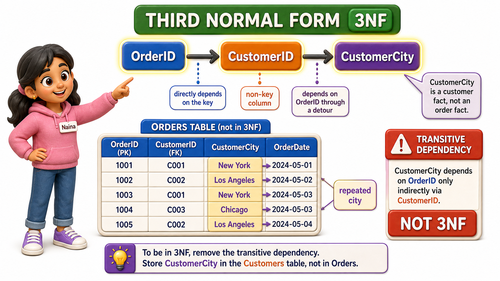
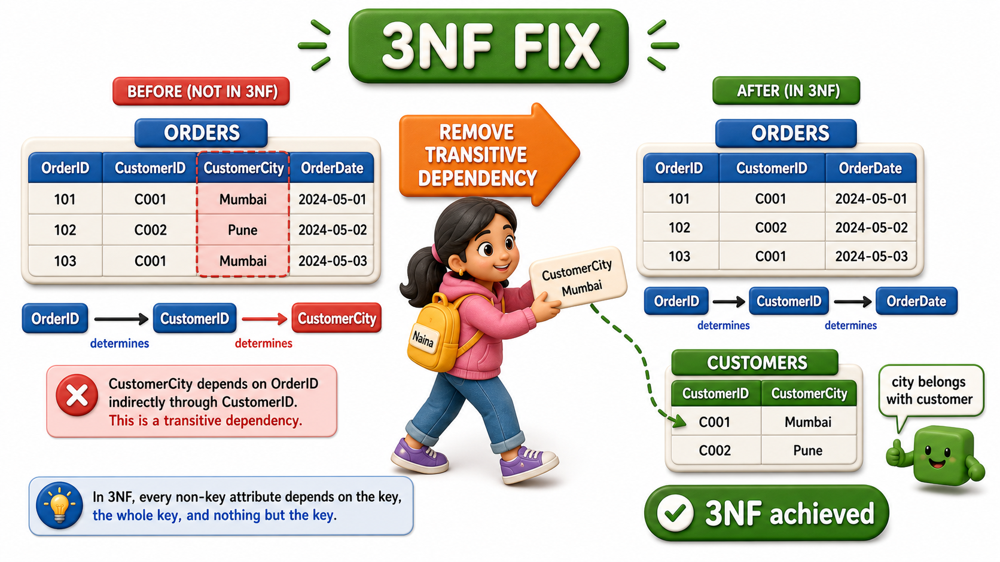

## Introduction

Naina picks up the Orders `table` next, the one left over after Tara and Arjun cleaned up phone numbers and order lines. It looks, at first glance, perfectly reasonable, a single-`column` `primary key`, no `composite key` to worry about, nothing that should trip the partial-dependency check Arjun just finished applying.

But when Naina runs the same kind of "what actually depends on what" exercise Meera taught the team, she finds a fact hiding in plain sight that has no business being there.

<table style="border-collapse: collapse; width: 100%; margin: 1rem 0; font-size: 0.95rem;">
  <thead>
    <tr>
      <th style="border: 1px solid #c8d7ea; padding: 10px 12px; text-align: left; background-color: #dceeff; color: #102a43; font-weight: 700;">OrderID</th>
      <th style="border: 1px solid #c8d7ea; padding: 10px 12px; text-align: left; background-color: #dceeff; color: #102a43; font-weight: 700;">CustomerID</th>
      <th style="border: 1px solid #c8d7ea; padding: 10px 12px; text-align: left; background-color: #dceeff; color: #102a43; font-weight: 700;">CustomerCity</th>
      <th style="border: 1px solid #c8d7ea; padding: 10px 12px; text-align: left; background-color: #dceeff; color: #102a43; font-weight: 700;">OrderDate</th>
    </tr>
  </thead>
  <tbody>
    <tr style="background-color: #ffffff;">
      <td style="border: 1px solid #d8e2ef; padding: 9px 12px; vertical-align: top;">O501</td>
      <td style="border: 1px solid #d8e2ef; padding: 9px 12px; vertical-align: top;">C12</td>
      <td style="border: 1px solid #d8e2ef; padding: 9px 12px; vertical-align: top;">Bengaluru</td>
      <td style="border: 1px solid #d8e2ef; padding: 9px 12px; vertical-align: top;">2026-06-02</td>
    </tr>
    <tr style="background-color: #f7fbff;">
      <td style="border: 1px solid #d8e2ef; padding: 9px 12px; vertical-align: top;">O502</td>
      <td style="border: 1px solid #d8e2ef; padding: 9px 12px; vertical-align: top;">C12</td>
      <td style="border: 1px solid #d8e2ef; padding: 9px 12px; vertical-align: top;">Bengaluru</td>
      <td style="border: 1px solid #d8e2ef; padding: 9px 12px; vertical-align: top;">2026-06-15</td>
    </tr>
    <tr style="background-color: #ffffff;">
      <td style="border: 1px solid #d8e2ef; padding: 9px 12px; vertical-align: top;">O503</td>
      <td style="border: 1px solid #d8e2ef; padding: 9px 12px; vertical-align: top;">C07</td>
      <td style="border: 1px solid #d8e2ef; padding: 9px 12px; vertical-align: top;">Mysuru</td>
      <td style="border: 1px solid #d8e2ef; padding: 9px 12px; vertical-align: top;">2026-06-18</td>
    </tr>
    <tr style="background-color: #f7fbff;">
      <td style="border: 1px solid #d8e2ef; padding: 9px 12px; vertical-align: top;">O504</td>
      <td style="border: 1px solid #d8e2ef; padding: 9px 12px; vertical-align: top;">C12</td>
      <td style="border: 1px solid #d8e2ef; padding: 9px 12px; vertical-align: top;">Bengaluru</td>
      <td style="border: 1px solid #d8e2ef; padding: 9px 12px; vertical-align: top;">2026-06-22</td>
    </tr>
  </tbody>
</table>

CustomerCity is repeated three times for CustomerID C12, once for every order that customer has placed, exactly the same redundancy pattern that caused trouble before. But this `table`'s `primary key` is just OrderID, a single `column`, so there is no `composite key` for CustomerCity to be "partially" dependent on.

The problem here is not partial dependency at all, it is a different, sneakier pattern, and untangling it is the job of **Third `Normal Form`**, or 3NF.

## A Dependency With a Detour

Naina traces exactly how CustomerCity connects back to the `primary key`, OrderID, in two hops:

1. An order's OrderID determines its CustomerID, since every order belongs to exactly one customer.

2. CustomerID, in turn, determines CustomerCity, since every customer is registered in exactly one city.

So OrderID does eventually reach CustomerCity, but only by first passing through CustomerID, a non-key `column`, along the way.

OrderID -> CustomerID -> CustomerCity

This two-step chain is a **transitive dependency**, a non-key `column` depending on the `primary key` only indirectly, through another non-key `column`, rather than depending on the key directly. CustomerCity is not really a fact about the order at all, it is a fact about the customer that happens to be riding along on every order `row` that customer touches.

That is precisely why it keeps repeating, every new order for C12 drags another copy of "Bengaluru" along with it, and if Ilyas Bakery Supplies ever relocates, every one of those repeated copies needs to be tracked down and corrected, the exact update anomaly Priya first ran into, resurfacing here in a `table` that already passed the 2NF check cleanly.

## Third Normal Form Builds on Second Normal Form

Just as 2NF assumes 1NF is already satisfied, 3NF assumes 2NF is already satisfied, and adds one further requirement on top of it: no non-key `column` may depend transitively on the `primary key` through another non-key `column`.

A `table` can pass the 2NF check perfectly, as Naina's Orders `table` does, having no `composite key` for anything to be partial against, and still fail 3NF because of a transitive chain like the one running through CustomerID. The two rules are catching two different shapes of the same underlying disease, redundant data, one shape rooted in composite keys, the other rooted in chains of non-key `columns` leaning on each other.

## Splitting Along the Chain

The fix follows the same logic as every earlier split, move the transitively dependent `column` into a `table` keyed by the thing it actually, directly depends on.

Orders, keeping only what genuinely depends on OrderID directly:

<table style="border-collapse: collapse; width: 100%; margin: 1rem 0; font-size: 0.95rem;">
  <thead>
    <tr>
      <th style="border: 1px solid #c8d7ea; padding: 10px 12px; text-align: left; background-color: #dceeff; color: #102a43; font-weight: 700;">OrderID</th>
      <th style="border: 1px solid #c8d7ea; padding: 10px 12px; text-align: left; background-color: #dceeff; color: #102a43; font-weight: 700;">CustomerID</th>
      <th style="border: 1px solid #c8d7ea; padding: 10px 12px; text-align: left; background-color: #dceeff; color: #102a43; font-weight: 700;">OrderDate</th>
    </tr>
  </thead>
  <tbody>
    <tr style="background-color: #ffffff;">
      <td style="border: 1px solid #d8e2ef; padding: 9px 12px; vertical-align: top;">O501</td>
      <td style="border: 1px solid #d8e2ef; padding: 9px 12px; vertical-align: top;">C12</td>
      <td style="border: 1px solid #d8e2ef; padding: 9px 12px; vertical-align: top;">2026-06-02</td>
    </tr>
    <tr style="background-color: #f7fbff;">
      <td style="border: 1px solid #d8e2ef; padding: 9px 12px; vertical-align: top;">O502</td>
      <td style="border: 1px solid #d8e2ef; padding: 9px 12px; vertical-align: top;">C12</td>
      <td style="border: 1px solid #d8e2ef; padding: 9px 12px; vertical-align: top;">2026-06-15</td>
    </tr>
    <tr style="background-color: #ffffff;">
      <td style="border: 1px solid #d8e2ef; padding: 9px 12px; vertical-align: top;">O503</td>
      <td style="border: 1px solid #d8e2ef; padding: 9px 12px; vertical-align: top;">C07</td>
      <td style="border: 1px solid #d8e2ef; padding: 9px 12px; vertical-align: top;">2026-06-18</td>
    </tr>
    <tr style="background-color: #f7fbff;">
      <td style="border: 1px solid #d8e2ef; padding: 9px 12px; vertical-align: top;">O504</td>
      <td style="border: 1px solid #d8e2ef; padding: 9px 12px; vertical-align: top;">C12</td>
      <td style="border: 1px solid #d8e2ef; padding: 9px 12px; vertical-align: top;">2026-06-22</td>
    </tr>
  </tbody>
</table>

Customers, keyed by CustomerID, holding the city fact where it truly belongs:

<table style="border-collapse: collapse; width: 100%; margin: 1rem 0; font-size: 0.95rem;">
  <thead>
    <tr>
      <th style="border: 1px solid #c8d7ea; padding: 10px 12px; text-align: left; background-color: #dceeff; color: #102a43; font-weight: 700;">CustomerID</th>
      <th style="border: 1px solid #c8d7ea; padding: 10px 12px; text-align: left; background-color: #dceeff; color: #102a43; font-weight: 700;">CustomerCity</th>
    </tr>
  </thead>
  <tbody>
    <tr style="background-color: #ffffff;">
      <td style="border: 1px solid #d8e2ef; padding: 9px 12px; vertical-align: top;">C12</td>
      <td style="border: 1px solid #d8e2ef; padding: 9px 12px; vertical-align: top;">Bengaluru</td>
    </tr>
    <tr style="background-color: #f7fbff;">
      <td style="border: 1px solid #d8e2ef; padding: 9px 12px; vertical-align: top;">C07</td>
      <td style="border: 1px solid #d8e2ef; padding: 9px 12px; vertical-align: top;">Mysuru</td>
    </tr>
  </tbody>
</table>

CustomerCity now exists exactly once per customer, no matter how many orders that customer places over the years. Naina can update Ilyas Bakery Supplies' city in a single `row` of Customers, and every order that references CustomerID C12 stays correctly, automatically associated with the right city, because the city is looked up through the relationship rather than copied onto every order.

## Telling Partial and Transitive Dependency Apart

Arjun and Naina's two problems can look similar at a glance, both involve a `column` that "shouldn't be there," but the shape of the mistake is different, and it helps to hold both clearly in mind.

<table style="border-collapse: collapse; width: 100%; margin: 1rem 0; font-size: 0.95rem;">
  <thead>
    <tr>
      <th style="border: 1px solid #c8d7ea; padding: 10px 12px; text-align: left; background-color: #dceeff; color: #102a43; font-weight: 700;">Feature</th>
      <th style="border: 1px solid #c8d7ea; padding: 10px 12px; text-align: left; background-color: #dceeff; color: #102a43; font-weight: 700;">Partial dependency (2NF)</th>
      <th style="border: 1px solid #c8d7ea; padding: 10px 12px; text-align: left; background-color: #dceeff; color: #102a43; font-weight: 700;">Transitive dependency (3NF)</th>
    </tr>
  </thead>
  <tbody>
    <tr style="background-color: #ffffff;">
      <td style="border: 1px solid #d8e2ef; padding: 9px 12px; vertical-align: top;">Where it shows up</td>
      <td style="border: 1px solid #d8e2ef; padding: 9px 12px; vertical-align: top;">Tables with a composite key</td>
      <td style="border: 1px solid #d8e2ef; padding: 9px 12px; vertical-align: top;">Tables with any kind of key, even a single column</td>
    </tr>
    <tr style="background-color: #f7fbff;">
      <td style="border: 1px solid #d8e2ef; padding: 9px 12px; vertical-align: top;">The pattern</td>
      <td style="border: 1px solid #d8e2ef; padding: 9px 12px; vertical-align: top;">A column depends on only part of the key</td>
      <td style="border: 1px solid #d8e2ef; padding: 9px 12px; vertical-align: top;">A column depends on the key only through another non-key column</td>
    </tr>
    <tr style="background-color: #ffffff;">
      <td style="border: 1px solid #d8e2ef; padding: 9px 12px; vertical-align: top;">Sunrise Traders example</td>
      <td style="border: 1px solid #d8e2ef; padding: 9px 12px; vertical-align: top;">ProductName depending on ProductID alone, inside a table keyed by OrderID + ProductID</td>
      <td style="border: 1px solid #d8e2ef; padding: 9px 12px; vertical-align: top;">CustomerCity depending on CustomerID, which depends on OrderID</td>
    </tr>
    <tr style="background-color: #f7fbff;">
      <td style="border: 1px solid #d8e2ef; padding: 9px 12px; vertical-align: top;">The fix</td>
      <td style="border: 1px solid #d8e2ef; padding: 9px 12px; vertical-align: top;">Move the column into a table keyed by the part it truly depends on</td>
      <td style="border: 1px solid #d8e2ef; padding: 9px 12px; vertical-align: top;">Move the column into a table keyed by the non-key column it truly depends on</td>
    </tr>
  </tbody>
</table>

## Third Normal Form at a Glance

<table style="border-collapse: collapse; width: 100%; margin: 1rem 0; font-size: 0.95rem;">
  <thead>
    <tr>
      <th style="border: 1px solid #c8d7ea; padding: 10px 12px; text-align: left; background-color: #dceeff; color: #102a43; font-weight: 700;">Check</th>
      <th style="border: 1px solid #c8d7ea; padding: 10px 12px; text-align: left; background-color: #dceeff; color: #102a43; font-weight: 700;">Before (fails 3NF)</th>
      <th style="border: 1px solid #c8d7ea; padding: 10px 12px; text-align: left; background-color: #dceeff; color: #102a43; font-weight: 700;">After (meets 3NF)</th>
    </tr>
  </thead>
  <tbody>
    <tr style="background-color: #ffffff;">
      <td style="border: 1px solid #d8e2ef; padding: 9px 12px; vertical-align: top;">CustomerCity&#x27;s true dependency</td>
      <td style="border: 1px solid #d8e2ef; padding: 9px 12px; vertical-align: top;">Reached only via CustomerID, a non-key column</td>
      <td style="border: 1px solid #d8e2ef; padding: 9px 12px; vertical-align: top;">Lives in Customers, keyed directly by CustomerID</td>
    </tr>
    <tr style="background-color: #f7fbff;">
      <td style="border: 1px solid #d8e2ef; padding: 9px 12px; vertical-align: top;">Cost of a customer relocating</td>
      <td style="border: 1px solid #d8e2ef; padding: 9px 12px; vertical-align: top;">Every order row for that customer needs correcting</td>
      <td style="border: 1px solid #d8e2ef; padding: 9px 12px; vertical-align: top;">One row in Customers is updated</td>
    </tr>
    <tr style="background-color: #ffffff;">
      <td style="border: 1px solid #d8e2ef; padding: 9px 12px; vertical-align: top;">Composite key involved</td>
      <td style="border: 1px solid #d8e2ef; padding: 9px 12px; vertical-align: top;">None, this is not a 2NF problem</td>
      <td style="border: 1px solid #d8e2ef; padding: 9px 12px; vertical-align: top;">Not applicable, the issue is a dependency chain</td>
    </tr>
  </tbody>
</table>

## Conclusion

Third `Normal Form` closes a gap that Second `Normal Form` cannot reach on its own: a `table` can have the simplest possible key, a single `column`, and still repeat data endlessly if some non-key `column` is really describing a different non-key `column` instead of the key itself.

Naina's Orders `table` repeated a customer's city on every single order because CustomerCity was never truly a fact about the order, it was a fact about the customer, reached only by a detour through CustomerID, and moving it into its own Customers `table`, keyed directly by CustomerID, closed that gap the same way every earlier split has, one dependency at a time.

Most everyday `table` designs stop needing further correction once they satisfy this rule, but there remains one subtler situation, involving `tables` with more than one legitimate way to uniquely identify a `row`, that this rule alone still lets slip through.
