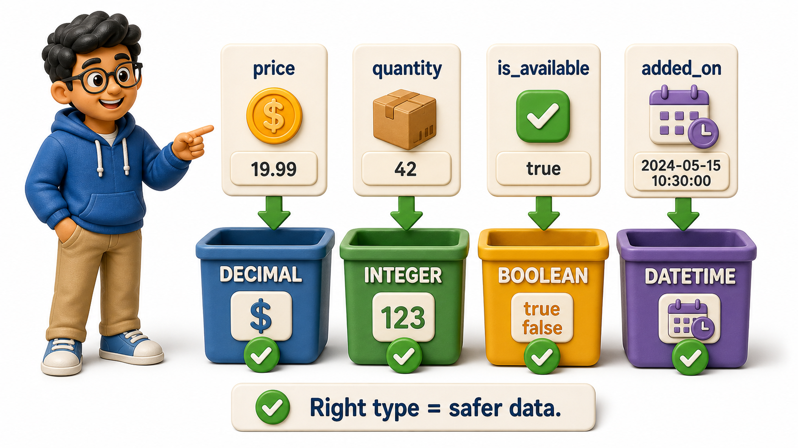
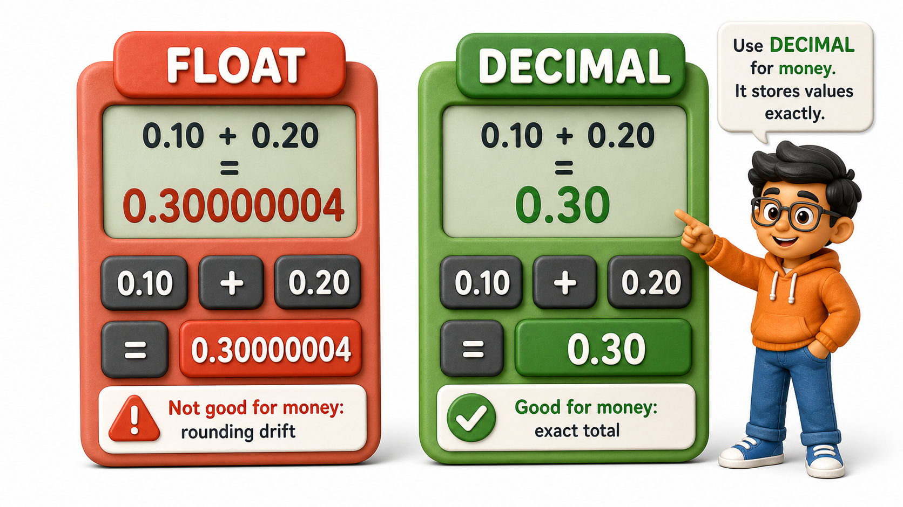

## Introduction

Arjun is three weeks into his first job as a backend developer at Kadam Retail, a small e-commerce startup, and his manager has just handed him a single task: sketch out the columns for the Products table before the rest of the team builds on top of it. Arjun opens a blank sheet and starts typing column names quickly, because naming a column feels easy. Naming is not where he gets stuck. What stops him cold is the quieter question every column asks right after it is named: what kind of value is actually allowed to sit inside it?

Two columns stop him cold:

- He types "price" and pauses. Is that a whole number, since some products are priced in flat rupee amounts? Or does it need to hold fractions, since other products are priced at 499.50?
- He types "product_name" and pauses again. How long can a name possibly get, and does the column need to reserve that much space for every row, even for a name that is four characters long? Arjun's manager, watching him hesitate, tells him what she wishes someone had told her early on: picking the right **data type** for a column, the exact kind and shape of value it is allowed to store, is not a formality to rush through. It is a decision a `schema` is hard to walk back once real rows depend on it.

## Whole Numbers, Decimals, and the Trap of Storing Money as a Float

Arjun's first instinct for the price column is to reach for whatever type his programming courses used for "numbers with decimals," a floating-point type. His manager stops him before he writes it down. Floating-point types store numbers as an approximation in binary, fine for scientific measurements where a tiny rounding error does not matter, but quietly dangerous for money. Add 0.10 and 0.20 in a floating-point column enough times and the running total can drift away from the exact 0.30 it should be, by a fraction too small to notice on any single row but large enough to make an accountant's totals disagree with the database's totals after a few thousand transactions.

The fix is a type built specifically for exact decimal amounts, one that stores a fixed number of digits before and after the decimal point rather than an approximation. A price of 499.50 stored this way is exactly 499.50, forever, no matter how many times it is added, subtracted, or summed across a million rows. Quantities belong in a plain whole-number type, since nobody orders 2.5 units of a product sold as a single item. The rule Arjun writes at the top of his notes is simple: whole counts get a whole-number type; money or anything needing exact fractional precision gets a fixed-precision decimal type, never an approximate floating type.

## Fixed-Length vs Variable-Length Text

The next decision is about text. Kadam Retail assigns every product a SKU code, and every SKU code in the company is exactly eight characters long by policy. For a column like that, a fixed-length text type makes sense, since every value occupies the same amount of space and the database never has to guess how much room a row will need. Product names are the opposite case entirely. Some are short, like "Pen," and others run to forty or fifty characters describing a bundle or a variant. Forcing every name into a fixed-length box would either truncate the long ones or waste space padding the short ones, so a variable-length text type, one that only stores as many characters as the value actually contains, up to some sensible upper limit, is the right choice.

Arjun's manager adds a habit worth keeping: always attach a maximum length to variable-length text, even when the type technically allows unlimited length. An unbounded name field will not break anything today, but it offers no protection against a data-entry mistake that pastes an entire description into the name field by accident, and no hint to future developers about what a "normal" value should look like.

## Dates, Times, and True/False Flags

Kadam Retail's Products table also needs to record when a product was added to the catalog and whether it is currently available for sale. The first is a natural fit for a dedicated date-and-time type, built to understand calendar rules and the difference between "June 30th" and "June 31st," which does not exist. Storing a date as plain text instead might look fine in a spreadsheet, but it throws away the database's ability to answer "which products were added in the last thirty days" without fragile text parsing.

The second, availability, is a true-or-false question with exactly two possible states, and a dedicated boolean type says so directly. Some designers are tempted to store this as a whole number, 1 for available and 0 for not, or worse, as text like "Yes" and "No," which invites typos such as "yess" that a boolean type simply cannot produce. A flag that can only ever be true or false should be declared as exactly that.

## When the Type Is Too Narrow, and When It Is Too Generous

Arjun's manager closes the review with a story from her own first year. An earlier version of Kadam Retail's inventory system stored stock quantity in a type that only accommodated small numbers, because nobody imagined a single warehouse holding more than a few thousand units of anything. Two years later, a bulk supplier deal pushed one product's stock past that ceiling, and the column silently overflowed, wrapping around to a nonsensical negative number that took the warehouse team a full day to trace back to its cause. Choosing a type too narrow for where data is actually headed does not fail today, it fails later, quietly, at the worst possible moment.

The opposite mistake is just as real, even if it feels safer. Reaching for the largest, most generous type available for every column "just in case" wastes storage at scale and, more subtly, hides mistakes a tighter type would have caught immediately. A column meant to hold a two-letter country code but declared with room for an entire paragraph will happily accept garbage input that a narrower, well-chosen type would have rejected outright. The goal is not the biggest type or the smallest type, it is the type that honestly matches what the value is and how far it is realistically expected to grow.

Putting these decisions together, Arjun's draft for the Products table starts to look like a considered design rather than a guess.

| Column | Plain-English type | Why that choice |
|---|---|---|
| product_id | Whole number, auto-generated | Every product needs a stable, always-present identifier |
| sku | Fixed-length text, 8 characters | Every SKU at Kadam Retail is exactly 8 characters by policy |
| name | Variable-length text, capped at 120 characters | Names vary widely in length but should never run unbounded |
| price | Fixed-precision decimal, 2 digits after the point | Money must never drift due to floating-point rounding |
| stock_quantity | Whole number, generous range | Counts are always whole, and stock levels can grow with bulk orders |
| is_available | True/false flag | Availability is a strict two-state question, nothing in between |
| added_on | Date and time | Lets the database reason about "recently added" without parsing text |

## Data Types at a Glance

| Kind of value | Type to reach for | Type to avoid |
|---|---|---|
| Money or exact fractional amounts | Fixed-precision decimal | Floating-point |
| Simple counts | Whole number | Text, floating-point |
| Short, uniform-length codes | Fixed-length text | Variable-length text with no real benefit |
| Free-form names or descriptions | Variable-length text, with a cap | Unbounded text, fixed-length text |
| Yes/no questions | Boolean flag | Whole number 0/1, or free text "Yes"/"No" |
| Calendar dates or timestamps | Dedicated date/time type | Plain text |

## Conclusion

Choosing a data type is really choosing a promise: what a column will and will not accept, and how precisely it will hold on to the values it is given. Money deserves exact decimal precision rather than an approximation that quietly drifts, counts deserve whole numbers, short uniform codes deserve fixed-length text, and free-form names deserve a bounded variable-length text field rather than either extreme. Get the type too narrow and the column fails silently the day real growth outpaces the assumption baked into it; get it too generous and the column stops doing the quiet job of catching mistakes before they ever reach a row.

With Arjun's Products table now resting on sensible types for every column, the next question his manager raises is just as consequential: how should each row in that table be identified in the first place, and what happens when the obvious choice, a simple auto-incrementing number, is not actually the safest option available.
