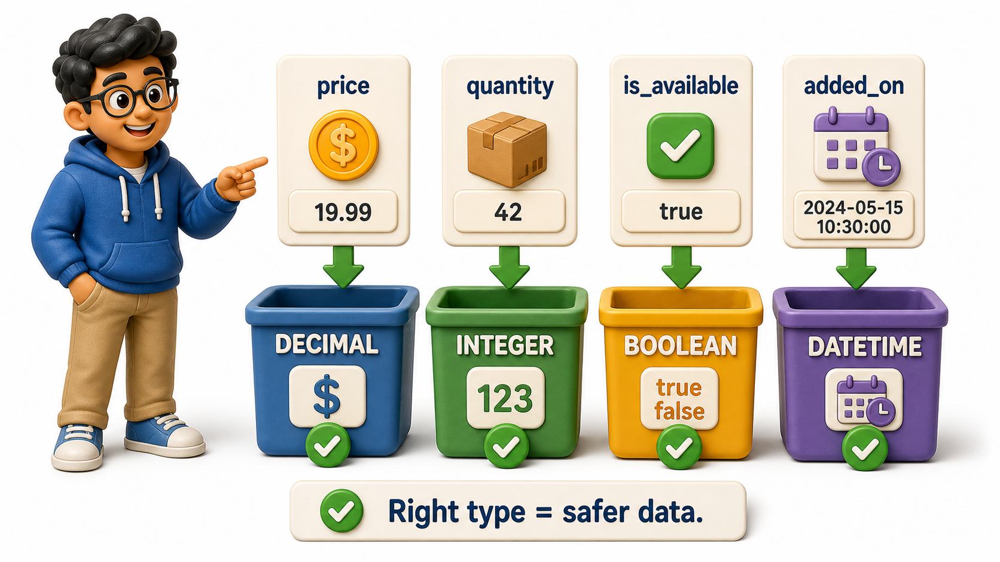
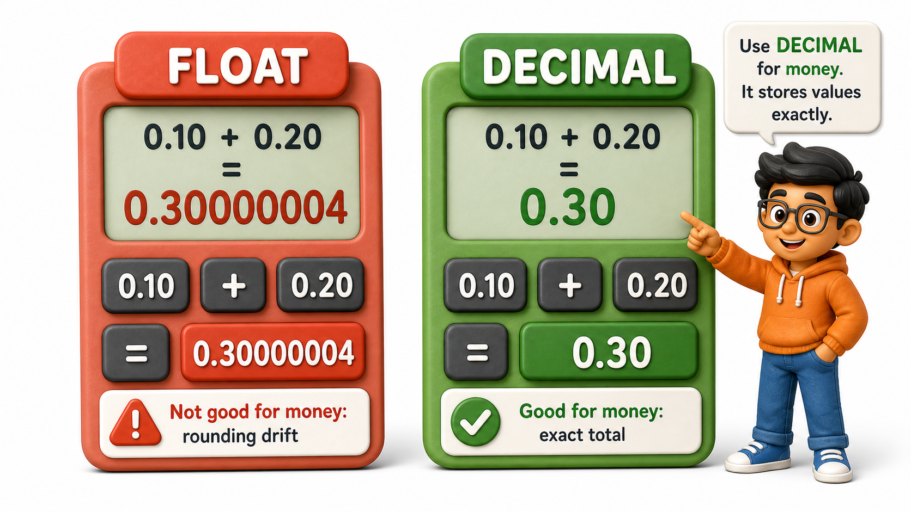

## Introduction

Arjun is three weeks into his first job as a backend developer at Kadam Retail, a small e-commerce startup, and his manager has just handed him a single task: sketch out the `columns` for the Products `table` before the rest of the team builds on top of it. Arjun opens a blank sheet and starts typing `column` names quickly, because naming a `column` feels easy.

Naming is not where he gets stuck. What stops him cold is the quieter question every `column` asks right after it is named: what kind of value is actually allowed to sit inside it?

Two `columns` stop him cold:

- He types "price" and pauses. Is that a whole number, since some products are priced in flat rupee amounts? Or does it need to hold fractions, since other products are priced at 499.50?
- He types "product_name" and pauses again. How long can a name possibly get, and does the `column` need to reserve that much space for every `row`, even for a name that is four characters long? Arjun's manager, watching him hesitate, tells him what she wishes someone had told her early on: picking the right **data type** for a `column`, the exact kind and shape of value it is allowed to store, is not a formality to rush through. It is a decision a `schema` is hard to walk back once real `rows` depend on it.



**Definition:** Choosing a data type is really choosing a promise: what a `column` will and will not accept, and how precisely it will hold on to the values it is given.

## Whole Numbers, Decimals, and the Trap of Storing Money as a Float

Arjun's first instinct for the price `column` is to reach for whatever type his programming courses used for "numbers with decimals," a floating-point type. His manager stops him before he writes it down. Floating-point types store numbers as an approximation in binary, fine for scientific measurements where a tiny rounding error does not matter, but quietly dangerous for money.

Add 0.10 and 0.20 in a floating-point `column` enough times and the running total can drift away from the exact 0.30 it should be, by a fraction too small to notice on any single `row` but large enough to make an accountant's totals disagree with the `database`'s totals after a few thousand `transactions`.

The fix is a type built specifically for exact decimal amounts, one that stores a fixed number of digits before and after the decimal point rather than an approximation. A price of 499.50 stored this way is exactly 499.50, forever, no matter how many times it is added, subtracted, or summed across a million `rows`.

Quantities belong in a plain whole-number type, since nobody orders 2.5 units of a product sold as a single item. The rule Arjun writes at the top of his notes is simple: whole counts get a whole-number type; money or anything needing exact fractional precision gets a fixed-precision decimal type, never an approximate floating type.



## Fixed-Length vs Variable-Length Text

The next decision is about text. Kadam Retail assigns every product a SKU code, and every SKU code in the company is exactly eight characters long by policy. For a `column` like that, a fixed-length text type makes sense, since every value occupies the same amount of space and the `database` never has to guess how much room a `row` will need.

Product names are the opposite case entirely. Some are short, like "Pen," and others run to forty or fifty characters describing a bundle or a variant.

Forcing every name into a fixed-length box would either truncate the long ones or waste space padding the short ones, so a variable-length text type, one that only stores as many characters as the value actually contains, up to some sensible upper limit, is the right choice.

Arjun's manager adds a habit worth keeping: always attach a maximum length to variable-length text, even when the type technically allows unlimited length. An unbounded name field will not break anything today, but it offers no protection against a data-entry mistake that pastes an entire description into the name field by accident, and no hint to future developers about what a "normal" value should look like.

## Dates, Times, and True/False Flags

Kadam Retail's Products `table` also needs to record when a product was added to the catalog and whether it is currently available for sale. The first is a natural fit for a dedicated date-and-time type, built to understand calendar rules and the difference between "June 30th" and "June 31st," which does not exist.

Storing a date as plain text instead might look fine in a spreadsheet, but it throws away the `database`'s ability to answer "which products were added in the last thirty days" without fragile text parsing.

The second, availability, is a true-or-false question with exactly two possible states, and a dedicated boolean type says so directly. Some designers are tempted to store this as a whole number, 1 for available and 0 for not, or worse, as text like "Yes" and "No," which invites typos such as "yess" that a boolean type simply cannot produce.

A flag that can only ever be true or false should be declared as exactly that.

## When the Type Is Too Narrow, and When It Is Too Generous

Arjun's manager closes the review with a story from her own first year. An earlier version of Kadam Retail's inventory system stored stock quantity in a type that only accommodated small numbers, because nobody imagined a single warehouse holding more than a few thousand units of anything.

Two years later, a bulk supplier deal pushed one product's stock past that ceiling, and the `column` silently overflowed, wrapping around to a nonsensical negative number that took the warehouse team a full day to trace back to its cause. Choosing a type too narrow for where data is actually headed does not fail today, it fails later, quietly, at the worst possible moment.

The opposite mistake is just as real, even if it feels safer. Reaching for the largest, most generous type available for every `column` "just in case" wastes storage at scale and, more subtly, hides mistakes a tighter type would have caught immediately.

A `column` meant to hold a two-letter country code but declared with room for an entire paragraph will happily accept garbage input that a narrower, well-chosen type would have rejected outright. The goal is not the biggest type or the smallest type, it is the type that honestly matches what the value is and how far it is realistically expected to grow.

Putting these decisions together, Arjun's draft for the Products `table` starts to look like a considered design rather than a guess. Here is that design as real, runnable PostgreSQL, showing TEXT versus a length-capped VARCHAR, a whole-number INTEGER versus an exact NUMERIC for money, a DATE for the catalog date, and a BOOLEAN for availability, all in one `CREATE TABLE`.

```postgresql file=init.sql
CREATE TABLE products (
    product_id      INTEGER PRIMARY KEY,
    sku             CHAR(8) NOT NULL,
    name            VARCHAR(120) NOT NULL,
    description     TEXT,
    price           NUMERIC(10, 2) NOT NULL,
    stock_quantity  INTEGER NOT NULL,
    is_available    BOOLEAN NOT NULL,
    added_on        DATE NOT NULL
);

INSERT INTO products
    (product_id, sku, name, description, price, stock_quantity, is_available, added_on)
VALUES
    (1, 'SKU00001', 'Wireless Mouse', 'A compact wireless mouse with USB receiver.', 499.50, 120, TRUE, '2026-01-15'),
    (2, 'SKU00002', 'Mechanical Keyboard', 'Full-size mechanical keyboard with blue switches.', 2999.00, 35, TRUE, '2026-02-02'),
    (3, 'SKU00003', 'USB-C Cable 1m', 'A durable braided USB-C to USB-C cable.', 149.00, 0, FALSE, '2026-02-20');
```

The active query checks that each type held on to exactly what it was given, no rounding on the price, no truncation on the name, and a clean true/false on availability:

```postgresql with=init.sql
SELECT sku, name, price, stock_quantity, is_available, added_on
FROM products
ORDER BY product_id;
```

Expected output:

| sku | name | price | stock_quantity | is_available | added_on |
| -------- | -------------------- | ------: | --------------: | ------------ | ---------- |
| SKU00001 | Wireless Mouse | 499.50 | 120 | t | 2026-01-15 |
| SKU00002 | Mechanical Keyboard | 2999.00 | 35 | t | 2026-02-02 |
| SKU00003 | USB-C Cable 1m | 149.00 | 0 | f | 2026-02-20 |

- `price` keeps its exact two decimal digits because `NUMERIC(10, 2)` never approximates, unlike a floating-point type.
- `sku` is declared `CHAR(8)`, matching the fixed 8-character policy, while `name` uses `VARCHAR(120)` so it can vary in length but never runs unbounded.
- `is_available` prints as PostgreSQL's literal `t`/`f` for a true `BOOLEAN`, never a stray "yess" or a bare `1`.

<table style="border-collapse: collapse; width: 100%; margin: 1rem 0; font-size: 0.95rem;">
  <thead>
    <tr>
      <th style="border: 1px solid #c8d7ea; padding: 10px 12px; text-align: left; background-color: #dceeff; color: #102a43; font-weight: 700;">Column</th>
      <th style="border: 1px solid #c8d7ea; padding: 10px 12px; text-align: left; background-color: #dceeff; color: #102a43; font-weight: 700;">Plain-English type</th>
      <th style="border: 1px solid #c8d7ea; padding: 10px 12px; text-align: left; background-color: #dceeff; color: #102a43; font-weight: 700;">Why that choice</th>
    </tr>
  </thead>
  <tbody>
    <tr style="background-color: #ffffff;">
      <td style="border: 1px solid #d8e2ef; padding: 9px 12px; vertical-align: top;">product_id</td>
      <td style="border: 1px solid #d8e2ef; padding: 9px 12px; vertical-align: top;">Whole number, auto-generated</td>
      <td style="border: 1px solid #d8e2ef; padding: 9px 12px; vertical-align: top;">Every product needs a stable, always-present identifier</td>
    </tr>
    <tr style="background-color: #f7fbff;">
      <td style="border: 1px solid #d8e2ef; padding: 9px 12px; vertical-align: top;">sku</td>
      <td style="border: 1px solid #d8e2ef; padding: 9px 12px; vertical-align: top;">Fixed-length text, 8 characters</td>
      <td style="border: 1px solid #d8e2ef; padding: 9px 12px; vertical-align: top;">Every SKU at Kadam Retail is exactly 8 characters by policy</td>
    </tr>
    <tr style="background-color: #ffffff;">
      <td style="border: 1px solid #d8e2ef; padding: 9px 12px; vertical-align: top;">name</td>
      <td style="border: 1px solid #d8e2ef; padding: 9px 12px; vertical-align: top;">Variable-length text, capped at 120 characters</td>
      <td style="border: 1px solid #d8e2ef; padding: 9px 12px; vertical-align: top;">Names vary widely in length but should never run unbounded</td>
    </tr>
    <tr style="background-color: #f7fbff;">
      <td style="border: 1px solid #d8e2ef; padding: 9px 12px; vertical-align: top;">price</td>
      <td style="border: 1px solid #d8e2ef; padding: 9px 12px; vertical-align: top;">Fixed-precision decimal, 2 digits after the point</td>
      <td style="border: 1px solid #d8e2ef; padding: 9px 12px; vertical-align: top;">Money must never drift due to floating-point rounding</td>
    </tr>
    <tr style="background-color: #ffffff;">
      <td style="border: 1px solid #d8e2ef; padding: 9px 12px; vertical-align: top;">stock_quantity</td>
      <td style="border: 1px solid #d8e2ef; padding: 9px 12px; vertical-align: top;">Whole number, generous range</td>
      <td style="border: 1px solid #d8e2ef; padding: 9px 12px; vertical-align: top;">Counts are always whole, and stock levels can grow with bulk orders</td>
    </tr>
    <tr style="background-color: #f7fbff;">
      <td style="border: 1px solid #d8e2ef; padding: 9px 12px; vertical-align: top;">is_available</td>
      <td style="border: 1px solid #d8e2ef; padding: 9px 12px; vertical-align: top;">True/false flag</td>
      <td style="border: 1px solid #d8e2ef; padding: 9px 12px; vertical-align: top;">Availability is a strict two-state question, nothing in between</td>
    </tr>
    <tr style="background-color: #ffffff;">
      <td style="border: 1px solid #d8e2ef; padding: 9px 12px; vertical-align: top;">added_on</td>
      <td style="border: 1px solid #d8e2ef; padding: 9px 12px; vertical-align: top;">Date and time</td>
      <td style="border: 1px solid #d8e2ef; padding: 9px 12px; vertical-align: top;">Lets the database reason about &quot;recently added&quot; without parsing text</td>
    </tr>
  </tbody>
</table>

## Data Types at a Glance

<table style="border-collapse: collapse; width: 100%; margin: 1rem 0; font-size: 0.95rem;">
  <thead>
    <tr>
      <th style="border: 1px solid #c8d7ea; padding: 10px 12px; text-align: left; background-color: #dceeff; color: #102a43; font-weight: 700;">Kind of value</th>
      <th style="border: 1px solid #c8d7ea; padding: 10px 12px; text-align: left; background-color: #dceeff; color: #102a43; font-weight: 700;">Type to reach for</th>
      <th style="border: 1px solid #c8d7ea; padding: 10px 12px; text-align: left; background-color: #dceeff; color: #102a43; font-weight: 700;">Type to avoid</th>
    </tr>
  </thead>
  <tbody>
    <tr style="background-color: #ffffff;">
      <td style="border: 1px solid #d8e2ef; padding: 9px 12px; vertical-align: top;">Money or exact fractional amounts</td>
      <td style="border: 1px solid #d8e2ef; padding: 9px 12px; vertical-align: top;">Fixed-precision decimal</td>
      <td style="border: 1px solid #d8e2ef; padding: 9px 12px; vertical-align: top;">Floating-point</td>
    </tr>
    <tr style="background-color: #f7fbff;">
      <td style="border: 1px solid #d8e2ef; padding: 9px 12px; vertical-align: top;">Simple counts</td>
      <td style="border: 1px solid #d8e2ef; padding: 9px 12px; vertical-align: top;">Whole number</td>
      <td style="border: 1px solid #d8e2ef; padding: 9px 12px; vertical-align: top;">Text, floating-point</td>
    </tr>
    <tr style="background-color: #ffffff;">
      <td style="border: 1px solid #d8e2ef; padding: 9px 12px; vertical-align: top;">Short, uniform-length codes</td>
      <td style="border: 1px solid #d8e2ef; padding: 9px 12px; vertical-align: top;">Fixed-length text</td>
      <td style="border: 1px solid #d8e2ef; padding: 9px 12px; vertical-align: top;">Variable-length text with no real benefit</td>
    </tr>
    <tr style="background-color: #f7fbff;">
      <td style="border: 1px solid #d8e2ef; padding: 9px 12px; vertical-align: top;">Free-form names or descriptions</td>
      <td style="border: 1px solid #d8e2ef; padding: 9px 12px; vertical-align: top;">Variable-length text, with a cap</td>
      <td style="border: 1px solid #d8e2ef; padding: 9px 12px; vertical-align: top;">Unbounded text, fixed-length text</td>
    </tr>
    <tr style="background-color: #ffffff;">
      <td style="border: 1px solid #d8e2ef; padding: 9px 12px; vertical-align: top;">Yes/no questions</td>
      <td style="border: 1px solid #d8e2ef; padding: 9px 12px; vertical-align: top;">Boolean flag</td>
      <td style="border: 1px solid #d8e2ef; padding: 9px 12px; vertical-align: top;">Whole number 0/1, or free text &quot;Yes&quot;/&quot;No&quot;</td>
    </tr>
    <tr style="background-color: #f7fbff;">
      <td style="border: 1px solid #d8e2ef; padding: 9px 12px; vertical-align: top;">Calendar dates or timestamps</td>
      <td style="border: 1px solid #d8e2ef; padding: 9px 12px; vertical-align: top;">Dedicated date/time type</td>
      <td style="border: 1px solid #d8e2ef; padding: 9px 12px; vertical-align: top;">Plain text</td>
    </tr>
  </tbody>
</table>

## Your Turn: Pick the Types

A ride-hailing app needs a Trips table recording a trip's fare, the number of passengers, whether the trip was cancelled, and the pickup timestamp. Choose a sensible type for each of these four facts, and name the one type you would actively avoid for fare.

A working answer: fare needs a fixed-precision decimal type, exactly like Arjun's price column, since money must never drift from floating-point rounding; number of passengers is a plain whole-number type, since nobody rides as 2.5 passengers; whether the trip was cancelled is a boolean, a strict two-state question; and pickup timestamp needs a dedicated date-and-time type so the app can answer "how many trips started after 6 PM" without parsing text. The type to actively avoid for fare is floating-point, for the same reason Arjun's manager stopped him before he wrote it down.

## Conclusion

Choosing a data type is really choosing a promise: what a `column` will and will not accept, and how precisely it will hold on to the values it is given. Money deserves exact decimal precision rather than an approximation that quietly drifts, counts deserve whole numbers, short uniform codes deserve fixed-length text, and free-form names deserve a bounded variable-length text field rather than either extreme.

Get the type too narrow and the `column` fails silently the day real growth outpaces the assumption baked into it; get it too generous and the `column` stops doing the quiet job of catching mistakes before they ever reach a `row`.

With Arjun's Products `table` now resting on sensible types for every `column`, the next question his manager raises is just as consequential: how should each `row` in that `table` be identified in the first place, and what happens when the obvious choice, a simple auto-incrementing number, is not actually the safest option available.
