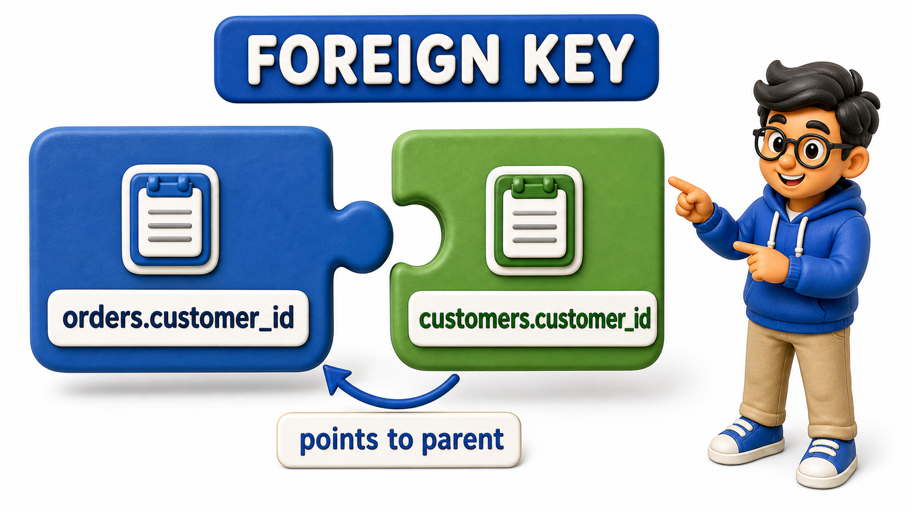

## Introduction

Sanjay has just joined a growing fintech company as its third backend hire, and his first week is spent doing something nobody warned him about in college: reading someone else's `database` instead of designing his own. Three inconsistencies greet him on his first read-through:

- The `schema` he inherits has a `table` called `Customer` and another called `transactions`, one written in the singular, the other in the plural, with no explanation for why.
- A `column` called `custId` sits beside another called `user_id`, both apparently referring to the same kind of person in different `tables`.
- A `column` simply called `type` shows up in three unrelated `tables`, and Sanjay has no way to tell, just by reading the name, whether it means a customer's account type, a `transaction`'s type, or a support ticket's type.

By Thursday, Sanjay has spent more time asking teammates "wait, which `table` does this belong to?" than he has spent writing any actual code. His tech lead, mildly embarrassed, admits the `schema` grew for three years without anyone agreeing on a shared set of rules for naming `tables` and `columns`.

What Sanjay is living through is the practical cost of ignoring **naming conventions**, the agreed-upon rules a team follows for how `tables` and `columns` are named, so that a name alone tells a reader what it holds and how it relates to everything else, without anyone needing to ask.


## Singular or Plural Table Names: Pick One and Never Look Back

The first inconsistency Sanjay flags is the mix of singular and plural `table` names. Some `database` designers name a `table` `Customer`, reasoning that each `row` is one customer. Others name it `Customers`, reasoning that the `table` as a whole is a collection of customers.

Neither convention is objectively correct, and reasonable teams disagree on which one to pick. What is not defensible is doing both in the same `schema`, because a developer who has just learned that `tables` are plural will confidently write `Transactions` for a new `table`, and be wrong the moment it turns out this particular `schema` actually prefers the singular form for that one `table`, for reasons nobody remembers.

The fix Sanjay proposes is unglamorous but effective: the team picks one convention, documents it in a single sentence at the top of their `schema` notes, and applies it to every `table` without exception going forward.

## snake_case or camelCase: The Same Rule Applies to Columns

The `custId` and `user_id` split is the `column`-level version of the same problem. One uses camelCase, capitalizing the first letter of each word after the first; the other uses snake_case, separating words with an underscore and keeping everything lowercase.

Most relational `database` systems are, by default, case-insensitive about unquoted identifiers, which means mixing the two styles does not just look inconsistent, it can actively cause confusion about whether `custId` and `custid` are meant to be the same `column` or different ones.

Sanjay's team settles on snake_case for every `column`, matching the convention most relational `database` tooling expects, and rewrites the plan for all new `tables` around it, leaving the legacy `columns` to be renamed gradually rather than all at once.

## Names That Collide With the Database's Own Vocabulary

- Sanjay also spots a `column` simply named `order`, in a Payments `table` meant to store the sequence number of a payment attempt.
- The trouble is that "order" is a word many `database` systems already reserve for their own sorting instructions, and a `column` sharing a name with a word the `database` itself uses for something else invites exactly the kind of subtle, hard-to-diagnose error that eats an afternoon.
- The fix is simple: prefer a more specific `column` name, such as `attempt_number`, which is not only safer but also more informative on its own.
- As a general habit, any `column` name that reads like an everyday instruction rather than a piece of data, words like "order," "group," "user," or "date" used bare, deserves a second look before it goes into a `schema`.

## Foreign Key Names That Say What They Point To

The most confusing inconsistency Sanjay finds is inside the Transactions `table`, where a `column` is simply named `id`. Read in isolation, `id` looks like it should be the `transaction`'s own `primary key`, but a closer look at the data shows it actually holds a reference to a `row` in the Customers `table`, meaning it is a `foreign key` masquerading as a `primary key` by name alone.

A well-named `foreign key` states plainly what it points to: `customer_id` inside a Transactions `table` leaves no doubt that the value refers to a `row` in Customers, while a bare `id` forces every new developer to go digging through the data just to find out what the `column` actually means.

Sanjay's rule of thumb going forward is that a `foreign key` `column` should always be named after the `table` it references, in the singular, followed by `_id`.



## Abbreviations That Only the Original Author Understood

- The last habit Sanjay pushes back on is unexplained abbreviation.
- A `column` named `cst_addr_ln1` might have been perfectly clear to whoever wrote it three years ago, but it forces every new reader to reverse-engineer "customer address line 1" from a handful of truncated fragments.
- Abbreviating to save a few keystrokes almost never pays for itself once a `schema` is read by more people than wrote it, which is nearly always.
- Sanjay's rule is not "never abbreviate," since a handful of abbreviations, like `id` itself, are so universally understood they cause no confusion.
- The rule is narrower: abbreviate only when the shortened form would be instantly obvious to any new teammate on their first day, and spell the rest out in full.

<table style="border-collapse: collapse; width: 100%; margin: 1rem 0; font-size: 0.95rem;">
  <thead>
    <tr>
      <th style="border: 1px solid #c8d7ea; padding: 10px 12px; text-align: left; background-color: #dceeff; color: #102a43; font-weight: 700;">Naming problem Sanjay found</th>
      <th style="border: 1px solid #c8d7ea; padding: 10px 12px; text-align: left; background-color: #dceeff; color: #102a43; font-weight: 700;">Fix the team agreed on</th>
    </tr>
  </thead>
  <tbody>
    <tr style="background-color: #ffffff;">
      <td style="border: 1px solid #d8e2ef; padding: 9px 12px; vertical-align: top;"><code>Customer</code> and <code>transactions</code> mixed singular/plural</td>
      <td style="border: 1px solid #d8e2ef; padding: 9px 12px; vertical-align: top;">Pick one convention for every table, document it once</td>
    </tr>
    <tr style="background-color: #f7fbff;">
      <td style="border: 1px solid #d8e2ef; padding: 9px 12px; vertical-align: top;"><code>custId</code> next to <code>user_id</code></td>
      <td style="border: 1px solid #d8e2ef; padding: 9px 12px; vertical-align: top;">snake_case for every column, no exceptions</td>
    </tr>
    <tr style="background-color: #ffffff;">
      <td style="border: 1px solid #d8e2ef; padding: 9px 12px; vertical-align: top;">A column named <code>order</code></td>
      <td style="border: 1px solid #d8e2ef; padding: 9px 12px; vertical-align: top;">Rename to something specific, like <code>attempt_number</code></td>
    </tr>
    <tr style="background-color: #f7fbff;">
      <td style="border: 1px solid #d8e2ef; padding: 9px 12px; vertical-align: top;">A foreign key simply named <code>id</code></td>
      <td style="border: 1px solid #d8e2ef; padding: 9px 12px; vertical-align: top;">Name it after the table it points to: <code>customer_id</code></td>
    </tr>
    <tr style="background-color: #ffffff;">
      <td style="border: 1px solid #d8e2ef; padding: 9px 12px; vertical-align: top;"><code>cst_addr_ln1</code></td>
      <td style="border: 1px solid #d8e2ef; padding: 9px 12px; vertical-align: top;">Spell it out: <code>customer_address_line1</code>, unless the short form is universally obvious</td>
    </tr>
  </tbody>
</table>

Here is a small `transactions` table built following every rule Sanjay's team settled on: plural table name applied consistently, snake_case throughout, a specific name instead of the reserved-sounding `order`, and a foreign key named after the table it references.

```postgresql file=init.sql
CREATE TABLE customers (
    customer_id  INTEGER GENERATED ALWAYS AS IDENTITY PRIMARY KEY,
    full_name    TEXT NOT NULL
);

CREATE TABLE transactions (
    transaction_id  INTEGER GENERATED ALWAYS AS IDENTITY PRIMARY KEY,
    customer_id     INTEGER NOT NULL REFERENCES customers(customer_id),
    attempt_number  INTEGER NOT NULL,
    amount          NUMERIC(10, 2) NOT NULL
);

INSERT INTO customers (full_name) VALUES ('Ilyas Bakery Supplies');

INSERT INTO transactions (customer_id, attempt_number, amount) VALUES
    (1, 1, 2500.00),
    (1, 2, 899.00);
```

The active query confirms the naming pays off immediately, a reader can tell exactly what `customer_id` points to without inspecting any data:

```postgresql with=init.sql
SELECT t.transaction_id, c.full_name, t.attempt_number, t.amount
FROM transactions t
JOIN customers c ON t.customer_id = c.customer_id
ORDER BY t.transaction_id;
```

Expected output:

| transaction_id | full_name | attempt_number | amount |
| ---------------: | ---------------------- | ---------------: | ------: |
| 1 | Ilyas Bakery Supplies | 1 | 2500.00 |
| 2 | Ilyas Bakery Supplies | 2 | 899.00 |

`customer_id` inside `transactions` leaves no doubt it refers to a row in `customers`, and `attempt_number` avoids the collision a bare `order` column would have risked with the database's own vocabulary.

## Naming Conventions at a Glance

<table style="border-collapse: collapse; width: 100%; margin: 1rem 0; font-size: 0.95rem;">
  <thead>
    <tr>
      <th style="border: 1px solid #c8d7ea; padding: 10px 12px; text-align: left; background-color: #dceeff; color: #102a43; font-weight: 700;">Element</th>
      <th style="border: 1px solid #c8d7ea; padding: 10px 12px; text-align: left; background-color: #dceeff; color: #102a43; font-weight: 700;">Convention to fix on</th>
      <th style="border: 1px solid #c8d7ea; padding: 10px 12px; text-align: left; background-color: #dceeff; color: #102a43; font-weight: 700;">Why it matters</th>
    </tr>
  </thead>
  <tbody>
    <tr style="background-color: #ffffff;">
      <td style="border: 1px solid #d8e2ef; padding: 9px 12px; vertical-align: top;">Table names</td>
      <td style="border: 1px solid #d8e2ef; padding: 9px 12px; vertical-align: top;">Singular or plural, chosen once</td>
      <td style="border: 1px solid #d8e2ef; padding: 9px 12px; vertical-align: top;">Prevents guesswork about which form a new table should take</td>
    </tr>
    <tr style="background-color: #f7fbff;">
      <td style="border: 1px solid #d8e2ef; padding: 9px 12px; vertical-align: top;">Column names</td>
      <td style="border: 1px solid #d8e2ef; padding: 9px 12px; vertical-align: top;">snake_case, consistently</td>
      <td style="border: 1px solid #d8e2ef; padding: 9px 12px; vertical-align: top;">Matches typical database tooling, avoids case-sensitivity confusion</td>
    </tr>
    <tr style="background-color: #ffffff;">
      <td style="border: 1px solid #d8e2ef; padding: 9px 12px; vertical-align: top;">Reserved-sounding words</td>
      <td style="border: 1px solid #d8e2ef; padding: 9px 12px; vertical-align: top;">Avoid using bare as column names</td>
      <td style="border: 1px solid #d8e2ef; padding: 9px 12px; vertical-align: top;">Prevents collisions with the database&#x27;s own vocabulary</td>
    </tr>
    <tr style="background-color: #f7fbff;">
      <td style="border: 1px solid #d8e2ef; padding: 9px 12px; vertical-align: top;">Foreign keys</td>
      <td style="border: 1px solid #d8e2ef; padding: 9px 12px; vertical-align: top;">Named after the referenced table plus <code>_id</code></td>
      <td style="border: 1px solid #d8e2ef; padding: 9px 12px; vertical-align: top;">Makes relationships readable without inspecting the data</td>
    </tr>
    <tr style="background-color: #ffffff;">
      <td style="border: 1px solid #d8e2ef; padding: 9px 12px; vertical-align: top;">Abbreviations</td>
      <td style="border: 1px solid #d8e2ef; padding: 9px 12px; vertical-align: top;">Only when instantly obvious to a newcomer</td>
      <td style="border: 1px solid #d8e2ef; padding: 9px 12px; vertical-align: top;">Keeps the <code>schema</code> self-explanatory years later</td>
    </tr>
  </tbody>
</table>

## Your Turn: Fix the Names

A draft schema has a table named `Ticket` next to a table named `venues`, a column named `venueID` inside `Ticket`, and a column named `group` recording which seating group a ticket belongs to. List every naming problem here and state the fix for each, following Sanjay's rules.

A working answer: `Ticket` and `venues` mix singular and plural, so the team should pick one, say plural, and rename `Ticket` to `tickets`. `venueID` uses camelCase inside an otherwise snake_case schema, so it becomes `venue_id`, which also happens to follow the foreign-key rule of naming it after the table it references. The `group` column collides with a word many database systems reserve for their own grouping instructions, so it should be renamed to something specific like `seating_group`, the same fix Sanjay applied to the `order` column.

## Conclusion

A naming convention is a small, almost invisible kind of documentation, one that lives inside the names themselves rather than in a separate document nobody reads.

Consistent singular-or-plural `table` names, a single consistent casing style for `columns`, `column` names that avoid the `database`'s own reserved vocabulary, `foreign keys` that plainly state what they reference, and abbreviations that never require a guess all add up to a `schema` a new developer can read cold, without pulling a teammate aside to translate it first.

Sanjay's team fixes their naming going forward, but naming alone does not tell a future reader when a `row` was created, when it last changed, or whether it was ever meant to disappear, questions that a different, equally quiet set of `columns` is built to answer.