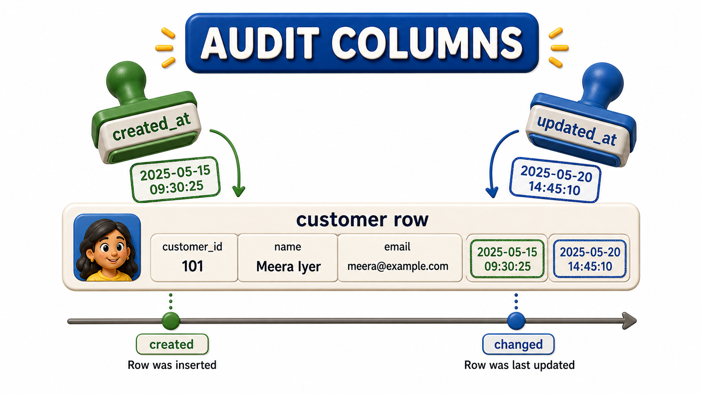
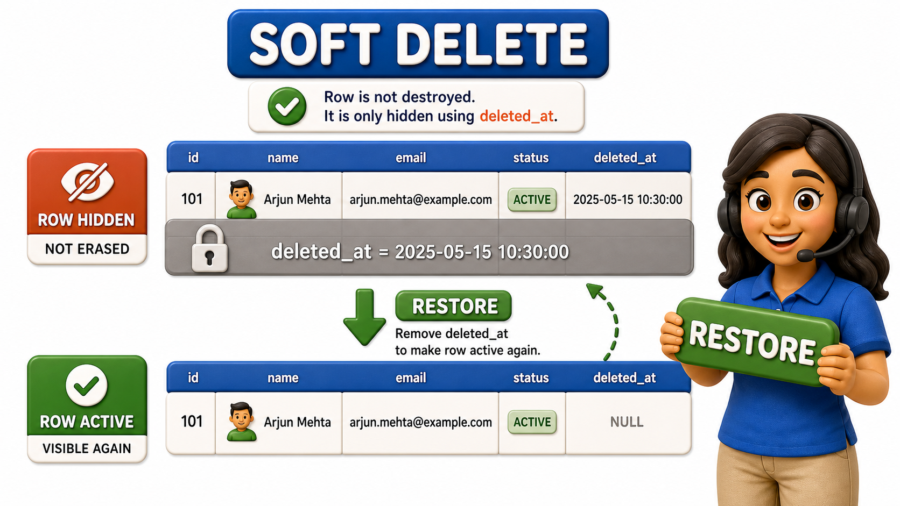

## Introduction

Farah works on the support team at a subscription meal-kit service, and her Tuesday morning starts with an angry phone call. A customer named Rekha Menon says her account was deleted by mistake during a cleanup script the engineering team ran over the weekend, wiping out two years of order history, saved preferences, and a loyalty discount she had been building toward. Farah checks the Customers table and finds exactly what she feared: Rekha's row is simply gone. Not marked inactive, not flagged as closed, gone, the way a sheet of paper is gone once it has been shredded.

Farah escalates to engineering, and the response she gets back is not reassuring: rows removed from that table cannot be recovered, because the table was never designed to remember that a row had ever existed once it was deleted. Her tech lead, reviewing the incident afterward, explains what should have been in place from the start, a pair of practices called **audit columns and soft deletes**, a small set of extra columns that record when a row was created and changed, and a way of "deleting" a row that keeps it recoverable instead of erasing it outright.

## Audit Columns: A Quiet Record of When Things Happened

An audit column is a column added to a table purely to track the history of the row itself, rather than any business fact about the customer, the order, or the product the row represents. The two most common are:

- `created_at`, a timestamp recorded automatically the moment a row is first inserted
- `updated_at`, a timestamp that refreshes automatically every time any part of the row is changed afterward Neither column is something a user of the meal-kit app ever types in directly; the database or the application layer sets them silently, in the background, every single time.

Their value shows up constantly once they exist. A support agent investigating a billing dispute can see exactly when an account was created and whether it was recently modified, which narrows down whether a change the customer is complaining about was even possible on the date they claim. An engineer debugging a data inconsistency can sort a table by `updated_at` to see which rows changed most recently, right around the time a suspicious script ran. None of this is possible after the fact if the columns were never there to begin with, which is exactly Farah's problem with Rekha's vanished row: there was no record of when it was created, let alone any trace of it being removed.

## Soft Deletes: Marking a Row Gone Without Actually Erasing It

The deeper fix Farah's tech lead proposes is a soft delete, the practice of marking a row as deleted rather than physically removing it from the table. Instead of a delete operation that erases the row entirely, the row gains either a boolean flag, commonly named `is_deleted`, or, more informatively, a nullable timestamp column named `deleted_at` that stays empty for every normal row and is filled in with the exact moment a row was "deleted." The row itself never leaves the table. It simply becomes invisible to the parts of the application that only want to see active customers, while remaining fully present and recoverable to anyone who specifically asks for it.

Had Rekha's row used a `deleted_at` column, the weekend cleanup script would have set that single timestamp rather than removing two years of history, and Farah could have resolved the entire phone call in minutes by finding the row, confirming it matched Rekha's account, and simply clearing the timestamp back to empty. The order history, preferences, and loyalty progress would never have been at risk, because none of it was ever actually gone.

## The Tradeoffs Nobody Should Skip Past

Soft deletes are not a free upgrade, and Farah's tech lead is careful to walk through the cost alongside the benefit. Every future query against that table that only wants "real," active rows now has to remember to filter out the soft-deleted ones, every single time, in every application, report, and script that touches the table. Forget that filter once, and a supposedly deleted customer reappears in a marketing email or a sales dashboard, which is its own kind of embarrassing mistake. Some teams handle this by building the filter into a `view` or a shared query helper so individual developers cannot forget it, rather than trusting every person who ever touches the table to remember by hand.

The second tradeoff is growth. A table using soft deletes never actually shrinks from deletions, because nothing is ever truly removed through the normal course of the application's use. Over years, a busy table can accumulate a large number of soft-deleted rows sitting alongside the active ones, which can slow down queries and inflate storage if nobody ever revisits old soft-deleted data for a genuine, permanent cleanup on a separate, deliberate schedule. Soft deletes trade the sharp, irreversible risk of Rekha's incident for a slower, more manageable maintenance burden, which is, for most customer-facing systems, a trade worth making.

| Column | Plain-English purpose | When it is set |
|---|---|---|
| created_at | Records the exact moment a row was first inserted | Once, automatically, at insert time |
| updated_at | Records the exact moment a row was last changed | Every time any part of the row changes |
| deleted_at | Marks a row as soft-deleted without removing it | Only when the row is "deleted"; empty otherwise |

## Audit Columns and Soft Deletes at a Glance

| Practice | What it protects against | Cost it introduces |
|---|---|---|
| created_at / updated_at | Losing all sense of a row's history | A small amount of extra storage, set automatically |
| Soft delete via is_deleted or deleted_at | Permanent, accidental loss of a row | Every read must remember to filter deleted rows |
| Skipping both | Nothing, until the first accidental deletion happens | Total, unrecoverable data loss when it eventually does |

## Conclusion

Audit columns and soft deletes both answer the same underlying worry: that a database, left to simply overwrite and erase without a trace, remembers nothing about its own past. Created and updated timestamps turn a silent row into one that can explain when it came to be and when it last changed, and a soft-delete flag or timestamp turns an irreversible deletion into a recoverable one, at the cost of remembering to filter deleted rows out of every future read and accepting that the table will grow without ever shrinking on its own. Had a `deleted_at` column existed on the Customers table, Farah could have restored Rekha Menon's two years of order history, preferences, and loyalty progress in minutes instead of telling her it was gone for good.

Rekha's account is only one row in one table, but the same idea scales to an entire company's worth of tables once those tables start getting grouped, organized, and separated from one another by the teams that own them, which is exactly the kind of organization a well-run database needs as it grows.
