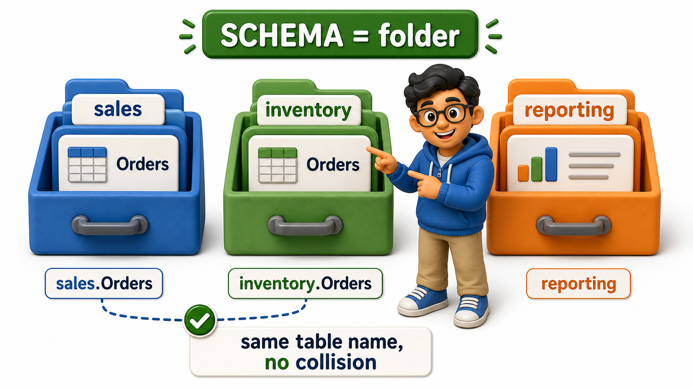
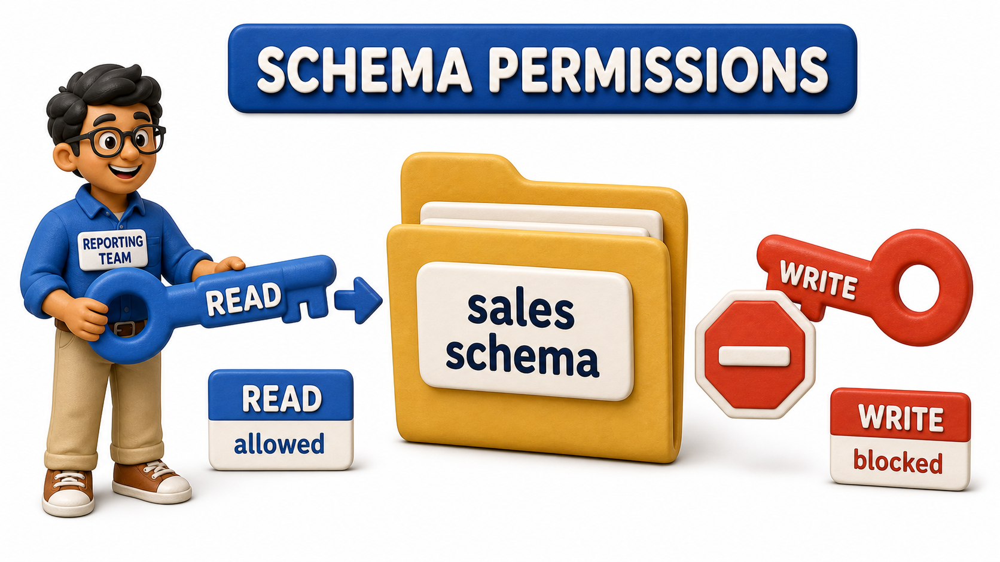

## Introduction

Kiran now leads platform engineering at a mid-sized retail company, three years after her first internship taught her that not every system stores data the same way. The company has grown from a single small team into three:

- A sales team building the storefront
- An inventory team tracking stock across warehouses
- A reporting team building dashboards for leadership

All three teams share one physical database server, because standing up a separate server for each team would be wasteful and would make it painfully hard to combine data across them for a single company-wide report.

The trouble starts small and grows fast. The sales team creates a table called `Orders`. Weeks later, without knowing this already exists, the inventory team creates a table called `Shipments`, and then, almost as an afterthought, a table also called `Orders`, meaning purchase orders sent to suppliers, a completely different concept from a customer's sales order but sharing the exact same name. The two `Orders` tables collide, and nobody notices until a report quietly pulls the wrong one. Kiran's fix is not a naming trick or a stricter review process, it is an organizational tool built into the database itself, called a **schema**, or **namespace**, a named grouping that lets related tables live together under one label while staying cleanly separated from tables owned by a different team.

## A Schema Is a Folder, Not a Table Design

The word "`schema`" is used two different ways in database work, and Kiran is careful to keep them apart when she explains this to new hires. One meaning, the one usually covered first, refers to the structure of a single table, its columns, types, and keys, the blueprint for what a row looks like. The meaning at stake here is different: a `schema` as a named container that groups a set of related tables together inside one database, much like a folder groups related files together on a hard drive without changing what is inside any individual file. A retail company's single physical database can hold a `sales` `schema`, an `inventory` `schema`, and a `reporting` `schema` side by side, each one free to contain its own `Orders` table without the two ever being confused, because a table's true identity is really the pair of its `schema` name and its table name together, `sales.Orders` and `inventory.Orders`, not the table name alone.

## Why Grouping Tables Prevents Collisions and Confusion

Once Kiran introduces the three `schemas`, the naming collision that started this whole mess simply cannot happen again. The sales team's `Orders` table lives inside `sales`, the inventory team's purchase-order table can keep the name `Orders` too, or be renamed to something clearer like `PurchaseOrders`, but either way it lives inside `inventory`, fully distinct from the sales table sharing a similar name. A developer querying the database no longer has to remember, from memory, that "the real Orders table is the third one someone created, the other two are legacy," because the `schema` prefix does that remembering for them, permanently, in the name itself.

The organizational benefit runs deeper than avoiding name clashes, too. When Kiran's reporting team is exploring what tables exist to build a new dashboard, browsing by `schema` lets them see, at a glance, which tables belong to sales, which belong to inventory, and which are reporting's own intermediate tables, rather than scrolling through one enormous undifferentiated list of every table the company has ever created. A `schema` turns a database's table list from a flat pile into something closer to a labeled set of drawers, each one holding what one team actually owns.

## Controlling Access at the Group Level

`Schemas` give Kiran one more lever that individual table names never could: access control that applies to an entire group of tables at once rather than one table at a time. The reporting team needs to read data from both sales and inventory to build cross-team dashboards, but has no business writing to either, and certainly should never be able to modify a live customer order by accident while building a chart. By granting the reporting team read-only access to the `sales` and `inventory` `schemas` as a whole, rather than listing out permissions table by table, Kiran sets one rule instead of maintaining a table-by-table list by hand. That rule does not automatically reach forward in time on its own, most database systems still need to be told, once, that any new table created inside a `schema` should inherit that same access policy, but setting that up is a single, one-time piece of configuration per `schema` rather than a fresh permissions grant every time someone on the sales or inventory team adds a table.

The sales team, by contrast, gets full read-and-write access to its own `sales` `schema`, and no access at all to `inventory`, because sales has no legitimate reason to modify warehouse stock counts directly. This is the same instinct behind giving each team its own labeled drawer rather than one shared drawer everyone digs through: a team that only ever reaches into its own `schema` is far less likely to accidentally break something that belongs to someone else.

| `Schema` | Owned by | Holds |
|---|---|---|
| sales | Storefront team | Customer orders, carts, payments |
| inventory | Warehouse team | Stock counts, purchase orders, shipments |
| reporting | Analytics team | Dashboards, aggregated summary tables |

## Schemas at a Glance

| Idea | What it means | Why Kiran's company needed it |
|---|---|---|
| `Schema` as a grouping | A named container holding a set of related tables | Lets each team's tables live together without colliding with another team's |
| Full table identity | `Schema` name plus table name together | `sales.Orders` and `inventory.Orders` can coexist safely |
| Browsing by `schema` | Tables organized by owning team, not one flat list | Makes it obvious at a glance who owns what |
| Access at the `schema` level | Permissions granted to a whole `schema`, not table by table | New tables can be configured to inherit the same rule, set up once per `schema` |

## Conclusion

A `schema`, in this sense, is less about how any single table is shaped and more about how a whole database full of tables is kept organized once more than one team is building on top of it. Grouping related tables under a shared name prevents the kind of accidental collision Kiran's company hit the moment two teams independently reached for the same obvious table name, makes a sprawling database easier to browse by simply showing who owns what, and lets access be granted or withheld for an entire team's worth of tables in one rule rather than one table at a time.

With tables now well-typed, well-keyed, sensibly named, quietly self-documenting through their audit columns, and cleanly grouped by the team that owns them, what remains is stepping back to look at a finished design the way a second reviewer would, catching the handful of classic mistakes that slip past even a careful first pass.
