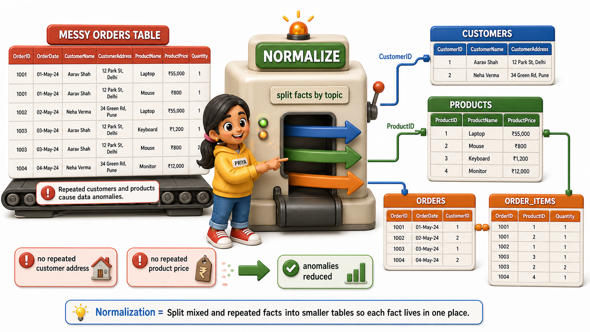

# Database Design & Modeling

**Database Management Systems**

Goal of this unit: Model real-world systems using ER diagrams, design well-structured relational `schemas`, and apply normalization principles to minimize redundancy and maintain data integrity.

## Chapters and Topics (teach in order)

### Entity-Relationship Modeling

<table style="border-collapse: collapse; width: 100%; margin: 1rem 0; font-size: 0.95rem;">
  <thead>
    <tr>
      <th style="border: 1px solid #c8d7ea; padding: 10px 12px; text-align: left; background-color: #dceeff; color: #102a43; font-weight: 700;">#</th>
      <th style="border: 1px solid #c8d7ea; padding: 10px 12px; text-align: left; background-color: #dceeff; color: #102a43; font-weight: 700;">Topic</th>
      <th style="border: 1px solid #c8d7ea; padding: 10px 12px; text-align: left; background-color: #dceeff; color: #102a43; font-weight: 700;">File</th>
    </tr>
  </thead>
  <tbody>
    <tr style="background-color: #ffffff;">
      <td style="border: 1px solid #d8e2ef; padding: 9px 12px; vertical-align: top;">1</td>
      <td style="border: 1px solid #d8e2ef; padding: 9px 12px; vertical-align: top;">Entities, Attributes, and Relationships: Modelling the Real World</td>
      <td style="border: 1px solid #d8e2ef; padding: 9px 12px; vertical-align: top;"><a href="2.1%20-%20Entity-Relationship%20Modeling/01_entities_attributes_and_relationships_modelling_th.md">01_entities_attributes_and_relationships_modelling_th.md</a></td>
    </tr>
    <tr style="background-color: #f7fbff;">
      <td style="border: 1px solid #d8e2ef; padding: 9px 12px; vertical-align: top;">2</td>
      <td style="border: 1px solid #d8e2ef; padding: 9px 12px; vertical-align: top;">Types of Attributes: Simple, Composite, Derived, Multivalued</td>
      <td style="border: 1px solid #d8e2ef; padding: 9px 12px; vertical-align: top;"><a href="2.1%20-%20Entity-Relationship%20Modeling/02_types_of_attributes_simple_composite_derived_multi.md">02_types_of_attributes_simple_composite_derived_multi.md</a></td>
    </tr>
    <tr style="background-color: #ffffff;">
      <td style="border: 1px solid #d8e2ef; padding: 9px 12px; vertical-align: top;">3</td>
      <td style="border: 1px solid #d8e2ef; padding: 9px 12px; vertical-align: top;">Relationship Cardinality</td>
      <td style="border: 1px solid #d8e2ef; padding: 9px 12px; vertical-align: top;"><a href="2.1%20-%20Entity-Relationship%20Modeling/03_relationship_cardinality.md">03_relationship_cardinality.md</a></td>
    </tr>
    <tr style="background-color: #f7fbff;">
      <td style="border: 1px solid #d8e2ef; padding: 9px 12px; vertical-align: top;">4</td>
      <td style="border: 1px solid #d8e2ef; padding: 9px 12px; vertical-align: top;">Participation Constraints</td>
      <td style="border: 1px solid #d8e2ef; padding: 9px 12px; vertical-align: top;"><a href="2.1%20-%20Entity-Relationship%20Modeling/04_participation_constraints.md">04_participation_constraints.md</a></td>
    </tr>
    <tr style="background-color: #ffffff;">
      <td style="border: 1px solid #d8e2ef; padding: 9px 12px; vertical-align: top;">5</td>
      <td style="border: 1px solid #d8e2ef; padding: 9px 12px; vertical-align: top;">Drawing an ER Diagram: Notation and Conventions</td>
      <td style="border: 1px solid #d8e2ef; padding: 9px 12px; vertical-align: top;"><a href="2.1%20-%20Entity-Relationship%20Modeling/05_drawing_an_er_diagram_notation_and_conventions.md">05_drawing_an_er_diagram_notation_and_conventions.md</a></td>
    </tr>
    <tr style="background-color: #f7fbff;">
      <td style="border: 1px solid #d8e2ef; padding: 9px 12px; vertical-align: top;">6</td>
      <td style="border: 1px solid #d8e2ef; padding: 9px 12px; vertical-align: top;">Converting an ER Diagram into Relational Tables</td>
      <td style="border: 1px solid #d8e2ef; padding: 9px 12px; vertical-align: top;"><a href="2.1%20-%20Entity-Relationship%20Modeling/06_converting_an_er_diagram_into_relational_tables.md">06_converting_an_er_diagram_into_relational_tables.md</a></td>
    </tr>
  </tbody>
</table>

### Normalization

<table style="border-collapse: collapse; width: 100%; margin: 1rem 0; font-size: 0.95rem;">
  <thead>
    <tr>
      <th style="border: 1px solid #c8d7ea; padding: 10px 12px; text-align: left; background-color: #dceeff; color: #102a43; font-weight: 700;">#</th>
      <th style="border: 1px solid #c8d7ea; padding: 10px 12px; text-align: left; background-color: #dceeff; color: #102a43; font-weight: 700;">Topic</th>
      <th style="border: 1px solid #c8d7ea; padding: 10px 12px; text-align: left; background-color: #dceeff; color: #102a43; font-weight: 700;">File</th>
    </tr>
  </thead>
  <tbody>
    <tr style="background-color: #ffffff;">
      <td style="border: 1px solid #d8e2ef; padding: 9px 12px; vertical-align: top;">1</td>
      <td style="border: 1px solid #d8e2ef; padding: 9px 12px; vertical-align: top;">Why Normalize? Update, Insert, and Delete Anomalies</td>
      <td style="border: 1px solid #d8e2ef; padding: 9px 12px; vertical-align: top;"><a href="2.2%20-%20Normalization/01_why_normalize_update_insert_and_delete_anomalies.md">01_why_normalize_update_insert_and_delete_anomalies.md</a></td>
    </tr>
    <tr style="background-color: #f7fbff;">
      <td style="border: 1px solid #d8e2ef; padding: 9px 12px; vertical-align: top;">2</td>
      <td style="border: 1px solid #d8e2ef; padding: 9px 12px; vertical-align: top;">Functional Dependencies: The Engine Behind Normalization</td>
      <td style="border: 1px solid #d8e2ef; padding: 9px 12px; vertical-align: top;"><a href="2.2%20-%20Normalization/02_functional_dependencies_the_engine_behind_normaliz.md">02_functional_dependencies_the_engine_behind_normaliz.md</a></td>
    </tr>
    <tr style="background-color: #ffffff;">
      <td style="border: 1px solid #d8e2ef; padding: 9px 12px; vertical-align: top;">3</td>
      <td style="border: 1px solid #d8e2ef; padding: 9px 12px; vertical-align: top;">First Normal Form (1NF)</td>
      <td style="border: 1px solid #d8e2ef; padding: 9px 12px; vertical-align: top;"><a href="2.2%20-%20Normalization/03_first_normal_form.md">03_first_normal_form.md</a></td>
    </tr>
    <tr style="background-color: #f7fbff;">
      <td style="border: 1px solid #d8e2ef; padding: 9px 12px; vertical-align: top;">4</td>
      <td style="border: 1px solid #d8e2ef; padding: 9px 12px; vertical-align: top;">Second Normal Form (2NF)</td>
      <td style="border: 1px solid #d8e2ef; padding: 9px 12px; vertical-align: top;"><a href="2.2%20-%20Normalization/04_second_normal_form.md">04_second_normal_form.md</a></td>
    </tr>
    <tr style="background-color: #ffffff;">
      <td style="border: 1px solid #d8e2ef; padding: 9px 12px; vertical-align: top;">5</td>
      <td style="border: 1px solid #d8e2ef; padding: 9px 12px; vertical-align: top;">Third Normal Form (3NF)</td>
      <td style="border: 1px solid #d8e2ef; padding: 9px 12px; vertical-align: top;"><a href="2.2%20-%20Normalization/05_third_normal_form.md">05_third_normal_form.md</a></td>
    </tr>
    <tr style="background-color: #f7fbff;">
      <td style="border: 1px solid #d8e2ef; padding: 9px 12px; vertical-align: top;">6</td>
      <td style="border: 1px solid #d8e2ef; padding: 9px 12px; vertical-align: top;">Boyce-Codd Normal Form (BCNF)</td>
      <td style="border: 1px solid #d8e2ef; padding: 9px 12px; vertical-align: top;"><a href="2.2%20-%20Normalization/06_boycecodd_normal_form.md">06_boycecodd_normal_form.md</a></td>
    </tr>
    <tr style="background-color: #ffffff;">
      <td style="border: 1px solid #d8e2ef; padding: 9px 12px; vertical-align: top;">7</td>
      <td style="border: 1px solid #d8e2ef; padding: 9px 12px; vertical-align: top;">When to Denormalize: Trade-offs in Practice</td>
      <td style="border: 1px solid #d8e2ef; padding: 9px 12px; vertical-align: top;"><a href="2.2%20-%20Normalization/07_when_to_denormalize_tradeoffs_in_practice.md">07_when_to_denormalize_tradeoffs_in_practice.md</a></td>
    </tr>
  </tbody>
</table>

### Practical Schema Design

<table style="border-collapse: collapse; width: 100%; margin: 1rem 0; font-size: 0.95rem;">
  <thead>
    <tr>
      <th style="border: 1px solid #c8d7ea; padding: 10px 12px; text-align: left; background-color: #dceeff; color: #102a43; font-weight: 700;">#</th>
      <th style="border: 1px solid #c8d7ea; padding: 10px 12px; text-align: left; background-color: #dceeff; color: #102a43; font-weight: 700;">Topic</th>
      <th style="border: 1px solid #c8d7ea; padding: 10px 12px; text-align: left; background-color: #dceeff; color: #102a43; font-weight: 700;">File</th>
    </tr>
  </thead>
  <tbody>
    <tr style="background-color: #ffffff;">
      <td style="border: 1px solid #d8e2ef; padding: 9px 12px; vertical-align: top;">1</td>
      <td style="border: 1px solid #d8e2ef; padding: 9px 12px; vertical-align: top;">Choosing the Right Data Type</td>
      <td style="border: 1px solid #d8e2ef; padding: 9px 12px; vertical-align: top;"><a href="2.3%20-%20Practical%20Schema%20Design/01_choosing_the_right_data_type.md">01_choosing_the_right_data_type.md</a></td>
    </tr>
    <tr style="background-color: #f7fbff;">
      <td style="border: 1px solid #d8e2ef; padding: 9px 12px; vertical-align: top;">2</td>
      <td style="border: 1px solid #d8e2ef; padding: 9px 12px; vertical-align: top;">Primary Key Strategies: Integer IDs vs. UUIDs</td>
      <td style="border: 1px solid #d8e2ef; padding: 9px 12px; vertical-align: top;"><a href="2.3%20-%20Practical%20Schema%20Design/02_primary_key_strategies_integer_ids_vs_uuids.md">02_primary_key_strategies_integer_ids_vs_uuids.md</a></td>
    </tr>
    <tr style="background-color: #ffffff;">
      <td style="border: 1px solid #d8e2ef; padding: 9px 12px; vertical-align: top;">3</td>
      <td style="border: 1px solid #d8e2ef; padding: 9px 12px; vertical-align: top;">Naming Conventions</td>
      <td style="border: 1px solid #d8e2ef; padding: 9px 12px; vertical-align: top;"><a href="2.3%20-%20Practical%20Schema%20Design/03_naming_conventions.md">03_naming_conventions.md</a></td>
    </tr>
    <tr style="background-color: #f7fbff;">
      <td style="border: 1px solid #d8e2ef; padding: 9px 12px; vertical-align: top;">4</td>
      <td style="border: 1px solid #d8e2ef; padding: 9px 12px; vertical-align: top;">Audit Columns and Soft Deletes</td>
      <td style="border: 1px solid #d8e2ef; padding: 9px 12px; vertical-align: top;"><a href="2.3%20-%20Practical%20Schema%20Design/04_audit_columns_and_soft_deletes.md">04_audit_columns_and_soft_deletes.md</a></td>
    </tr>
    <tr style="background-color: #ffffff;">
      <td style="border: 1px solid #d8e2ef; padding: 9px 12px; vertical-align: top;">5</td>
      <td style="border: 1px solid #d8e2ef; padding: 9px 12px; vertical-align: top;">Database Schemas and Namespaces</td>
      <td style="border: 1px solid #d8e2ef; padding: 9px 12px; vertical-align: top;"><a href="2.3%20-%20Practical%20Schema%20Design/05_database_schemas_and_namespaces.md">05_database_schemas_and_namespaces.md</a></td>
    </tr>
    <tr style="background-color: #f7fbff;">
      <td style="border: 1px solid #d8e2ef; padding: 9px 12px; vertical-align: top;">6</td>
      <td style="border: 1px solid #d8e2ef; padding: 9px 12px; vertical-align: top;">Schema Design Review: Spotting Common Mistakes</td>
      <td style="border: 1px solid #d8e2ef; padding: 9px 12px; vertical-align: top;"><a href="2.3%20-%20Practical%20Schema%20Design/06_schema_design_review_spotting_common_mistakes.md">06_schema_design_review_spotting_common_mistakes.md</a></td>
    </tr>
  </tbody>
</table>

Each lesson follows the house style: a standardized **Introduction** heading (no page-title H1), a story-led flow with real-world examples under natural headings, and a closing **Conclusion**. This unit precedes SQL Essentials, so `schema` and normalization ideas are illustrated with prose and Markdown `tables` of sample data rather than runnable SQL. No emojis, no em dashes, no forward or backward references to other units or chapters.

_Status: all 19 lessons authored and reviewed._
