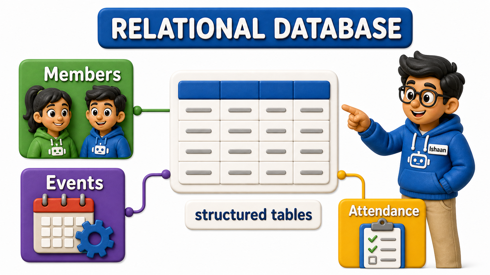
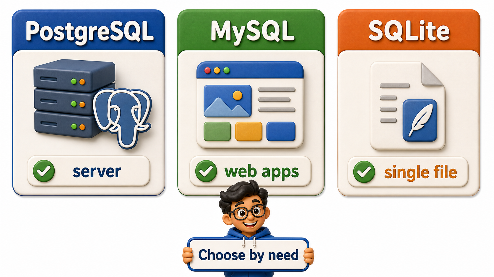

## Introduction

Ishaan has just been handed a real assignment for the first time: build a small system to track members, events, and attendance for his college's robotics club. Before he writes a single line of anything, he needs a place to actually store that data, and when he searches for "database" online, he is met with a wall of names. PostgreSQL. MySQL. SQLite. MongoDB. Oracle. SQL Server. Someone in a forum thread insists one is "the only real choice," someone else insists the opposite, and Ishaan closes seventeen browser tabs no closer to an answer than when he started. His actual decision comes down to three things:

- What a relational database management system is actually built to do well
- Which of the several relational systems on offer make the most sense for someone learning the craft from scratch
- What his robotics club's data genuinely needs, not what sounds most impressive

What Ishaan actually needs is not a ranking of which database is "best" in some abstract sense. He needs to understand what a **relational database management system**, a piece of software that stores data in structured tables and lets him ask precise questions of it using a shared query language, is built to do well, and which of the several relational systems on offer make the most sense for someone learning the craft from scratch. That question has a much calmer answer than the forum threads suggest.

## The Relational Family Ishaan Keeps Running Into

Almost every name Ishaan encountered belongs to one of two broad families. The first is the relational family: PostgreSQL, MySQL, SQLite, Oracle, and SQL Server all organize data into rows and columns inside named tables, and all of them understand the same general query language, with small dialect differences between them. The second family covers everything else, loosely grouped under "NoSQL", systems built around documents, key-value pairs, or graphs instead of rigid tables, aimed at problems where the relational shape does not fit naturally, such as storing loosely structured logs or building a recommendation graph.

Ishaan's robotics club data, members, events, attendance records, and the relationships between them, is a textbook fit for the relational shape. A member belongs to the club, attends events, and each attendance record links a specific member to a specific event on a specific date. That is precisely the kind of structured, interrelated data a relational system was designed to hold, so Ishaan can set the NoSQL family aside for now and focus his attention on the relational options in front of him.



## PostgreSQL, MySQL, and SQLite Compared

Among the relational systems, three names come up constantly for anyone starting out, and each earned its popularity for a different reason.

PostgreSQL is open source, free to use without restriction, and has spent decades building a reputation for closely following the official SQL standard rather than inventing its own shortcuts. It handles complex queries, enforces data integrity rules strictly, and is trusted in production by companies running everything from small startups to large financial systems. Because it behaves so predictably and sticks so closely to the standard, whatever Ishaan learns on PostgreSQL transfers almost unchanged to most other relational systems he might meet later in his career.

MySQL is also open source, also free, and arguably even more widely deployed across the web, particularly in content management systems and many popular hosting stacks. It is fast for simple, high-volume read-heavy workloads and has an enormous community around it. Where it differs from PostgreSQL is mostly in smaller feature emphasis: PostgreSQL tends to support more advanced query features and stricter data validation out of the box, while MySQL has historically prioritized straightforward speed for common web workloads. Neither is "wrong"; they simply grew up optimizing for slightly different priorities.

SQLite is a different kind of tool altogether. It is not a server you connect to at all, it is a library that stores an entire database inside a single file on disk, with no separate process to install, configure, or keep running. That makes it wonderful for a mobile app's local storage, a small script's scratch data, or a quick prototype, since there is nothing to set up beyond the file itself. But that same simplicity is its limitation: SQLite is not built to have many people or programs writing to it at once over a network, which is exactly the situation a shared club-membership system, accessed by several club officers at once, actually needs.

```text
PostgreSQL  -> full server, standards-strict, free, great for learning and production alike
MySQL       -> full server, free, extremely popular, slightly different feature emphasis
SQLite      -> no server at all, one file, perfect for small or embedded use, not for shared multi-user systems
```



## Database Systems at a Glance

| System | Setup | Best suited for |
|---|---|---|
| PostgreSQL | Install a server process | Learning SQL properly, and real shared, multi-user applications |
| MySQL | Install a server process | High-traffic web applications, content-heavy sites |
| SQLite | No server, single file | Small scripts, mobile apps, quick local prototypes |

## Why Ishaan's Club System Points Toward PostgreSQL

Weighing the three against what his robotics club actually needs, Ishaan notices the shape of the decision quickly. His system will be used by more than one officer at a time, needs to enforce that an attendance record cannot point to a member or event that does not exist, and will only grow more demanding as the club adds more events and more members. SQLite's single-file simplicity is tempting for a first weekend of hacking, but it was never built for several people editing shared data at once. MySQL would work perfectly well too, but PostgreSQL's stricter adherence to the standard, its free and open licensing, and its enormous presence in real production systems make it the steadier long-term choice for someone who wants what they learn to matter beyond a single toy project.

That is exactly the reasoning behind a decision worth stating plainly, since it shapes everything from here forward: this course uses PostgreSQL as its primary tool for learning and practicing SQL. Every example, every exercise, and every worked scenario going forward assumes a PostgreSQL environment, precisely because it gives the clearest, most standards-faithful foundation to build on.

## Conclusion

Choosing a database system is not about finding one flawless option and discarding the rest, it is about matching a system's actual design to the shape of the problem in front of you. PostgreSQL, MySQL, and SQLite all belong to the same relational family and share the same core query language, but they differ sharply in how they are run, how strictly they enforce rules, and how well they support several people working against the same data at once. For a shared, growing system like Ishaan's club tracker, and for learning SQL in a way that transfers cleanly to real-world work, a full standards-compliant server is the right starting point.

With that decision settled, the next natural question is a practical one: how does a system like this actually get onto a machine in the first place, and what does that process look like in practice.
