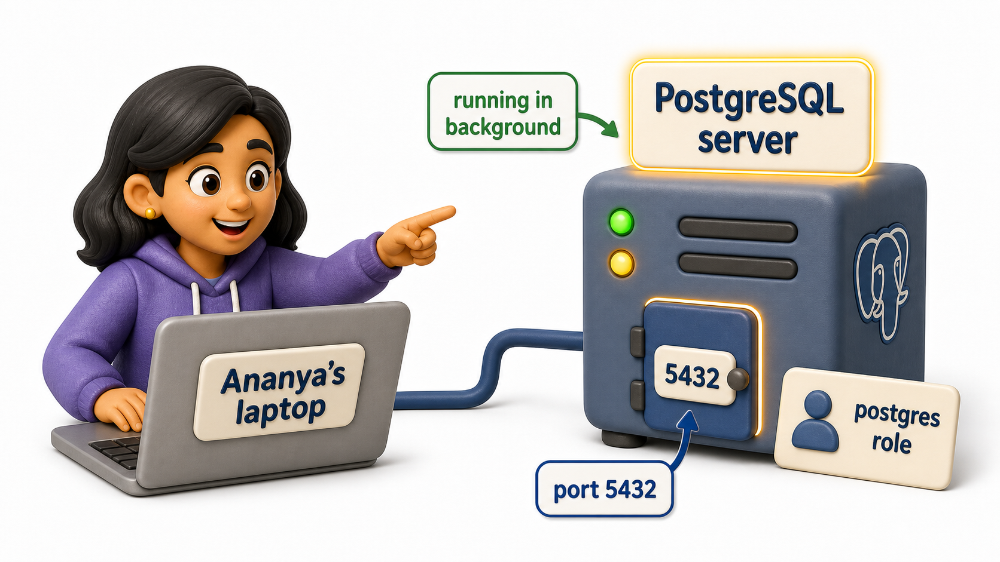
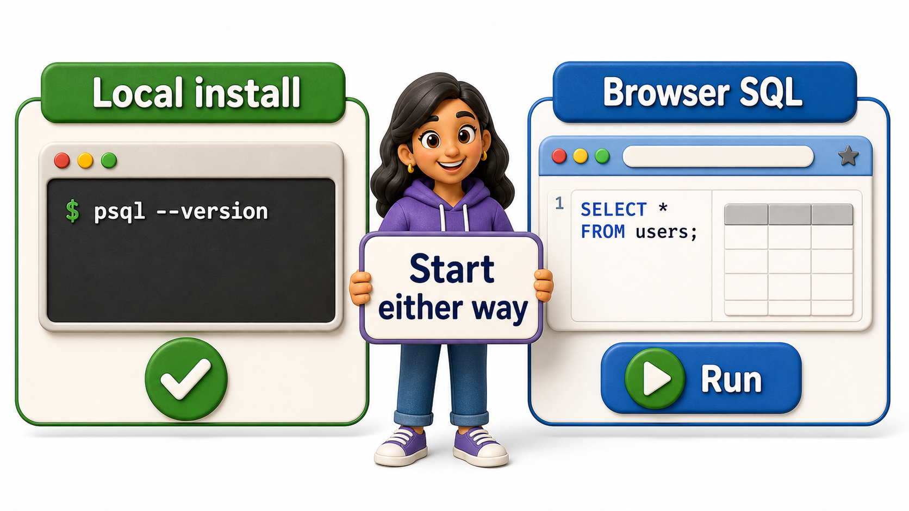

## Introduction

Ananya has decided which system she wants to learn on, and now she is staring at her own laptop wondering what "installing a database" even involves in practice. She has installed apps before, the double-click-and-follow-the-wizard kind, but a database feels different somehow, more like setting up a piece of infrastructure than opening a program. Is it a program she opens each time, like a text editor? Does it run quietly in the background, like something she can forget about until she needs it?

The honest answer is that PostgreSQL is a small, ongoing **server process**, a program that starts once, keeps running quietly in the background listening for connections, and stays available until she stops it or shuts down her machine, rather than something she opens and closes each time like a document. Understanding that one idea makes the rest of installing it far less mysterious, because everything else, the installer, the default user, the port number, exists to get that background process running reliably and to give Ananya a safe way to reach it.



## What an Install Actually Sets Up

Regardless of which operating system Ananya is on, a PostgreSQL install accomplishes the same handful of things underneath whatever wizard or command happens to drive it.

On Windows and Mac, the usual route is a downloadable installer that walks through a short wizard: choose an install location, choose which components to include, pick a password for the default administrative account, and confirm a network port. On Linux, the far more common route is a single command through the system's package manager, since Linux distributions treat PostgreSQL as just another package to fetch and configure, no downloaded installer file involved at all.

```text
# Windows / Mac: run the downloaded installer, then follow its wizard steps
#   1. Choose an install directory
#   2. Choose components (server, command-line tools, pgAdmin)
#   3. Set a password for the default "postgres" superuser role
#   4. Confirm the port (default 5432)
#   5. Finish, and the server starts automatically

# Linux (Debian/Ubuntu-style package manager)
sudo apt update
sudo apt install postgresql
```

Whichever route Ananya takes, the installer leaves her with the same three things in place:

1. A running server process
2. A default administrative `role`
3. A default network port the server listens on

## The Default Admin Role and the Default Port

Every fresh PostgreSQL install creates one particular `role` automatically, conventionally named `postgres`, which has full administrative rights over the whole server. Ananya will use this `role` for her very first connection, the same way a brand-new laptop hands you one built-in administrator account before you create your own. In a real team setting, nobody keeps using that account forever; separate, more limited `roles` get created for each person or application. But for a first install on her own machine, `postgres` is exactly the account she is meant to start with.

Alongside the admin `role`, the installer configures the server to listen for connections on a specific network port, and PostgreSQL's convention is **port 5432**. A port, in this context, is simply the numbered "door" a program listens at for incoming connections, the same way a building might have several numbered entrances even though it is one structure. Ananya does not need to memorize this number so much as recognize it later: any tool that wants to talk to her PostgreSQL server, whether that is a command-line client or a graphical one, will ask for a host, typically her own machine, and a port, typically 5432, before it asks for anything else.

## Verifying the Install Actually Worked

Once the installer finishes, Ananya's next instinct, and the right one, is to confirm the install actually took hold rather than assuming silently that it did. The simplest check is asking the installed tools to report their own version number from a terminal.

```console
$ psql --version
psql (PostgreSQL) 16.2

$ postgres --version
postgres (PostgreSQL) 16.2
```

Seeing a version number printed back, rather than a "command not found" style error, tells Ananya two things at once: the software is genuinely on her machine, and the terminal knows where to find it. If the command is not recognized, the usual culprit is that the install's tools were not added to her system's command search path during setup, a fixable configuration detail rather than a sign that anything is fundamentally broken.

## A Zero-Install Way to Start Right Now

Here is the reassuring part for anyone who would rather not fight with installers on day one: a full local install is not required to begin writing and running real SQL. A browser-based SQL environment, reachable through nothing more than a web page, gives you an already-running database connection instantly, with no download, no password setup, and no port configuration to think about. It is the SQL equivalent of a code runner that lets a brand-new programmer try a first few lines of code without first setting up an entire development machine, and it is a perfectly sound place to spend your first stretch of practice.

Installing PostgreSQL on your own machine is absolutely worth doing, and most of the exercises ahead can be tried either way, but there is no need to treat it as a prerequisite for getting started. Get comfortable typing queries and seeing real results first, in whichever environment is in front of you, and treat a local install as a milestone to reach once the basics of talking to a database no longer feel unfamiliar.



## Installing PostgreSQL at a Glance

| Step | What happens | Why it matters |
|---|---|---|
| Run the installer or package manager command | The server software is copied onto the machine | Nothing runs until the software actually exists locally |
| Set a password for the default admin `role` | A `postgres` superuser account is created | Gives you a safe first way to connect and manage the server |
| Confirm the port | The server listens on port 5432 by default | Every client tool needs to know which door to knock on |
| Check the version | `psql --version` or `postgres --version` prints a number | Confirms the install actually succeeded before you go further |

## Conclusion

Installing PostgreSQL, stripped of wizard screens and package-manager syntax, comes down to the same few ideas everywhere: get the server software onto the machine, set up a default administrative account to manage it, agree on a port for tools to connect through, and confirm the whole thing actually worked with a quick version check. None of it demands deep systems knowledge, and none of it needs to happen before Ananya writes her first query, since an online environment can get her typing real SQL within seconds.

Once a server is reachable, whether local or online, the next question is how to actually talk to it, and it turns out there are two quite different styles of tool for exactly that job, one built for typing and one built for pointing and clicking.
