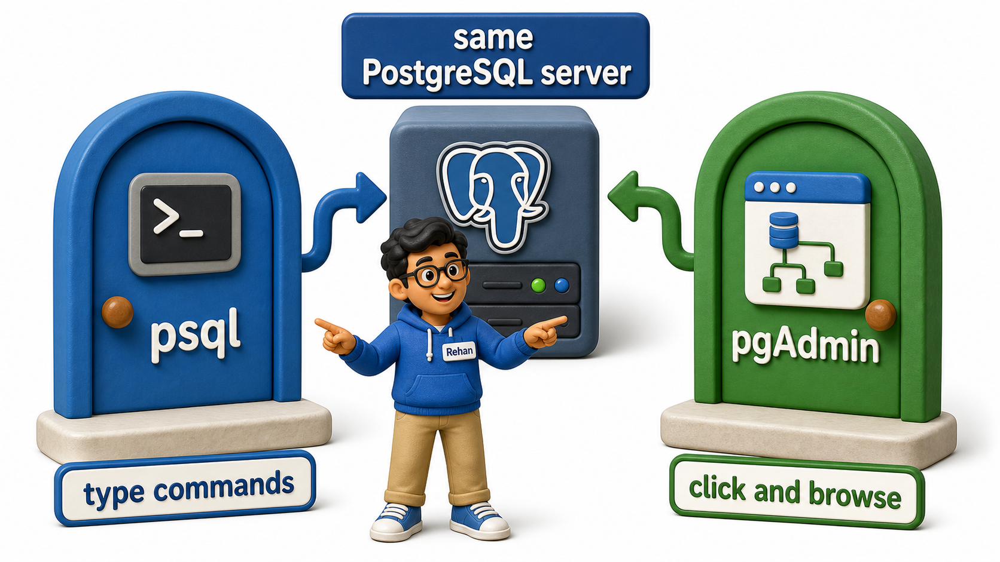
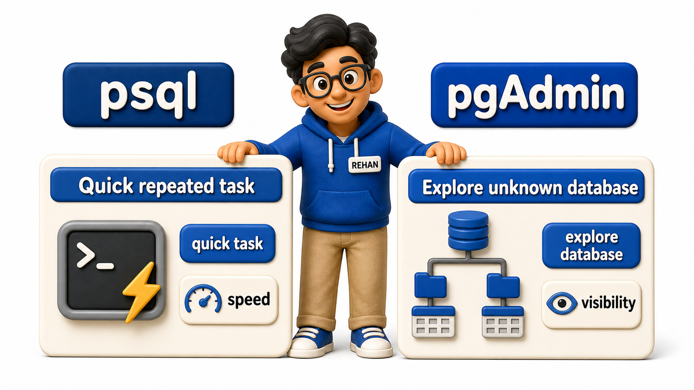

## Introduction

Rehan has PostgreSQL running on his machine, and he opens a tutorial video to see what happens next. The presenter types a short, cryptic command starting with a backslash into a plain black terminal window, and a list of database names appears instantly. Rehan closes that video and opens another, and this presenter instead clicks around a colourful application window, expanding little tree icons labelled with database and table names, right-clicking on one to open a spreadsheet-like grid of rows. Both presenters are doing the same job, talking to a PostgreSQL server and looking at what is inside it, yet the two screens look like they belong to entirely different worlds.

They do belong to two different worlds, in a sense, and Rehan has just discovered the two main doors into any PostgreSQL server. One is **psql**, a command-line client where you type SQL statements and short meta-commands directly and read the results back as text. The other is **pgAdmin**, a graphical client where databases, `schemas`, and tables are represented as a browsable tree you can click through, with visual query editors and result grids instead of a scrolling terminal. Neither tool changes what the database actually stores, they are simply two different lenses for looking at, and working with, the same underlying server.



## Inside psql: Typing Your Way to an Answer

psql is what is often called a command-line interface, meaning every action, connecting to a database, listing its tables, running a query, happens by typing a line of text and pressing Enter. Alongside ordinary SQL statements, psql understands a set of shortcuts called meta-commands, each starting with a backslash, that answer common "what exists here" questions without writing a full SQL query for them.

```console
$ psql -U postgres
psql (16.2)
Type "help" for help.

postgres=# \l
                                  List of databases
   Name    |  Owner   | Encoding |  Collation  |    Access privileges
-----------+----------+----------+-------------+--------------------------
 campus    | postgres | UTF8     | en_US.UTF-8 |
 postgres  | postgres | UTF8     | en_US.UTF-8 |

postgres=# \c campus
You are now connected to database "campus" as user "postgres".

campus=# \dt
           List of relations
 Schema |   Name    | Type  |  Owner
--------+-----------+-------+----------
 public | students  | table | postgres
 public | courses   | table | postgres

campus=# \d students
                          Table "public.students"
   Column    |  Type   | Collation | Nullable | Default
-------------+---------+-----------+----------+---------
 student_id  | integer |           | not null |
 full_name   | text    |           |          |
 email       | text    |           |          |

campus=# \q
```

Reading that session line by line:

- `\l` lists every database on the server.
- `\c campus` switches the connection over to the `campus` database.
- `\dt` lists the tables inside whichever database is currently connected.
- `\d students` describes one specific table's columns and types.
- `\q` quits back out to the ordinary terminal.

None of this is SQL in the strict sense; these are psql's own shortcuts for questions that would otherwise take a longer query to answer.

## Inside pgAdmin: Seeing the Structure Instead of Typing It

pgAdmin takes the same underlying information, which databases exist, which `schemas` and tables they contain, what each column is called and typed, and represents it as an expandable tree in a left-hand panel, much like a file browser's folder tree. Clicking a database node expands to reveal its `schemas`; clicking a `schema` reveals its tables; clicking a table reveals its columns, without a single meta-command typed anywhere. Alongside that tree sits a query editor panel, where you can still write and run full SQL statements when a click cannot do what you need, and a results grid that displays rows in a familiar spreadsheet-like layout.

The trade a graphical tool like this makes is speed for visibility. Where a psql user who already knows the shape of their database can type `\dt` in half a second, someone unfamiliar with what they are looking at often finds it faster to simply expand a tree and look, especially when hunting for a table whose exact name they cannot quite recall.

## Choosing the Right Door for the Task

Rehan starts to notice a pattern once he uses both tools for a week. When he already knows exactly what he wants, a specific table's columns, a quick one-line query, whether a particular database exists, psql answers in the time it takes to type a short line, with no window to open and no mouse required. That speed compounds further once he starts writing scripts that run a sequence of SQL commands unattended, something a command-line tool supports naturally and a purely graphical one does not.

When Rehan is exploring something unfamiliar instead, a database a teammate built that he has never opened before, pgAdmin's tree lets him orient himself visually in a few clicks, seeing the whole shape of what exists before he commits to typing anything specific. For a genuine beginner still building a mental model of what a `schema`, a table, and a column even look like in relation to each other, that visual scaffolding is often worth more than the extra speed a command line offers to someone who already knows the terrain.



## psql and pgAdmin at a Glance

| Aspect | psql | pgAdmin |
|---|---|---|
| Interface | Command-line, typed input | Graphical, point-and-click |
| Best for | Speed, scripting, repeated tasks | Visual exploration, seeing structure at a glance |
| Learning curve | Meta-commands to memorize | Menus and trees to click through |
| Great for beginners? | Once comfortable with a terminal | Immediately, with little prior setup |
| Typical use | Quick checks, automation, remote servers | Browsing unfamiliar databases, building queries visually |

## Conclusion

psql and pgAdmin are not competing products so much as two different instruments suited to two different moments. A command-line tool like psql rewards familiarity with speed, letting a short typed line answer a question that would otherwise take several clicks, while a graphical tool like pgAdmin rewards unfamiliarity with visibility, turning an unknown database into something you can see and navigate before you ever type a query against it. Most people who work with databases regularly end up reaching for both, psql for the quick, repeated checks and pgAdmin for the moments that call for a wider view. Rehan's two confusing tutorial videos now make sense side by side rather than as competing approaches: one presenter was optimizing for speed with psql, the other for visibility with pgAdmin, and both were showing him the same server from a different door.

Either tool eventually points at the same destination: an actual database, holding actual `schemas` and tables, waiting to be created for the very first time.
