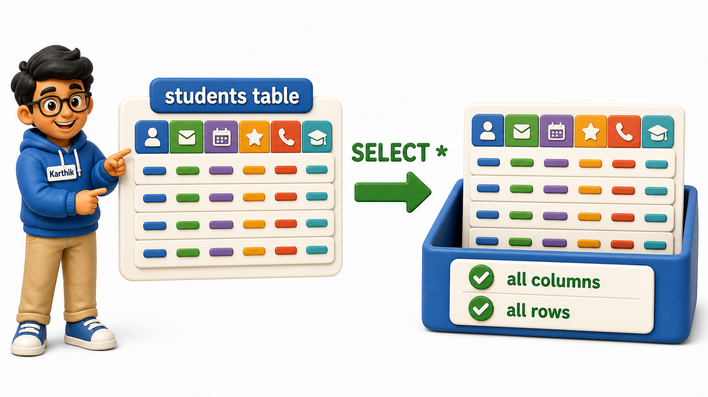

## Introduction

Karthik has just been given read access to his college's student records database. It is his first morning helping out in the admissions office, and the office coordinator has a simple request: "pull up the students list, all of it, for the orientation folder." Karthik opens a query window, looks at the empty text box, and realises he does not actually know how to ask a database for its own data yet. He is not filtering anything, not searching for one particular person, not doing any arithmetic. He just wants everything a table is holding, laid out as rows and columns he can read. That plain request, "show me what is in this table," is exactly what the **`SELECT` statement** answers, and it is the single most used piece of SQL a person will ever type.

## Asking For Everything in a Table

The students table already exists in the college's database, with one row per student and columns for their ID, name, email, city, phone number, and the date they joined. Karthik's first query asks for all of it, every column, every row.

```postgresql file=students.sql
CREATE TABLE students (
    student_id INTEGER PRIMARY KEY,
    full_name TEXT,
    email TEXT,
    city TEXT,
    phone TEXT,
    joined_on DATE
);

INSERT INTO students (student_id, full_name, email, city, phone, joined_on) VALUES
(1, 'Ishaan Verma', 'ishaan.verma@example.com', 'Bengaluru', '9845011111', '2025-01-10'),
(2, 'Meera Pillai', 'meera.pillai@example.com', 'Chennai', '9884022222', '2025-01-12'),
(3, 'Arjun Bhat', 'arjun.bhat@example.com', 'Bengaluru', NULL, '2025-01-15'),
(4, 'Kavya Reddy', 'kavya.reddy@example.com', 'Pune', '9922033333', '2025-01-18'),
(5, 'Rohan Joshi', 'rohan.joshi@example.com', 'Hyderabad', '9640044444', '2025-01-20'),
(6, 'Sneha Gowda', 'sneha.gowda@example.com', 'Mysuru', NULL, '2025-01-22'),
(7, 'Aditya Kulkarni', 'aditya.kulkarni@example.com', 'Pune', '9822055555', '2025-01-25'),
(8, 'Priya Subramaniam', 'priya.subramaniam@example.com', 'Chennai', '9884066666', '2025-01-28');
```

```postgresql with=students.sql
SELECT * FROM students;
```

Running this returns all eight rows and all six columns, exactly as they are stored. `SELECT` names what to retrieve, `*` is a shorthand meaning "every column," and `FROM students` names the table to read from. Karthik gets his orientation list in one line, and for a quick, throwaway look at a small table, that is a perfectly reasonable way to work.



## Asking For Only What You Need

A few minutes later, the coordinator asks a narrower question: "I just need names and cities, for the seating arrangement." Pulling every column again and mentally ignoring the ones that do not matter would work, but it is not what a careful query looks like. Karthik instead names exactly the columns he wants, separated by commas, in the order he wants them to appear.

```postgresql with=students.sql
SELECT full_name, city FROM students;
```

The result now has exactly two columns, `full_name` and `city`, for all eight students. Naming columns explicitly is not just shorter to read, it tells anyone looking at the query, including Karthik himself a month from now, precisely what data the query depends on. He can add `email` to the list just as easily.

```postgresql with=students.sql
SELECT full_name, email, city FROM students;
```

The column list can hold as many or as few columns as the task needs, in any order, and that order is exactly how they will appear in the result, regardless of how the table itself was created.


## Why Not Always Use SELECT *

`SELECT *` feels convenient, so it is worth being clear about why experienced SQL users reach for it sparingly once a table grows beyond a handful of columns. The students table here only has six columns, but real tables in production systems often have twenty, thirty, or more: audit timestamps, internal flags, `foreign keys` to other tables, columns nobody on the team has looked at in months. Asking for all of them when a report only needs two wastes bandwidth pulling data nobody will read, and it makes the output harder to scan.

There is a subtler risk too. A query that says `SELECT *` silently changes its own output if someone later adds a column to the table, or reorders the columns during a redesign. A query that names its columns explicitly keeps returning exactly what it always returned, column for column, no matter what else changes around it. The rule of thumb that follows:

- For a one-off look at a small table, `*` is fine.
- For anything Karthik plans to reuse, save, or hand to someone else, naming the columns is the safer habit to build early.

## The SELECT Statement at a Glance

| Form | What it returns | Typical use |
|---|---|---|
| `SELECT * FROM students;` | Every column, every row | Quick look at a small or unfamiliar table |
| `SELECT full_name FROM students;` | One named column, every row | A single fact needed from each row |
| `SELECT full_name, city FROM students;` | Several named columns, every row | A focused report or list |

## Your Turn

The coordinator now wants a phone contact sheet: just the name and the phone number for every student. Write a query against the students table above that returns exactly those two columns, in that order.

```postgresql with=students.sql
-- Write your query below
```

If your query starts with `SELECT full_name, phone FROM students;`, you are done, and you will notice Arjun Bhat and Sneha Gowda show up with an empty phone value, since no number was recorded for either of them. That gap will matter a great deal once filtering enters the picture.

## Conclusion

The `SELECT` statement is the starting point of nearly every piece of SQL anyone writes: name the columns you want, name the table they live in, and the database hands back exactly that slice of data. `SELECT *` is a handy shortcut for a first look at a table, but naming specific columns keeps a query readable, efficient, and stable even as the table around it changes shape. Karthik's first morning ends with him able to answer both requests that came his way, the full orientation list and the narrower names-and-cities view, using nothing more than `SELECT` and a well-chosen column list. With a comfortable way to pull raw columns out of a table established, the next step is making those columns easier to read once they arrive in the result, starting with giving them friendlier names.
