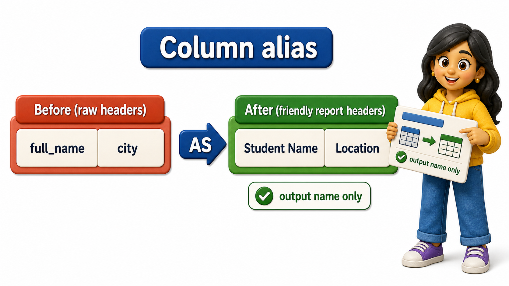
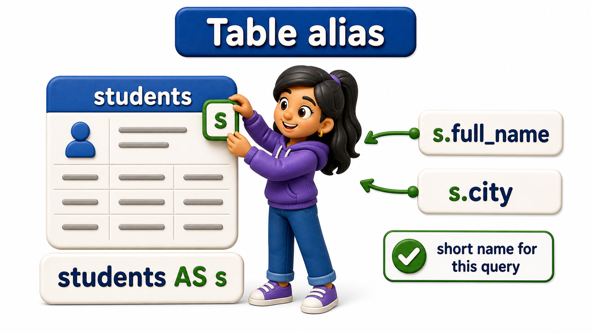

## Introduction

Divya is putting together a one-page summary for the Dean's office, and she needs the student list to look presentable, not like a raw database dump. She writes a quick query, `SELECT full_name, city FROM students;`, and the result comes back correctly, but the column headers read `full_name` and `city`, underscore and all, exactly as they are stored internally. For her own work that is fine, but this sheet is going in front of people who have never seen a database table in their life. She wants the headers to read "Student Name" and "Location" instead. Renaming a column in the output, without touching the actual table, is what a **column alias** does, and SQL gives her a clean way to write it: the `AS` keyword.

## Renaming a Column With AS

Divya rewrites her query, adding `AS` after each column followed by the label she actually wants to appear in the result.

```postgresql file=students.sql
CREATE TABLE students (
    student_id INTEGER PRIMARY KEY,
    full_name TEXT,
    email TEXT,
    city TEXT,
    phone TEXT,
    joined_on DATE
);

INSERT INTO students (student_id, full_name, email, city, phone, joined_on) VALUES
(1, 'Ishaan Verma', 'ishaan.verma@example.com', 'Bengaluru', '9845011111', '2025-01-10'),
(2, 'Meera Pillai', 'meera.pillai@example.com', 'Chennai', '9884022222', '2025-01-12'),
(3, 'Arjun Bhat', 'arjun.bhat@example.com', 'Bengaluru', NULL, '2025-01-15'),
(4, 'Kavya Reddy', 'kavya.reddy@example.com', 'Pune', '9922033333', '2025-01-18'),
(5, 'Rohan Joshi', 'rohan.joshi@example.com', 'Hyderabad', '9640044444', '2025-01-20'),
(6, 'Sneha Gowda', 'sneha.gowda@example.com', 'Mysuru', NULL, '2025-01-22'),
(7, 'Aditya Kulkarni', 'aditya.kulkarni@example.com', 'Pune', '9822055555', '2025-01-25'),
(8, 'Priya Subramaniam', 'priya.subramaniam@example.com', 'Chennai', '9884066666', '2025-01-28');
```

```postgresql with=students.sql
SELECT full_name AS student_name, city AS location
FROM students;
```

The data has not changed at all, still eight rows of the same names and cities, but the header row of the result now reads `student_name` and `location`. `AS` sits between the real column and the label Divya wants in its place, and the label only exists for this one result, it never renames anything inside the actual table. Run `SELECT * FROM students;` again separately and the column is still called `full_name` there, untouched.



## AS Is Optional, But Worth Keeping

SQL allows a shorter form: dropping the word `AS` entirely and just writing the alias right after the column name.

```postgresql with=students.sql
SELECT full_name student_name, city location
FROM students;
```

This produces the exact same result as the version with `AS`. PostgreSQL is happy to accept either form, so why bother typing the extra word?

- Without it, a reader scanning the query has to pause and work out whether `student_name` is a second column being selected or a rename of the one before it.
- With `AS` sitting in between, the intent is unambiguous at a glance: this word is a label, not another column.

The two extra characters buy real clarity, which is why it is worth the habit even though PostgreSQL will not force it on you.

## Giving a Table a Short Alias

Aliases are not only for columns. A table can be given a short alias too, and once it has one, that alias can be used anywhere else in the same query in place of the full table name. It looks unnecessary on a query this small, but the habit pays off the moment a query starts pulling from more than one table, which is exactly where the students, courses, and enrollments tables are eventually headed together.

```postgresql with=students.sql
SELECT s.full_name AS student_name, s.city AS location
FROM students AS s;
```

Here `students AS s` tells PostgreSQL that `s` now stands for the students table for the rest of this query, so `s.full_name` means "the `full_name` column, from the table aliased as `s`." The `AS` before a table alias is optional too, and it is common to see it dropped, `FROM students s`, which behaves identically. Divya keeps it in her own queries because it reads more clearly to anyone who has not seen the query before.



## Aliases and Table Aliases at a Glance

| Alias type | Syntax | Effect |
|---|---|---|
| Column alias | `full_name AS student_name` | Renames the column heading in the result only |
| Column alias, short form | `full_name student_name` | Same effect, `AS` omitted |
| Table alias | `FROM students AS s` | Gives the table a short name usable elsewhere in the query |
| Using a table alias | `s.full_name` | Refers to a column through the table's alias |

## Your Turn

Divya's next request from the Dean's office is a sheet with headers "Full Name" and "Email Address" instead of the raw column names, using a table alias `s` for students along the way. Write that query.

```postgresql with=students.sql
-- Write your query below
```

A working answer looks like `SELECT s.full_name AS "Full Name", s.email AS "Email Address" FROM students AS s;`. Notice the double quotes around aliases that contain a space, since PostgreSQL treats an unquoted alias as a single word and would otherwise misread "Full Name" as two separate tokens.

## Conclusion

Aliases let a query speak in whatever words are most useful to whoever is reading the result, without ever touching the underlying table. `AS` renames a column for the duration of one query, and the same keyword, used right after a table name, gives that table a short handle the rest of the query can lean on. Neither kind of alias changes what is stored, only how the answer is labelled and referred to on the way out. Divya's Dean's office summary can now show "Student Name" and "Location" instead of raw column names like `full_name` and `city`, turning a database dump into something presentable without altering a single row of underlying data. With friendlier headers now within reach, the next question is what to do when a query returns the same value over and over across many rows, and how to see only the distinct values hiding underneath the repetition.
