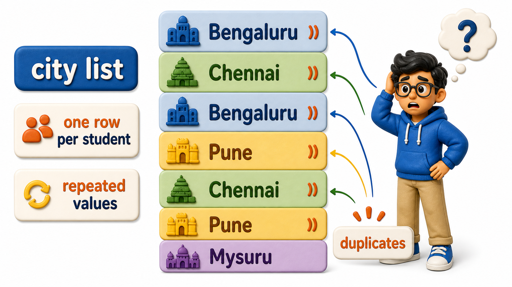
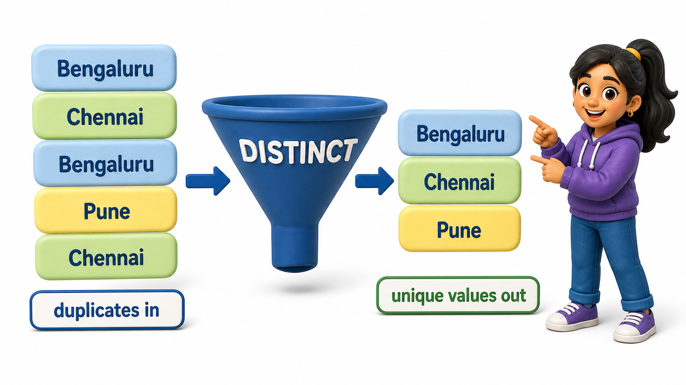

## Introduction

Simran has been asked a question that sounds like it should have a short answer: "which cities do our students come from?" She writes what feels like the obvious query, selecting the city column from the students table, and runs it. Eight rows come back, one for every student, and Bengaluru shows up twice, Chennai shows up twice, Pune shows up twice. She scrolls through the list herself, mentally crossing off repeats, to work out that there are really only five distinct cities represented. That is exactly the kind of tedious, error-prone work a database should be doing for her. The tool for it is **`DISTINCT`**, a keyword that tells PostgreSQL to collapse repeated values in a result down to one appearance each.

## The Repeated-Rows Problem

Before reaching for `DISTINCT`, it helps to see the problem it solves in plain output.

```postgresql file=students.sql
CREATE TABLE students (
    student_id INTEGER PRIMARY KEY,
    full_name TEXT,
    email TEXT,
    city TEXT,
    phone TEXT,
    joined_on DATE
);

INSERT INTO students (student_id, full_name, email, city, phone, joined_on) VALUES
(1, 'Ishaan Verma', 'ishaan.verma@example.com', 'Bengaluru', '9845011111', '2025-01-10'),
(2, 'Meera Pillai', 'meera.pillai@example.com', 'Chennai', '9884022222', '2025-01-12'),
(3, 'Arjun Bhat', 'arjun.bhat@example.com', 'Bengaluru', NULL, '2025-01-15'),
(4, 'Kavya Reddy', 'kavya.reddy@example.com', 'Pune', '9922033333', '2025-01-18'),
(5, 'Rohan Joshi', 'rohan.joshi@example.com', 'Hyderabad', '9640044444', '2025-01-20'),
(6, 'Sneha Gowda', 'sneha.gowda@example.com', 'Mysuru', NULL, '2025-01-22'),
(7, 'Aditya Kulkarni', 'aditya.kulkarni@example.com', 'Pune', '9822055555', '2025-01-25'),
(8, 'Priya Subramaniam', 'priya.subramaniam@example.com', 'Chennai', '9884066666', '2025-01-28');
```

```postgresql with=students.sql
SELECT city FROM students;
```

The result has eight rows, matching the eight students, and Bengaluru, Chennai, and Pune each appear twice because two students happen to live in each of those cities. Nothing is wrong with this query:

- It is faithfully reporting one city per student.
- It does not answer Simran's actual question, which is about the set of cities involved, not the list of students.



## Collapsing Repeats With DISTINCT

Adding the word `DISTINCT` right after `SELECT` changes the question from "what city does each student live in" to "what cities appear at all."

```postgresql with=students.sql
SELECT DISTINCT city FROM students;
```

This time the result has exactly five rows: Bengaluru, Chennai, Pune, Hyderabad, and Mysuru, each listed once no matter how many students share it. PostgreSQL builds the full list first and then throws away any row whose value is an exact repeat of one already kept. Simran gets the answer to her real question directly, without counting anything by hand.



## DISTINCT Across More Than One Column

`DISTINCT` does not have to apply to a single column. Given more than one column in the list, it keeps a row only if the entire combination of values, taken together, is unique, not just one column in isolation. To see this clearly, it helps to look at a different table where a few rows genuinely repeat the same combination.

```postgresql file=courses.sql
CREATE TABLE courses (
    course_id INTEGER PRIMARY KEY,
    title TEXT,
    department TEXT,
    credits INTEGER
);

INSERT INTO courses (course_id, title, department, credits) VALUES
(101, 'Database Systems', 'Computer Science', 4),
(102, 'Data Structures', 'Computer Science', 4),
(103, 'Linear Algebra', 'Mathematics', 3),
(104, 'Discrete Mathematics', 'Mathematics', 3),
(105, 'Microeconomics', 'Economics', 3);
```

```postgresql with=courses.sql
SELECT DISTINCT department, credits FROM courses;
```

The courses table has five rows, but this query returns only three: `Computer Science, 4`, `Mathematics, 3`, and `Economics, 3`. Both Computer Science courses are worth 4 credits, so that pair of values collapses into a single row, and the same happens for the two 3-credit Mathematics courses. Economics stays on its own since no other row shares its exact department-and-credits combination. `DISTINCT` here is answering "which department-and-credit-load combinations actually exist," a genuinely different question from listing every course.

## DISTINCT at a Glance

| Query | Rows without DISTINCT | Rows with DISTINCT |
|---|---|---|
| `SELECT city FROM students;` | 8, one per student | 5, one per unique city |
| `SELECT department, credits FROM courses;` | 5, one per course | 3, one per unique combination |

## Your Turn

The registrar wants to know which departments the college currently offers courses in, listed once each, with no repeats. Write a query against the courses table above that returns just that.

```postgresql with=courses.sql
-- Write your query below
```

`SELECT DISTINCT department FROM courses;` gets there in one line, returning Computer Science, Mathematics, and Economics, each exactly once, even though the underlying table has five course rows spread across those three departments.

## Conclusion

`DISTINCT` strips a result down to its genuinely unique rows, whether uniqueness is judged on a single column or on the combination of every column named in the `SELECT` list. It does not change the underlying table in any way, only the shape of the answer that comes back for that one query. Simran's original question, which cities the students come from, is now a single `SELECT DISTINCT city` away instead of a manual scroll-and-count through eight repeated rows. Knowing how to collapse repeated values is one half of getting a clean result; the other half is being able to compute new values that are not sitting in any column at all, which is exactly the kind of query that comes next.
