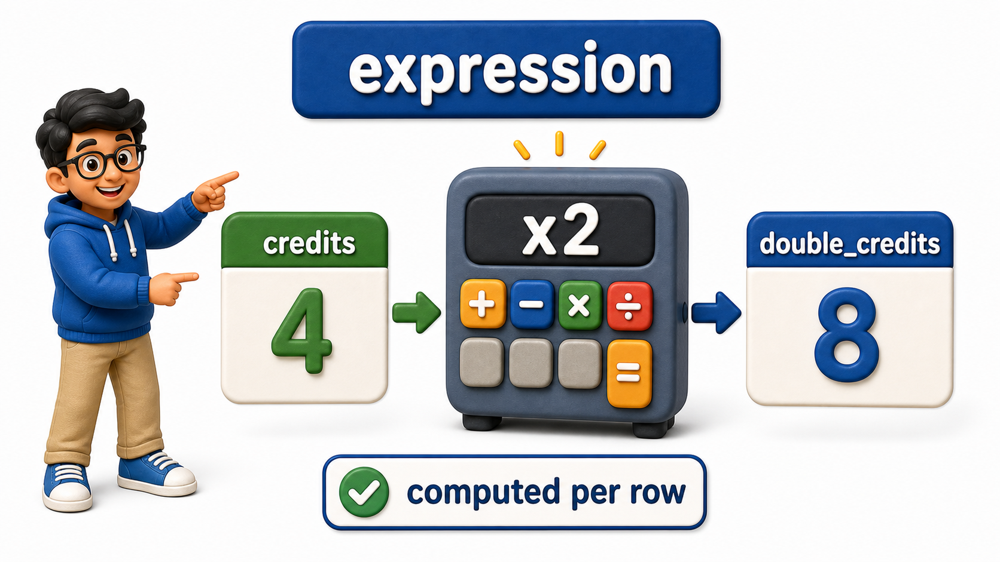
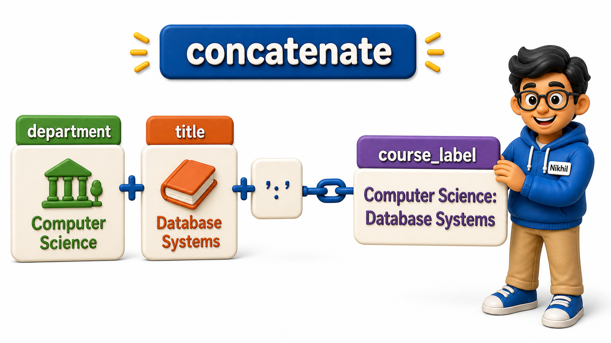

## Introduction

Nikhil is building a small course catalog page, and the design calls for two things the courses table does not actually store:

- A combined label like "Computer Science: Database Systems" for each row
- A "workload score" that doubles the credit value to weight it against another metric the page tracks

Neither of these exists as a column. Nothing needs to be added to the table to get them, though, because SQL can compute new values on the fly, right inside a `SELECT` list, using the columns that already exist. A value built this way, out of columns and operators rather than read directly off disk, is called an **expression**, and when it is given a name in the output, it behaves exactly like a calculated column.

## Doing Arithmetic in a SELECT List

The courses table stores a `credits` column as a plain integer. Nikhil wants a doubled version of it for his workload score, and he gets it by writing the arithmetic directly where a column name would normally go.

```postgresql file=courses.sql
CREATE TABLE courses (
    course_id INTEGER PRIMARY KEY,
    title TEXT,
    department TEXT,
    credits INTEGER
);

INSERT INTO courses (course_id, title, department, credits) VALUES
(101, 'Database Systems', 'Computer Science', 4),
(102, 'Data Structures', 'Computer Science', 4),
(103, 'Linear Algebra', 'Mathematics', 3),
(104, 'Discrete Mathematics', 'Mathematics', 3),
(105, 'Microeconomics', 'Economics', 3);
```

```postgresql with=courses.sql
SELECT title, credits, credits * 2 AS double_credits
FROM courses;
```

The result carries a third column, `double_credits`, holding 8, 8, 6, 6, and 6 for the five courses in that order, double whatever sat in `credits` for that row. PostgreSQL computes `credits * 2` fresh for every row as it builds the result; nothing about that math is stored anywhere, and running the same query again next year, after credit values might have changed, would simply recompute it from whatever `credits` holds then. The usual arithmetic operators all work the same way inside a `SELECT` list: `+`, `-`, `*`, `/`, and `%` for remainder.



## Combining Text With Concatenation

Numbers are not the only thing an expression can build. PostgreSQL lets you glue pieces of text together using the `||` operator, called concatenation, which is exactly what Nikhil needs for his combined label.

```postgresql with=courses.sql
SELECT department || ': ' || title AS course_label
FROM courses;
```

Each row now returns a single text value: "Computer Science: Database Systems", "Computer Science: Data Structures", "Mathematics: Linear Algebra", and so on. `||` takes whatever sits on its left and right, department and a literal string in this case, and joins them into one piece of text, left to right. A literal piece of text written directly in the query, like `': '` here, is just a fixed value in single quotes; it is not read from any column, it is simply inserted as-is between the two real column values, giving the colon-and-space separator its shape.



## Mixing Expressions With Ordinary Columns

An expression does not have to stand alone. It sits in the `SELECT` list exactly like any real column, so a single query can freely mix calculated values with columns pulled straight from the table.

```postgresql with=courses.sql
SELECT course_id, title, credits, credits * 2 AS double_credits, department || ': ' || title AS course_label
FROM courses;
```

This single query returns five columns: two untouched columns straight off the table, `course_id` and `title`, alongside `credits` shown plainly, then the doubled value, then the combined label, all computed in one pass over the same five rows. Nothing stops a query from having as many expressions as it needs sitting beside as many plain columns as it needs.

## Expressions at a Glance

| Expression | Example | Result for Database Systems (CS, 4 credits) |
|---|---|---|
| Arithmetic | `credits * 2 AS double_credits` | `8` |
| Concatenation | `department \|\| ': ' \|\| title AS course_label` | `Computer Science: Database Systems` |
| Mixed with plain columns | `title, credits, credits * 2 AS double_credits` | `Database Systems`, `4`, `8` |

## Your Turn

The catalog page also needs a "credit hours per week" figure, assuming each credit corresponds to roughly 15 contact hours across a term, shown alongside the course title. Write a query that returns `title` and a calculated column named `contact_hours`, equal to `credits * 15`.

```postgresql with=courses.sql
-- Write your query below
```

`SELECT title, credits * 15 AS contact_hours FROM courses;` produces exactly that, showing 60 contact hours for each 4-credit course and 45 for each 3-credit course, computed fresh from whatever `credits` currently holds.

## Conclusion

Expressions turn a `SELECT` list from a plain menu of stored columns into a small calculator that runs once per row: arithmetic operators combine numbers, `||` combines text, and `AS` gives the result a name worth keeping. None of this changes a single value sitting in the table, it only shapes what comes back for that one query. Nikhil's course catalog page can now show its combined "Computer Science: Database Systems" label and doubled workload score straight from a `SELECT`, with no new column ever added to the courses table itself. With the ability to pick columns, rename them, deduplicate them, and compute new ones from them all in hand, the next natural need is controlling the order those rows arrive in, rather than accepting whatever order the database happens to hand them back.
