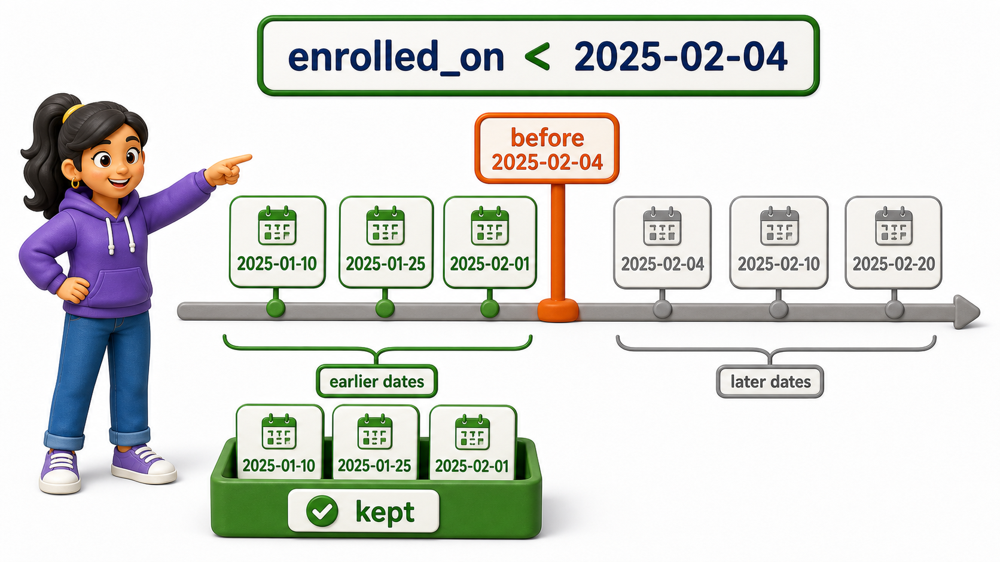

## Introduction

Neha is checking which courses are worth the heavier workload before she registers, and equality will not answer the question she actually has. She does not want courses where `credits = 4` specifically, she wants anything that costs more than the standard three-credit load, and separately she wants to see which of her enrollments were recorded before a certain date. Both questions lean on the same family of tools, the **comparison operators**, which let `WHERE` ask "greater than," "less than," or "not equal to," instead of only "equal to."

## Six Operators, One Idea

SQL gives you six comparison operators, and every one of them reduces to the same thing `WHERE` has always done: test a row, keep it if the test is true.

```postgresql file=schema.sql
CREATE TABLE students (
    student_id INTEGER PRIMARY KEY,
    full_name TEXT,
    email TEXT,
    city TEXT,
    phone TEXT,
    joined_on DATE
);

INSERT INTO students (student_id, full_name, email, city, phone, joined_on) VALUES
(1, 'Omkar Rane', 'omkar.rane@campusmail.edu', 'Bengaluru', '9845011111', '2025-01-10'),
(2, 'Neha Sharma', 'neha.sharma@campusmail.edu', 'Mysuru', NULL, '2025-01-12'),
(3, 'Varun Nair', 'varun.nair@gmail.com', 'Chennai', '9845022222', '2025-01-15'),
(4, 'Siddharth Rao', 'siddharth.rao@campusmail.edu', 'Hyderabad', '9845033333', '2025-01-18'),
(5, 'Yusuf Khan', 'yusuf.khan@gmail.com', 'Pune', NULL, '2025-01-20'),
(6, 'Ishita Menon', 'ishita.menon@campusmail.edu', 'Bengaluru', '9845044444', '2025-01-22'),
(7, 'Rahul Verma', 'rahul.verma@gmail.com', 'Chennai', '9845055555', '2025-01-25'),
(8, 'Sanya Iyer', 'sanya.iyer@campusmail.edu', 'Mysuru', NULL, '2025-01-28');

CREATE TABLE courses (
    course_id INTEGER PRIMARY KEY,
    title TEXT,
    department TEXT,
    credits INTEGER
);

INSERT INTO courses (course_id, title, department, credits) VALUES
(101, 'Database Systems', 'Computer Science', 4),
(102, 'Data Structures', 'Computer Science', 4),
(103, 'Linear Algebra', 'Mathematics', 3),
(104, 'Discrete Mathematics', 'Mathematics', 3),
(105, 'Microeconomics', 'Economics', 2);

CREATE TABLE instructors (
    instructor_id INTEGER PRIMARY KEY,
    full_name TEXT,
    department TEXT
);

INSERT INTO instructors (instructor_id, full_name, department) VALUES
(201, 'Ananya Bose', 'Computer Science'),
(202, 'Manoj Pillai', 'Mathematics'),
(203, 'Kavita Reddy', 'Economics');

CREATE TABLE enrollments (
    enrollment_id INTEGER PRIMARY KEY,
    student_id INTEGER REFERENCES students(student_id),
    course_id INTEGER REFERENCES courses(course_id),
    enrolled_on DATE,
    grade TEXT
);

INSERT INTO enrollments (enrollment_id, student_id, course_id, enrolled_on, grade) VALUES
(1, 1, 101, '2025-02-01', 'A'),
(2, 1, 103, '2025-02-01', 'B+'),
(3, 2, 101, '2025-02-02', NULL),
(4, 3, 102, '2025-02-03', 'A-'),
(5, 3, 105, '2025-02-03', NULL),
(6, 4, 104, '2025-02-04', 'B'),
(7, 5, 101, '2025-02-05', NULL),
(8, 6, 102, '2025-02-06', 'A'),
(9, 7, 103, '2025-02-07', 'C+'),
(10, 8, 105, '2025-02-08', 'B-');
```

```postgresql with=schema.sql
SELECT title, credits
FROM courses
WHERE credits > 3;
```

That returns `Database Systems` and `Data Structures`, the two courses worth more than three credits. `Linear Algebra` and `Discrete Mathematics` sit at exactly three credits, so `> 3` leaves them out; had Neha written `>= 3` instead, both would have qualified alongside the two Computer Science courses.


## Numeric and Date Comparisons Work the Same Way

Dates compare exactly the way numbers do: earlier dates are "smaller" than later ones. Neha can use this to see which enrollments were recorded in the opening days of registration.

```postgresql with=schema.sql
SELECT enrollment_id, student_id, course_id, enrolled_on
FROM enrollments
WHERE enrolled_on < '2025-02-04'
ORDER BY enrolled_on;
```

This returns the five enrollments dated the 1st, 2nd, and 3rd of February, stopping just before the 4th. The `<` operator treats `'2025-02-04'` as a genuine date value here because the column itself is typed `DATE`, so PostgreSQL compares calendar order rather than comparing the text character by character.



Not-equal-to has two spellings that mean the same thing:

- `!=`
- `<>`

Both are standard, and most teams simply pick one and stay consistent with it.

```postgresql with=schema.sql
SELECT title, department
FROM courses
WHERE department <> 'Mathematics';
```

Every course except `Linear Algebra` and `Discrete Mathematics` comes back, since those are the only two rows where the condition `department <> 'Mathematics'` is false.

## Comparison Operators at a Glance

| Operator | Meaning | Example |
|---|---|---|
| `=` | Equal to | `credits = 4` |
| `!=` or `<>` | Not equal to | `department != 'Mathematics'` |
| `>` | Greater than | `credits > 3` |
| `<` | Less than | `enrolled_on < '2025-02-04'` |
| `>=` | Greater than or equal to | `credits >= 3` |
| `<=` | Less than or equal to | `credits <= 2` |

## Text Compares Alphabetically Too

These same six operators work on text columns, not just numbers and dates. PostgreSQL compares strings character by character in alphabetical order, so `>` and `<` on a text column ask whether one value sorts after or before another.

```postgresql with=schema.sql
SELECT full_name
FROM students
WHERE full_name >= 'M'
ORDER BY full_name;
```

Every name starting with M onward comes back: Neha Sharma, Omkar Rane, Rahul Verma, Sanya Iyer, Siddharth Rao, Varun Nair, and Yusuf Khan. Ishita Menon is left out because `'Ishita Menon'` sorts before `'M'` alphabetically. This is genuinely useful for range-style text filters, splitting a roster into two halves for two examiners, for instance, without needing anything fancier than the operators Neha already knows from numbers.

## Your Turn

Write a query against `courses` that returns only the course with the lowest credit value, using a comparison operator rather than sorting and limiting.

```postgresql with=schema.sql
SELECT title, credits
FROM courses
WHERE credits <= 2;
```

This should return only `Microeconomics`, the sole course carrying two credits. Try changing `<=` to `<` and notice the result stays the same here, since no course carries fewer than two credits, then try it against data where a boundary value actually exists to see the difference show up.

## Conclusion

Comparison operators let `WHERE` reach past plain equality into ordering: greater than, less than, and their inclusive cousins, all working consistently across numbers, dates, and even text compared alphabetically. Neha can now answer both of her original questions directly, filtering courses with `credits > 3` for the heavier workload and enrollments with `enrolled_on < '2025-02-04'` for the early registrations, without equality ever standing in her way. Once a condition can express "more than," "before," or "after," the next natural step is combining several such conditions in a single query, deciding what it means for a row to satisfy more than one requirement at once.
