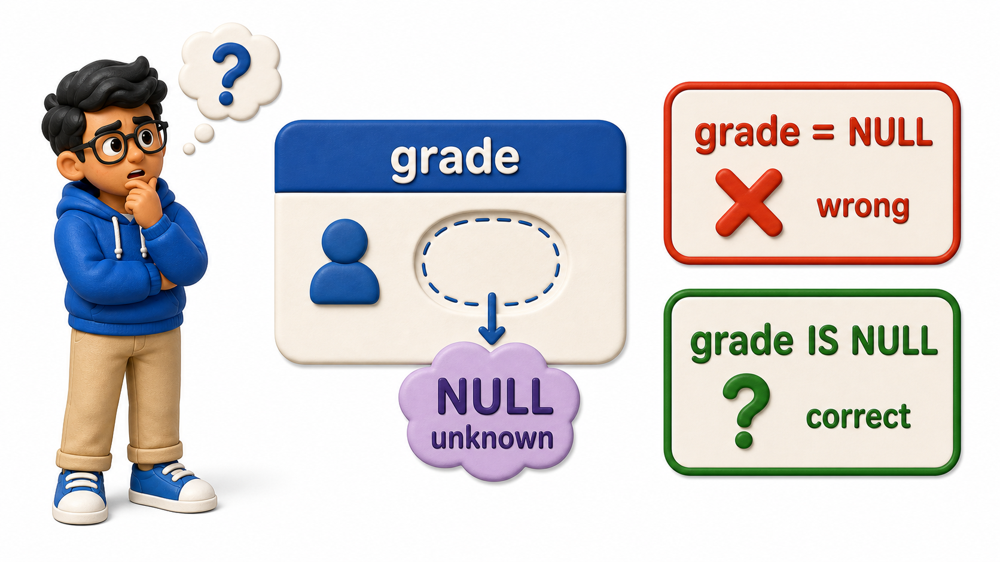
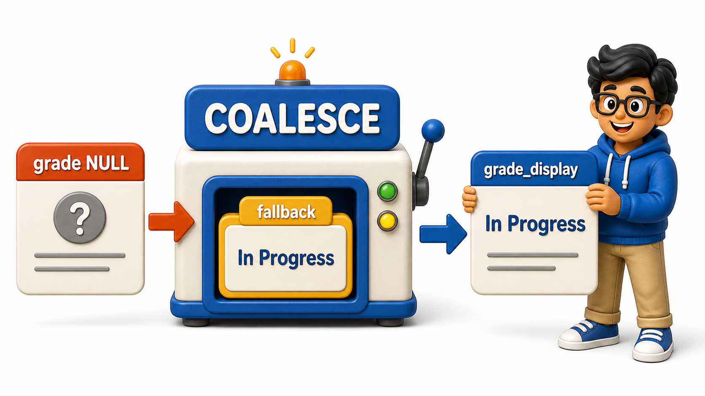

## Introduction

Yusuf is trying to list every enrollment that has already been graded, so he writes the condition the way he would for any other value: `WHERE grade = NULL`. The query runs without error, but it comes back completely empty, even though he can see graded rows sitting right there in the table. Nothing is broken. He has just run into the one place where SQL's usual comparison rules quietly stop applying: **`NULL`**, the marker for a value that is missing or not yet known.

## Why grade = NULL Never Works

`NULL` does not mean any of these:

- Zero
- An empty string
- False

It means "unknown." Three of Yusuf's enrollments have not been graded yet, because the courses are still in progress, so their `grade` column holds `NULL` rather than any particular grade.

```postgresql file=schema.sql
CREATE TABLE students (
    student_id INTEGER PRIMARY KEY,
    full_name TEXT,
    email TEXT,
    city TEXT,
    phone TEXT,
    joined_on DATE
);

INSERT INTO students (student_id, full_name, email, city, phone, joined_on) VALUES
(1, 'Omkar Rane', 'omkar.rane@campusmail.edu', 'Bengaluru', '9845011111', '2025-01-10'),
(2, 'Neha Sharma', 'neha.sharma@campusmail.edu', 'Mysuru', NULL, '2025-01-12'),
(3, 'Varun Nair', 'varun.nair@gmail.com', 'Chennai', '9845022222', '2025-01-15'),
(4, 'Siddharth Rao', 'siddharth.rao@campusmail.edu', 'Hyderabad', '9845033333', '2025-01-18'),
(5, 'Yusuf Khan', 'yusuf.khan@gmail.com', 'Pune', NULL, '2025-01-20'),
(6, 'Ishita Menon', 'ishita.menon@campusmail.edu', 'Bengaluru', '9845044444', '2025-01-22'),
(7, 'Rahul Verma', 'rahul.verma@gmail.com', 'Chennai', '9845055555', '2025-01-25'),
(8, 'Sanya Iyer', 'sanya.iyer@campusmail.edu', 'Mysuru', NULL, '2025-01-28');

CREATE TABLE courses (
    course_id INTEGER PRIMARY KEY,
    title TEXT,
    department TEXT,
    credits INTEGER
);

INSERT INTO courses (course_id, title, department, credits) VALUES
(101, 'Database Systems', 'Computer Science', 4),
(102, 'Data Structures', 'Computer Science', 4),
(103, 'Linear Algebra', 'Mathematics', 3),
(104, 'Discrete Mathematics', 'Mathematics', 3),
(105, 'Microeconomics', 'Economics', 2);

CREATE TABLE instructors (
    instructor_id INTEGER PRIMARY KEY,
    full_name TEXT,
    department TEXT
);

INSERT INTO instructors (instructor_id, full_name, department) VALUES
(201, 'Ananya Bose', 'Computer Science'),
(202, 'Manoj Pillai', 'Mathematics'),
(203, 'Kavita Reddy', 'Economics');

CREATE TABLE enrollments (
    enrollment_id INTEGER PRIMARY KEY,
    student_id INTEGER REFERENCES students(student_id),
    course_id INTEGER REFERENCES courses(course_id),
    enrolled_on DATE,
    grade TEXT
);

INSERT INTO enrollments (enrollment_id, student_id, course_id, enrolled_on, grade) VALUES
(1, 1, 101, '2025-02-01', 'A'),
(2, 1, 103, '2025-02-01', 'B+'),
(3, 2, 101, '2025-02-02', NULL),
(4, 3, 102, '2025-02-03', 'A-'),
(5, 3, 105, '2025-02-03', NULL),
(6, 4, 104, '2025-02-04', 'B'),
(7, 5, 101, '2025-02-05', NULL),
(8, 6, 102, '2025-02-06', 'A'),
(9, 7, 103, '2025-02-07', 'C+'),
(10, 8, 105, '2025-02-08', 'B-');
```

```postgresql with=schema.sql
SELECT enrollment_id, student_id, course_id, grade
FROM enrollments
WHERE grade = NULL;
```

Zero rows come back, even though three enrollments genuinely have a `NULL` grade. The reason is that `=` asks "are these two values the same," and `NULL` is not a value at all, it is the absence of one. Comparing an unknown quantity against anything, even against another unknown quantity, does not produce true, it produces unknown, and `WHERE` only keeps rows where the condition comes out true. A condition that comes out unknown is treated exactly like one that came out false: the row is dropped either way.



## IS NULL and IS NOT NULL

Because `=` cannot test for `NULL`, SQL provides a dedicated pair of operators for exactly this question: `IS NULL` and `IS NOT NULL`.

```postgresql with=schema.sql
SELECT enrollment_id, student_id, course_id, grade
FROM enrollments
WHERE grade IS NULL;
```

This time three rows come back, enrollment 3, 5, and 7, the courses that are still in progress and have not been assigned a grade yet. `IS NULL` does not compare the column to anything; it asks the column directly whether it is holding a value at all, which is a different kind of question from `=` and the only one that reliably finds missing data.

```postgresql with=schema.sql
SELECT enrollment_id, student_id, course_id, grade
FROM enrollments
WHERE grade IS NOT NULL;
```

This returns the other seven enrollments, every row where a grade has actually been recorded. The same pattern applies anywhere a column might be missing data. The `students` table has a `phone` column left `NULL` for three students who never provided one, and `phone IS NULL` is the only correct way to find them.

## Supplying a Fallback with COALESCE

Sometimes the goal is not to filter `NULL` out but to display something more readable in its place. `COALESCE` takes a list of values and returns the first one that is not `NULL`, which makes it useful for substituting a fallback label directly in a `SELECT` list.

```postgresql with=schema.sql
SELECT enrollment_id, course_id, COALESCE(grade, 'In Progress') AS grade_display
FROM enrollments
ORDER BY enrollment_id;
```

Every row that already had a grade shows that grade unchanged, since `COALESCE` only reaches for its fallback when the first value is `NULL`. Enrollments 3, 5, and 7 now show `In Progress` instead of a blank grade, which reads far better in a report than an empty cell that could just as easily be mistaken for a data entry mistake.



## NULL at a Glance

| Situation | What to write | What NOT to write |
|---|---|---|
| Find rows with a missing value | `WHERE column IS NULL` | `WHERE column = NULL` |
| Find rows with a value present | `WHERE column IS NOT NULL` | `WHERE column != NULL` |
| Show a fallback for a missing value | `COALESCE(column, 'fallback')` in the SELECT list | Comparing the column directly to text |
| Meaning of NULL | Unknown or missing | Not zero, not an empty string, not false |

## Your Turn

Write a query that lists the `full_name` of every student who has not provided a phone number.

```postgresql with=schema.sql
SELECT full_name
FROM students
WHERE phone IS NULL;
```

This should return Neha Sharma, Yusuf Khan, and Sanya Iyer, the three students whose `phone` column was left `NULL` when the data was entered. Try writing `WHERE phone = NULL` instead and confirm it silently returns nothing, the same trap Yusuf ran into with grades.

## Conclusion

`NULL` represents a genuinely unknown value, not a stand-in for zero or empty text, which is exactly why an ordinary `=` comparison against it never returns true and `IS NULL` or `IS NOT NULL` exist as the dedicated way to ask the question instead. `COALESCE` rounds this out by letting a report show something meaningful in place of a gap, without changing the underlying data at all. Yusuf's original list of graded enrollments now comes back correctly once `WHERE grade = NULL` is replaced with `WHERE grade IS NOT NULL`, the fix for the exact trap that returned zero rows the first time he ran it. Filtering and reading data only goes so far, though. Sooner or later that in-progress enrollment needs its grade actually entered, a new student needs to be added to the roster, or an old record needs to be corrected, and that means moving from asking the database questions to actually changing what it holds.
