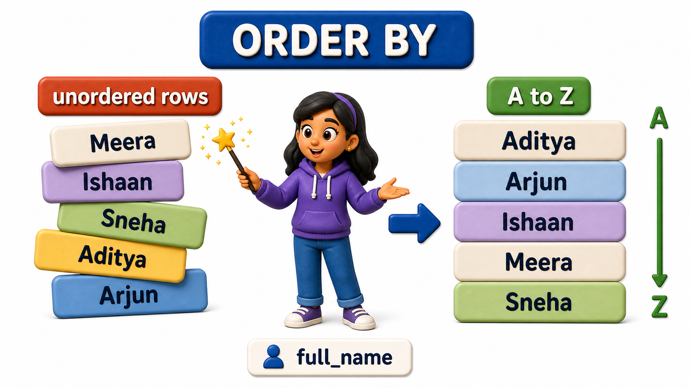
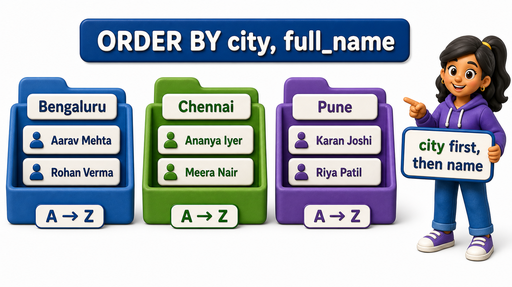

## Introduction

Rhea is preparing a printed roster for orientation day, and she wants the students listed alphabetically by name so the volunteers checking people in can find a name quickly instead of scanning a jumbled list.

She runs a plain `SELECT full_name, city FROM students;` and the `rows` come back in whatever order PostgreSQL happens to store or retrieve them in, which is not alphabetical, not by city, not by anything Rhea can rely on. A `table`'s `rows` have no built-in order at all unless a `query` explicitly asks for one.

The clause that asks for one is **`ORDER BY`**, and it is what turns an unpredictable pile of `rows` into a sequence a person can actually use.

## Sorting Ascending, the Default

The `students` `table` holds this data, in no particular order:

| student_id | full_name | email | city | phone | joined_on |
| ---------- | ----------------- | ------------------------------ | --------- | ---------- | ---------- |
| 1 | Ishaan Verma | ishaan.verma@example.com | Bengaluru | 9845011111 | 2025-01-10 |
| 2 | Meera Pillai | meera.pillai@example.com | Chennai | 9884022222 | 2025-01-12 |
| 3 | Arjun Bhat | arjun.bhat@example.com | Bengaluru | *NULL* | 2025-01-15 |
| 4 | Kavya Reddy | kavya.reddy@example.com | Pune | 9922033333 | 2025-01-18 |
| 5 | Rohan Joshi | rohan.joshi@example.com | Hyderabad | 9640044444 | 2025-01-20 |
| 6 | Sneha Gowda | sneha.gowda@example.com | Mysuru | *NULL* | 2025-01-22 |
| 7 | Aditya Kulkarni | aditya.kulkarni@example.com | Pune | 9822055555 | 2025-01-25 |
| 8 | Priya Subramaniam | priya.subramaniam@example.com | Chennai | 9884066666 | 2025-01-28 |

To build this `table` with this data, a `CREATE TABLE` statement defines the six `columns` shown above, and an `INSERT INTO` statement loads the eight `rows` into it.

Rhea's first fix is simple: add `ORDER BY` followed by the `column` she wants to sort on: `SELECT full_name, city FROM students ORDER BY full_name;`.

Expected output:

| full_name | city |
| ----------------- | --------- |
| Aditya Kulkarni | Pune |
| Arjun Bhat | Bengaluru |
| Ishaan Verma | Bengaluru |
| Kavya Reddy | Pune |
| Meera Pillai | Chennai |
| Priya Subramaniam | Chennai |
| Rohan Joshi | Hyderabad |
| Sneha Gowda | Mysuru |

The result now starts with Aditya Kulkarni and ends with Sneha Gowda, running alphabetically A to Z the whole way through. This is ascending order, and it is what PostgreSQL uses whenever `ORDER BY` is given a `column` with no further instruction:

- For text, ascending means alphabetical.
- For numbers, it means smallest to largest.
- For dates, it means earliest to latest.



Try it yourself:

```postgresql file=init.sql
CREATE TABLE students (
    student_id INTEGER PRIMARY KEY,
    full_name TEXT,
    email TEXT,
    city TEXT,
    phone TEXT,
    joined_on DATE
);

INSERT INTO students (student_id, full_name, email, city, phone, joined_on) VALUES
(1, 'Ishaan Verma', 'ishaan.verma@example.com', 'Bengaluru', '9845011111', '2025-01-10'),
(2, 'Meera Pillai', 'meera.pillai@example.com', 'Chennai', '9884022222', '2025-01-12'),
(3, 'Arjun Bhat', 'arjun.bhat@example.com', 'Bengaluru', NULL, '2025-01-15'),
(4, 'Kavya Reddy', 'kavya.reddy@example.com', 'Pune', '9922033333', '2025-01-18'),
(5, 'Rohan Joshi', 'rohan.joshi@example.com', 'Hyderabad', '9640044444', '2025-01-20'),
(6, 'Sneha Gowda', 'sneha.gowda@example.com', 'Mysuru', NULL, '2025-01-22'),
(7, 'Aditya Kulkarni', 'aditya.kulkarni@example.com', 'Pune', '9822055555', '2025-01-25'),
(8, 'Priya Subramaniam', 'priya.subramaniam@example.com', 'Chennai', '9884066666', '2025-01-28');
```

```postgresql with=init.sql
SELECT full_name, city
FROM students
ORDER BY full_name;
```

## Sorting Descending

Sometimes the useful order runs the other way. If Rhea instead wants the newest joiners at the top of a "welcome our latest students" notice, ascending order on the join date would put the oldest joiners first, exactly backwards from what she needs. Adding `DESC` after the `column` reverses the direction: `SELECT full_name, joined_on FROM students ORDER BY joined_on DESC;`.

Expected output:

| full_name | joined_on |
| ----------------- | ---------- |
| Priya Subramaniam | 2025-01-28 |
| Aditya Kulkarni | 2025-01-25 |
| Sneha Gowda | 2025-01-22 |
| Rohan Joshi | 2025-01-20 |
| Kavya Reddy | 2025-01-18 |
| Arjun Bhat | 2025-01-15 |
| Meera Pillai | 2025-01-12 |
| Ishaan Verma | 2025-01-10 |

Now Priya Subramaniam, who joined on 2025-01-28, appears first, and Ishaan Verma, who joined on 2025-01-10, appears last. Writing `ASC` explicitly is also allowed for ascending order, but since ascending is the default, most people leave it out and only write `DESC` when they actually need the reverse.

Try it yourself:

```postgresql with=init.sql
SELECT full_name, joined_on
FROM students
ORDER BY joined_on DESC;
```

## Sorting by More Than One Column

- A single sort key is not always enough.
- Suppose Rhea wants students grouped by city, and within each city, listed alphabetically by name, so a volunteer working the Bengaluru desk can find their group's names in order without scrolling past every other city first.
- `ORDER BY` accepts a list of `columns`, and it sorts by the first one, then uses the second one only to break ties within groups that share the same first value: `SELECT full_name, city FROM students ORDER BY city, full_name;`.

Expected output:

| full_name | city |
| ----------------- | --------- |
| Arjun Bhat | Bengaluru |
| Ishaan Verma | Bengaluru |
| Meera Pillai | Chennai |
| Priya Subramaniam | Chennai |
| Rohan Joshi | Hyderabad |
| Sneha Gowda | Mysuru |
| Aditya Kulkarni | Pune |
| Kavya Reddy | Pune |

The result groups all of Bengaluru's students together, sorted alphabetically within that group, then moves to Chennai's students sorted alphabetically within that group, and so on through Hyderabad, Mysuru, and Pune. Arjun Bhat appears before Ishaan Verma within Bengaluru because the tie on city is broken by name.

Each `column` in the list can carry its own direction too, so `ORDER BY city, full_name DESC` would keep cities grouped in ascending order while listing names within each city from Z to A.



Try it yourself:

```postgresql with=init.sql
SELECT full_name, city
FROM students
ORDER BY city, full_name;
```

## Sorting Results at a Glance

<table style="border-collapse: collapse; width: 100%; margin: 1rem 0; font-size: 0.95rem;">
  <thead>
    <tr>
      <th style="border: 1px solid #c8d7ea; padding: 10px 12px; text-align: left; background-color: #dceeff; color: #102a43; font-weight: 700;">Clause</th>
      <th style="border: 1px solid #c8d7ea; padding: 10px 12px; text-align: left; background-color: #dceeff; color: #102a43; font-weight: 700;">Direction</th>
      <th style="border: 1px solid #c8d7ea; padding: 10px 12px; text-align: left; background-color: #dceeff; color: #102a43; font-weight: 700;">Example</th>
    </tr>
  </thead>
  <tbody>
    <tr style="background-color: #ffffff;">
      <td style="border: 1px solid #d8e2ef; padding: 9px 12px; vertical-align: top;"><code>ORDER BY full_name</code></td>
      <td style="border: 1px solid #d8e2ef; padding: 9px 12px; vertical-align: top;">Ascending (default), A to Z</td>
      <td style="border: 1px solid #d8e2ef; padding: 9px 12px; vertical-align: top;">Aditya first, Sneha last</td>
    </tr>
    <tr style="background-color: #f7fbff;">
      <td style="border: 1px solid #d8e2ef; padding: 9px 12px; vertical-align: top;"><code>ORDER BY joined_on DESC</code></td>
      <td style="border: 1px solid #d8e2ef; padding: 9px 12px; vertical-align: top;">Descending, latest to earliest</td>
      <td style="border: 1px solid #d8e2ef; padding: 9px 12px; vertical-align: top;">Priya (2025-01-28) first</td>
    </tr>
    <tr style="background-color: #ffffff;">
      <td style="border: 1px solid #d8e2ef; padding: 9px 12px; vertical-align: top;"><code>ORDER BY city, full_name</code></td>
      <td style="border: 1px solid #d8e2ef; padding: 9px 12px; vertical-align: top;">Groups by city, then name within each city</td>
      <td style="border: 1px solid #d8e2ef; padding: 9px 12px; vertical-align: top;">Bengaluru names together, sorted</td>
    </tr>
  </tbody>
</table>

## Your Turn

The office also wants a version of the roster sorted so that students from the same city are still grouped together, but this time with the most recently joined student in each city appearing first. Write a `query` that returns `full_name`, `city`, and `joined_on`, grouped by city ascending and, within each city, newest join date first.

```postgresql with=init.sql
-- Write your query below
```

`SELECT full_name, city, joined_on FROM students ORDER BY city, joined_on DESC;` does exactly this. Expected output:

| full_name | city | joined_on |
| ----------------- | --------- | ---------- |
| Arjun Bhat | Bengaluru | 2025-01-15 |
| Ishaan Verma | Bengaluru | 2025-01-10 |
| Priya Subramaniam | Chennai | 2025-01-28 |
| Meera Pillai | Chennai | 2025-01-12 |
| Rohan Joshi | Hyderabad | 2025-01-20 |
| Sneha Gowda | Mysuru | 2025-01-22 |
| Aditya Kulkarni | Pune | 2025-01-25 |
| Kavya Reddy | Pune | 2025-01-18 |

Cities still run alphabetically overall, but inside each city's block the most recent joiner leads.

## Conclusion

- `ORDER BY` replaces an unpredictable `row` order with one you actually chose, ascending by default or reversed with DESC, and it can chain several `columns` together so later ones only settle ties left by earlier ones.
- None of this changes how `rows` are stored, it only shapes the sequence a particular `query` hands back.
- Rhea's orientation roster can now print alphabetically by name, or grouped by city with each group internally sorted, so her volunteers can find any student in seconds instead of scanning an unpredictable list.
- Once a result can be put into a meaningful order, the natural next question is how to show only the first handful of `rows` from a large, sorted result, which is exactly the kind of trimming a dashboard preview needs.
